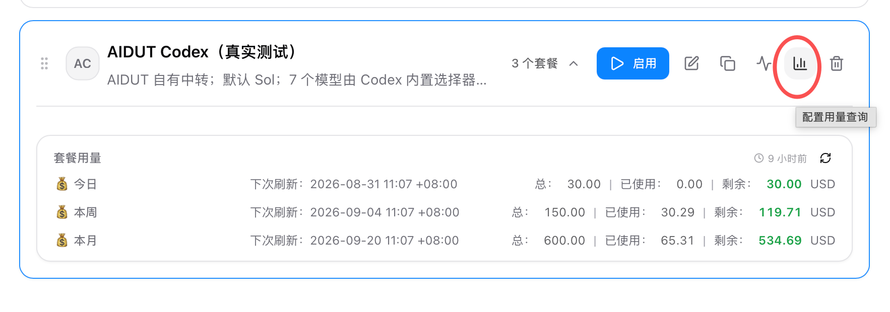
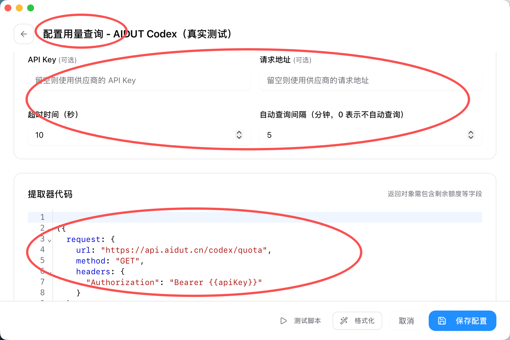

# AIDUT 中转与 CC Switch 手动配置

本页适用于已经获得 AIDUT（兔子）个人 Key、希望在 CC Switch 中使用 Codex 的用户。配置完成后，CC Switch 负责保存和切换线路，Codex 负责执行任务；默认模型为 `gpt-5.6-sol`，其他可用模型仍可在 Codex 官方模型选择器中自由切换。

## 配置结果

* 模型请求地址：`https://api.aidut.cn/codex`
* 默认模型：`gpt-5.6-sol`
* 用量查询地址：`https://api.aidut.cn/codex/quota`
* 余额显示：`今日`、`本周`、`本月`，每项显示总额、已用、剩余和下次刷新时间
* 官方登录和 CC Switch 的高级选项保持不变，不需要手工编辑 `auth.json` 或 `config.toml`

## 已有用户：在原有卡片上开通用量显示

已经在使用 AIDUT 中转的用户不需要新建 Provider，也不需要重新粘贴 Key。只编辑当前那张 AIDUT 卡，模型地址、默认模型、官方登录和高级选项保持不变。

1. 打开 `CC Switch → Codex`，找到正在使用的 AIDUT Provider，点击编辑。
2. 点击卡片右侧的用量图标，进入“配置用量查询”；开启“启用用量查询”，选择“自定义”。
3. 按第二张图填写：

| 字段          | 填写内容                   |
| ----------- | ---------------------- |
| API Key（可选） | 留空，复用当前卡已经保存的 Key      |
| 请求地址（可选）    | 留空，由提取器代码中的固定 URL 发起请求 |
| 超时时间（秒）     | `10`                   |
| 自动查询间隔（分钟）  | `5`                    |
| 提取器代码       | 粘贴本页下方的完整正式脚本          |

4. 不要把 `{{apiKey}}` 改成真实 Key；点击“格式化”→“测试脚本”→“保存配置”。
5. 回到卡片点击“刷新用量”。正常会看到 `今日`、`本周`、`本月` 三组额度。



图 1：点击卡片右侧被红圈标出的用量图标，进入用量查询配置。保存成功后，同一张卡会显示三组额度。



图 2：API Key 和请求地址是可选项；按图留空，填写超时和自动查询间隔，并粘贴正式提取器代码。

## 新建 AIDUT 卡

入口：`Codex → 添加新供应商 → Codex 供应商 → 自定义配置`。

| CC Switch 字段 | 填写内容                                  |
| ------------ | ------------------------------------- |
| 供应商名称        | `AIDUT Codex`                         |
| 备注           | `AIDUT 自有中转；默认 Sol；模型由 Codex 官方选择器提供` |
| 官网链接         | `https://api.aidut.cn`                |
| API Key      | 只在客户自己的电脑上粘贴客户自己的 AIDUT Key           |
| 完整 URL       | 关闭                                    |
| API 请求地址     | `https://api.aidut.cn/codex`          |
| 默认模型         | `gpt-5.6-sol`                         |

可直接复制字段：

```
供应商名称：AIDUT Codex
备注：AIDUT 自有中转；默认 Sol；模型由 Codex 官方选择器提供
官网链接：https://api.aidut.cn
完整 URL：关闭
API 请求地址：https://api.aidut.cn/codex
默认模型：gpt-5.6-sol
```

API Key 不要写进公开文档、聊天记录或截图；只在客户本机输入。

## 可选择的模型

默认使用 `gpt-5.6-sol`。在 Codex 官方模型选择器中还可以选择：

| 模型                    | 支持的思考等级                                |
| --------------------- | -------------------------------------- |
| `gpt-5.6-sol`         | `low, medium, high, xhigh, max, ultra` |
| `gpt-5.6-terra`       | `low, medium, high, xhigh, max, ultra` |
| `gpt-5.6-luna`        | `low, medium, high, xhigh, max`        |
| `gpt-5.5`             | `low, medium, high, xhigh`             |
| `gpt-5.4`             | `low, medium, high, xhigh`             |
| `gpt-5.4-mini`        | `low, medium, high, xhigh`             |
| `gpt-5.3-codex-spark` | `low, medium, high, xhigh`             |

不需要在 CC Switch 中重复创建 7 张卡，也不需要手工维护模型映射。

## 高级选项

高级选项不用更新：

* 上游格式保持 `Responses（原生）`；
* 模型映射、Header 覆盖、Body 覆盖和自定义 User-Agent 留空；
* 不手工填写 `auth.json`、`config.toml` 或 `experimental_bearer_token`；
* 不额外开启远程压缩、应用通用配置或 1M 上下文窗口。

## 配置余额查询

在 AIDUT 卡片中进入：`配置用量查询 → 启用用量查询 → 自定义`。

提取器代码必须完整粘贴下面的脚本。`{{apiKey}}` 是 CC Switch 的占位符，不能替换成真实 Key。

```javascript
({
  request: {
    url: "https://api.aidut.cn/codex/quota",
    method: "GET",
    headers: {
      "Authorization": "Bearer {{apiKey}}"
    }
  },
  extractor: function(response) {
    function invalid(message) {
      return {
        isValid: false,
        invalidMessage: message,
        remaining: 0,
        unit: "USD"
      };
    }

    function isObject(value) {
      return value !== null && typeof value === "object" && !Array.isArray(value);
    }

    function firstDefined(primary, alias) {
      return primary !== undefined && primary !== null ? primary : alias;
    }

    function amount(primary, alias) {
      var value = firstDefined(primary, alias);
      if (typeof value === "string") {
        if (value.trim() === "") {
          return null;
        }
        value = Number(value);
      }
      if (typeof value !== "number" || !isFinite(value) || value < 0) {
        return null;
      }
      return value;
    }

    function resetValue(primary, alias) {
      var value = firstDefined(primary, alias);
      if (typeof value !== "string") {
        return null;
      }
      var match = value.match(
        /^(\d{4})-(\d{2})-(\d{2})T(?:[01]\d|2[0-3]):[0-5]\d:[0-5]\d(?:\.\d{1,9})?(Z|[+-](\d{2}):(\d{2}))$/
      );
      if (!match) {
        return null;
      }
      var year = Number(match[1]);
      var month = Number(match[2]);
      var day = Number(match[3]);
      var leapYear = year % 4 === 0 && (year % 100 !== 0 || year % 400 === 0);
      var daysInMonth = [31, leapYear ? 29 : 28, 31, 30, 31, 30, 31, 31, 30, 31, 30, 31];
      if (year < 1 || month < 1 || month > 12 || day < 1 || day > daysInMonth[month - 1]) {
        return null;
      }
      if (match[4] !== "Z") {
        var offsetHour = Number(match[5]);
        var offsetMinute = Number(match[6]);
        if (offsetHour > 14 || offsetMinute > 59 || (offsetHour === 14 && offsetMinute !== 0)) {
          return null;
        }
      }
      var zone = match[4] === "Z" ? "UTC" : match[4];
      return value.slice(0, 16).replace("T", " ") + " " + zone;
    }

    if (!isObject(response)) {
      return invalid("余额响应格式异常");
    }
    if (response.code !== 0) {
      return invalid(
        typeof response.message === "string" && response.message.length > 0
          ? response.message
          : "查询失败"
      );
    }
    if (!isObject(response.data)) {
      return invalid("余额响应缺少数据");
    }

    var data = response.data;
    var subscription = data.subscription === undefined
      ? data
      : data.subscription;
    if (!isObject(subscription)) {
      return invalid("余额响应缺少套餐数据");
    }

    var status = firstDefined(subscription.status, data.status);
    if (typeof status !== "string" || status.length === 0) {
      return invalid("套餐状态格式异常");
    }
    if (status !== "active") {
      return invalid("套餐状态：" + status);
    }

    var windows = [
      {
        label: "今日",
        used: amount(subscription.daily_used, subscription.daily_usage_usd),
        total: amount(subscription.daily_limit, subscription.daily_limit_usd),
        reset: resetValue(
          subscription.daily_reset_at,
          data.daily_reset_at
        )
      },
      {
        label: "本周",
        used: amount(subscription.weekly_used, subscription.weekly_usage_usd),
        total: amount(subscription.weekly_limit, subscription.weekly_limit_usd),
        reset: resetValue(
          subscription.weekly_reset_at,
          data.weekly_reset_at
        )
      },
      {
        label: "本月",
        used: amount(subscription.monthly_used, subscription.monthly_usage_usd),
        total: amount(subscription.monthly_limit, subscription.monthly_limit_usd),
        reset: resetValue(
          subscription.monthly_reset_at,
          data.monthly_reset_at
        )
      }
    ];

    var invalidWindow = windows.some(function(window) {
      return window.used === null || window.total === null || window.reset === null;
    });
    if (invalidWindow) {
      return invalid("额度字段格式异常");
    }

    return windows.map(function(window) {
      return {
        isValid: true,
        invalidMessage: null,
        planName: window.label,
        remaining: Math.max(window.total - window.used, 0),
        used: window.used,
        total: window.total,
        unit: "USD",
        extra: "下次刷新：" + window.reset
      };
    });
  }
})
```

脚本只请求 AIDUT 的 `/codex/quota`，并严格生成三张有效卡：`今日`、`本周`、`本月`。单位固定为 `USD`。

## 最终验收

1. 在 CC Switch 中确认 AIDUT 卡已保存，默认模型为 `gpt-5.6-sol`。
2. 点击“测试脚本”并保存用量查询配置。
3. 点击“刷新用量”，确认三张卡都显示总额、已用、剩余和下次刷新时间。
4. 在 Codex 新建一个不含敏感信息的短测试任务，确认模型请求正常。

## 常见问题

### 模型请求正常，但余额查不到

检查用量查询是否开启、类型是否为“自定义”、提取器代码是否完整，以及 `{{apiKey}}` 是否仍保留。API Key 和请求地址留空是正常的；它们是可选输入。

### 返回 401

当前卡中的 AIDUT Key 无效、过期或没有权限。请让客户在本机重新粘贴自己的有效 Key，不要把 Key 发给售后或 AI。

### 返回 404

确认模型请求地址是 `https://api.aidut.cn/codex`，不要把模型请求改成兔子直连地址；余额查询脚本使用的是独立的 `/codex/quota` 地址。

### CC Switch 页面没有“配置用量查询”

先备份 CC Switch 数据，再从官方渠道升级到支持该功能的版本。不要为了补余额而新建第二张卡。

## 安全提醒

个人 Key 等同于密码。只在客户自己的设备上输入；不要把完整 Key 放进 GitBook、群聊、截图、公开仓库或备份文件。遇到 Key 泄露，应立即停用并更换。
