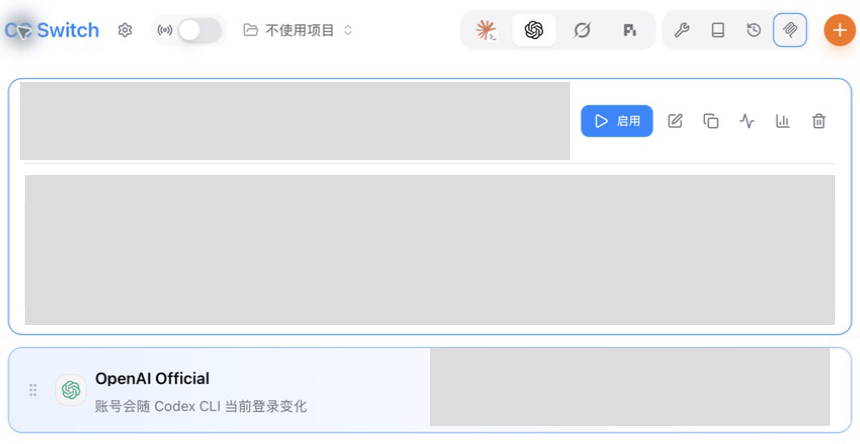
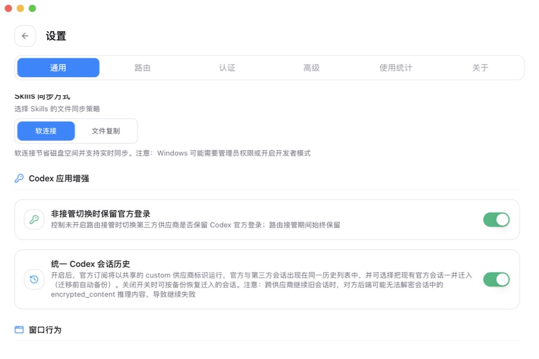
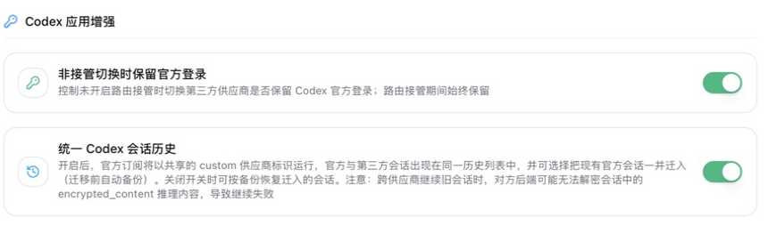

# CC Switch增强功能

如果你有自己的 ChatGPT/OpenAI 账号，但模型额度由已经购买的 Codex 中转站线路提供，推荐按下面的顺序配置：

**先完成官方登录，再开启 CC Switch 的 Codex 应用增强，最后切换中转站线路。**

这样做的目的，是把两件事分开：

| 项目             | 由什么决定                      |
| -------------- | -------------------------- |
| Codex 中显示的登录身份 | 你的 ChatGPT/OpenAI 官方账号     |
| 当前模型请求使用的线路    | CC Switch 中当前启用的 Codex 供应商 |
| 额度、限额和数据处理规则   | 当前中转站线路的实际规则               |

OpenAI 官方文档说明，Codex 本地客户端支持使用 ChatGPT 账号登录，也支持使用 API Key。本文先通过 ChatGPT 账号建立官方登录状态，再让模型请求使用 CC Switch 中的第三方线路。

[OpenAI：Authentication](https://learn.chatgpt.com/docs/auth)

[CC Switch：保留官方登录攻略](https://github.com/farion1231/cc-switch/blob/main/docs/guides/codex-official-auth-preservation-guide-zh.md)

## 开始前确认

请先完成以下准备：

* 已经安装并能打开 Codex 桌面端；
* 已经安装 CC Switch；
* 已经把购买的 Codex 中转站线路导入 CC Switch；
* 有一个可以正常登录的 ChatGPT/OpenAI 账号。

如果还没有安装 CC Switch，请先阅读[安装 CC Switch](an-zhuang-cc-switch.md)。如果还不清楚 CC Switch 的作用，请先阅读[CC Switch 是什么？有什么用？](cc-switch-shi-shen-me-you-shen-me-yong.md)。

本页截图来自 macOS 上的 CC Switch v3.20.0。Windows 版按相同的菜单名称操作；如果实际界面没有“Codex 应用增强”，请先从 CC Switch 官方渠道更新软件。[CC Switch v3.20.0 发布说明](https://github.com/farion1231/cc-switch/releases/tag/v3.20.0)

## 第一步：先启用 OpenAI Official

打开 CC Switch，进入顶部的 **Codex** 页面，找到 **OpenAI Official**。

* 如果卡片已经高亮或显示正在使用，不需要重复操作；
* 如果当前使用的是其他线路，先在 OpenAI Official 卡片上点击“启用”。

_图：先让 OpenAI Official 成为当前供应商。上方灰色区域是已经脱敏的中转站线路卡片，稍后需要点击其“启用”按钮。macOS 实拍，CC Switch v3.20.0。_

## 第二步：在 Codex 中完成官方登录

启动 Codex 桌面端。如果当前没有登录：

1. 点击登录或继续按钮；
2. 在打开的浏览器中登录自己的 ChatGPT/OpenAI 账号；
3. 完成浏览器授权后返回 Codex；
4. 确认 Codex 中能够看到自己的官方账号状态。

OpenAI 官方登录流程会从客户端打开浏览器，登录完成后再把凭据返回 Codex。账号密码、验证码和浏览器登录信息只应填写在 OpenAI 官方登录页面，不要填写到 CC Switch 或发送给售后。[OpenAI：Authentication](https://learn.chatgpt.com/docs/auth) [OpenAI：ChatGPT desktop app](https://learn.chatgpt.com/docs/app)

## 第三步：完全退出 Codex

登录完成后，**完全退出 Codex**。不要只关闭窗口；如果 Codex 仍在系统托盘或菜单栏运行，也要先退出。后面切换线路后再重新打开，使 Codex 重新读取配置。

## 第四步：找到 Codex 应用增强

回到 CC Switch，依次进入：

**设置 → 通用 → Codex 应用增强**

_图：CC Switch 的“设置 → 通用”页面。向下找到“Codex 应用增强”。macOS 实拍，CC Switch v3.20.0。_

这里有两个需要开启的开关：

1. **非接管切换时保留官方登录**
2. **统一 Codex 会话历史**

_图：两个开关均已开启。本文使用非接管切换，因此第一个开关必须保持开启。macOS 实拍，CC Switch v3.20.0。_

## 第五步：开启“非接管切换时保留官方登录”

打开“非接管切换时保留官方登录”开关。

这个开关控制的是：未开启路由接管时，切换到第三方供应商是否保留 Codex 官方登录。

开启后，CC Switch 在写入第三方供应商配置时，会保留 Codex 的官方登录缓存。Codex 中继续显示官方账号是预期结果，不代表模型请求仍在使用官方额度。实际模型线路要看 CC Switch 当前启用的供应商和中转站用量记录。[CC Switch：保留官方登录攻略](https://github.com/farion1231/cc-switch/blob/main/docs/guides/codex-official-auth-preservation-guide-zh.md)

## 第六步：开启“统一 Codex 会话历史”

打开“统一 Codex 会话历史”开关。

开启后，官方和第三方供应商会使用共享的会话归类标识，使开启之后创建的会话出现在同一个历史列表中。[CC Switch：统一 Codex 会话历史攻略](https://github.com/farion1231/cc-switch/blob/main/docs/guides/codex-unified-session-history-guide-zh.md)

首次开启时，如果弹窗中出现“同时迁入现有官方会话历史”，本教程建议：

* 保持该选项不勾选；
* 确认开启统一会话历史；
* 只从现在开始统一新会话。

这样不会改写以前官方会话的归类标签。以前的官方会话可能暂时不出现在第三方线路的历史列表中，但会话文件并没有因此被删除。

如果以后确实需要迁入旧会话，请先阅读 CC Switch 的[统一 Codex 会话历史官方攻略](https://github.com/farion1231/cc-switch/blob/main/docs/guides/codex-unified-session-history-guide-zh.md)，理解自动备份、恢复方式和跨供应商续聊风险后再操作。

## 第七步：切换到中转站线路

返回 CC Switch 的 Codex 供应商页面：

1. 找到已经导入的中转站线路；
2. 确认该线路没有“需要路由”标记；
3. 点击线路卡片上的“启用”；
4. 确认中转站线路已经成为当前供应商；
5. 保持顶部路由接管开关关闭。

不要重新填写或复制官方账号密码，也不要把官方登录凭据粘贴到中转站配置中。中转站线路只使用购买后获得的线路信息。

## 第八步：重新打开 Codex 并验证

重新启动 Codex，先发送一个不含敏感信息的简短测试任务，然后逐项检查：

| 检查项             | 正常结果                   |
| --------------- | ---------------------- |
| Codex 账号位置      | 仍显示自己的官方账号             |
| CC Switch 当前供应商 | 显示已购买的中转站线路            |
| 路由接管            | 保持关闭                   |
| 中转站用量或后台记录      | 测试请求后出现相应变化            |
| 新会话历史           | 开启统一历史后创建的会话可以在共享列表中看到 |

**不要只根据 Codex 显示的账号判断请求走向。** 保留官方登录后，Codex 继续显示官方账号是设计目标；模型请求实际使用哪条线路，应以 CC Switch 当前供应商和中转站记录为准。

## 两个开关分别解决什么问题

| 开关            | 解决的问题                | 不会做什么                    |
| ------------- | -------------------- | ------------------------ |
| 非接管切换时保留官方登录  | 切换第三方供应商时保留官方登录状态    | 不会把中转站变成官方订阅，也不会增加官方账号权限 |
| 统一 Codex 会话历史 | 让官方与第三方的新会话进入同一个历史列表 | 不保证不同供应商都能继续生成同一个旧会话     |

“统一历史”解决的是会话在列表中的归类和可见性，不是把不同供应商的后端变成同一个服务。

## 常见问题

### 为什么 Codex 里仍然显示官方账号？

这是预期行为。官方账号显示来自保留下来的登录状态；模型请求使用哪条线路，由 CC Switch 当前启用的供应商决定。

### 为什么以前的官方会话没有出现在统一列表中？

因为本文默认没有迁入旧会话。旧会话仍保留在原来的归类中，不等于被删除。不要为了让列表重新出现而删除 Codex 或 CC Switch 的数据目录。

### 为什么旧会话能看见，但继续发送消息失败？

不同供应商可能无法解密旧会话中的加密推理内容。出现这种情况时，新建会话后继续任务，不要删除原会话。CC Switch 的统一历史说明也明确提示了这一限制。[CC Switch：统一 Codex 会话历史攻略](https://github.com/farion1231/cc-switch/blob/main/docs/guides/codex-unified-session-history-guide-zh.md)

### 为什么没有看到这两个开关？

先检查 CC Switch 是否为较新的版本，再通过软件内更新入口或[官方发布页面](https://github.com/farion1231/cc-switch/releases)更新。不要从不明网站下载修改版。

### 切换后测试请求没有出现在中转站记录里怎么办？

1. 完全退出 Codex；
2. 在 CC Switch 中确认当前供应商确实是中转站线路；
3. 确认顶部路由接管开关仍然关闭；
4. 重新打开 Codex 并新建会话测试；
5. 仍然异常时，保存报错截图和出现时间，在客户群反馈。

反馈截图必须遮住账号、个人密钥、完整线路地址和其他敏感信息。

### 官方登录相关功能仍然不可用怎么办？

先在 CC Switch 中切回 OpenAI Official，重新启动 Codex 并完成一次官方登录；随后完全退出 Codex，再按本文开启两个开关并切回中转站线路。

具体功能是否开放，仍取决于账号权限、客户端版本和 OpenAI 当前状态。本教程只能保留登录状态，不能为账号增加原本没有的权限。

## 事实核查与资料来源

| 本文中的事实声明                               | 原始来源                                                                                                                                 |
| -------------------------------------- | ------------------------------------------------------------------------------------------------------------------------------------ |
| Codex 本地客户端支持 ChatGPT 登录和 API Key 两种方式 | [OpenAI：Authentication](https://learn.chatgpt.com/docs/auth)                                                                         |
| ChatGPT 桌面端通过账号登录，并可在桌面工作区使用 Codex     | [OpenAI：ChatGPT desktop app](https://learn.chatgpt.com/docs/app)                                                                     |
| 第三方供应商配置可以与官方登录缓存分开保存                  | [CC Switch：保留官方登录攻略](https://github.com/farion1231/cc-switch/blob/main/docs/guides/codex-official-auth-preservation-guide-zh.md)     |
| 统一历史会修改会话归类标识，并支持迁移前备份与关闭后恢复           | [CC Switch：统一 Codex 会话历史攻略](https://github.com/farion1231/cc-switch/blob/main/docs/guides/codex-unified-session-history-guide-zh.md) |
| 跨供应商续聊可能因加密推理内容无法解密而失败                 | [CC Switch：统一 Codex 会话历史攻略](https://github.com/farion1231/cc-switch/blob/main/docs/guides/codex-unified-session-history-guide-zh.md) |
| 截图所用 CC Switch 版本为 v3.20.0             | 本机“设置 → 关于”页面；[CC Switch v3.20.0 发布说明](https://github.com/farion1231/cc-switch/releases/tag/v3.20.0)                                 |
