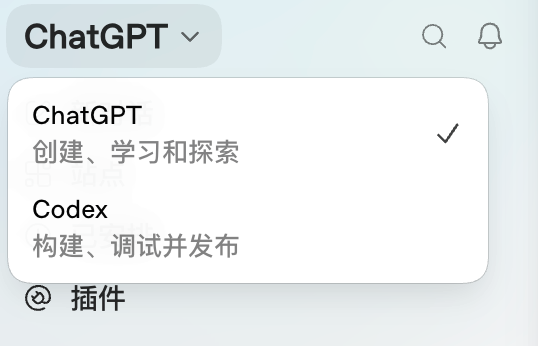
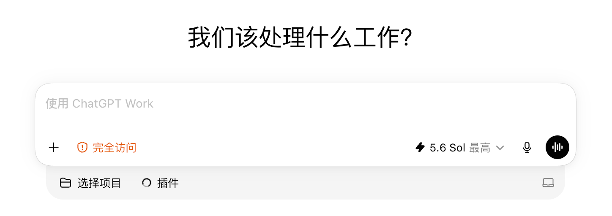

# 入门教程

## 1  ChatGPT（Work）与Codex

<figure><figcaption></figcaption></figure>

图1.1  桌面端ChatGPT的模式切换

<figure><figcaption></figcaption></figure>

图1.2  桌面端ChatGPT的Work模式

<figure><figcaption></figcaption></figure>

图1.3  桌面端ChatGPT的Codex模式

在最新版本中，OpenAI 将 ChatGPT 与 Codex 合并为一个桌面端软件。同时为 ChatGPT 分成了两种模式，分别是 Work 模式和 Codex 模式。那大家的问题主要就在于这两个界面几乎一模一样，那它们到底有什么区别？那通过我们上面的图1.2和图1.3。以及图1.1可以看到，在官方眼里其实是有一定作用和用途的区分的。Word 更适合的是创建、学习和探索。也就是说，它主要围绕项目文件、网页等业务资料展开，主要是用于 创建学习和探索，比如说文件编辑、构建测试、 diff 还有文件生成，还有产出文档、表格、 PPT 等传统的工作文件。

而 CodeX 主要还是更适合软件开发和可执行任务。它默认的是构建、调试并发布，也就是围绕代码去做事。比如说图片上可以显到，它让你去连接代码、构建功能、审查代码和修复问题和失败。比如说它更主要的是做一些 Git 项目规则展开。就是编程相关的。

可以简单一点的理解就是，如果你要让它编程写代码写，那么就用 Codex，其余都使用 Work。

## 2  设置教程

### 2.1  常规

* [ ] 默认权限打开
* [ ] 完全访问权限在使用的前1个月不要打开，根据个人实际体验再决定是否打开
*

'''
