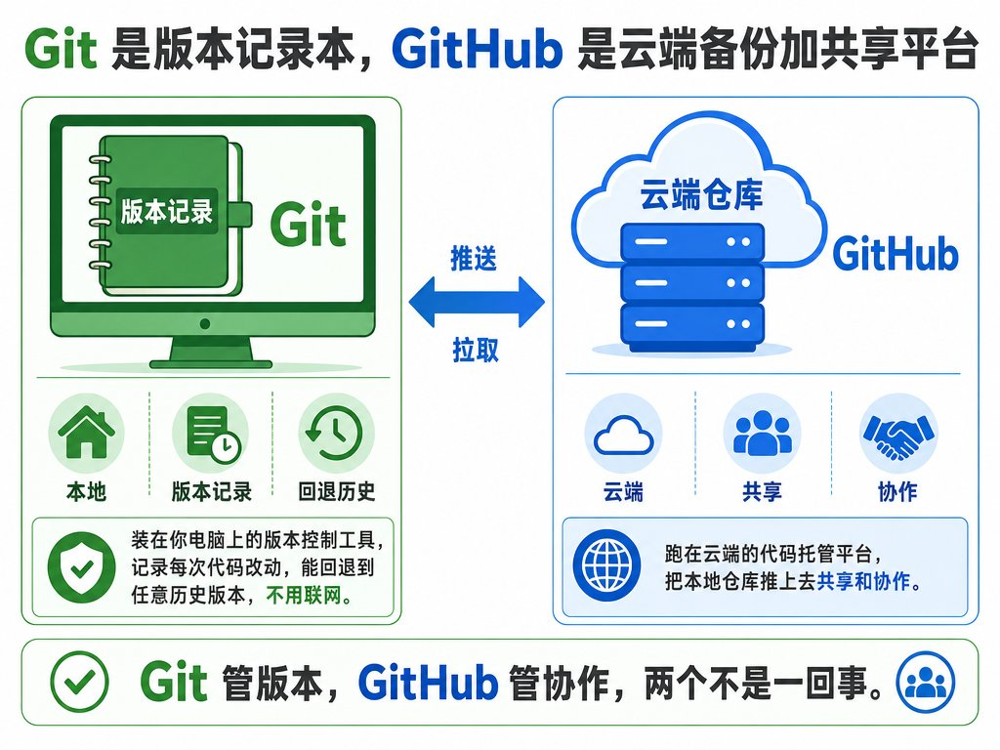
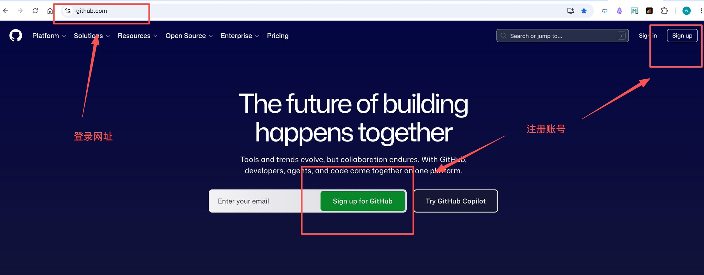
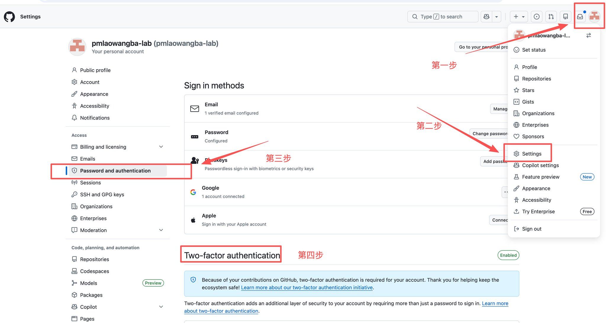
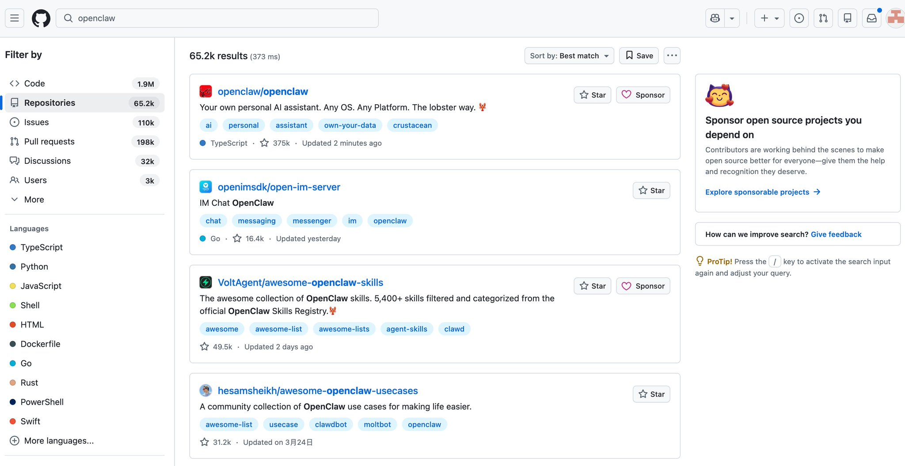
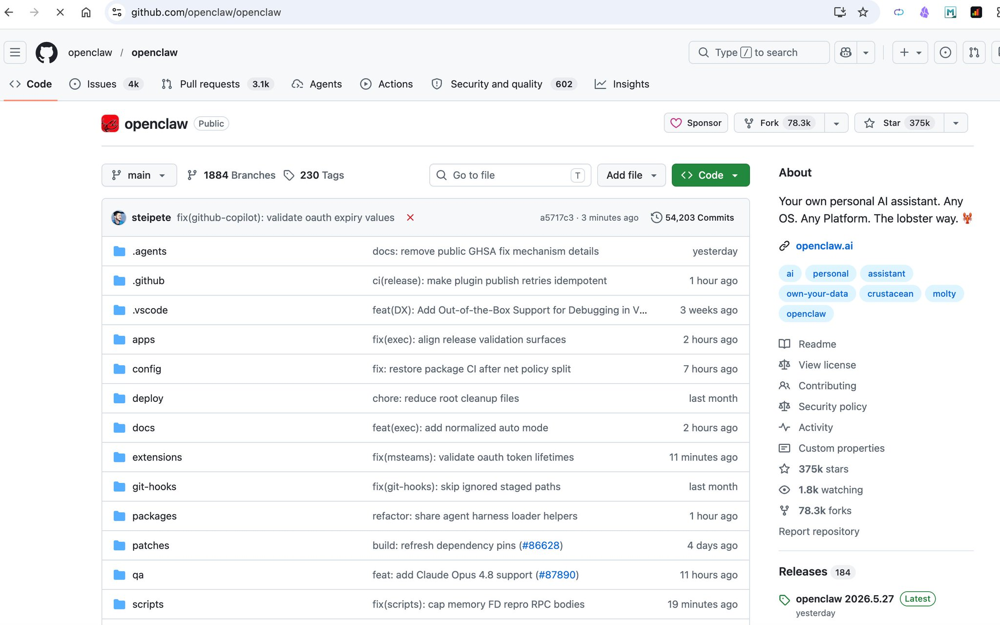
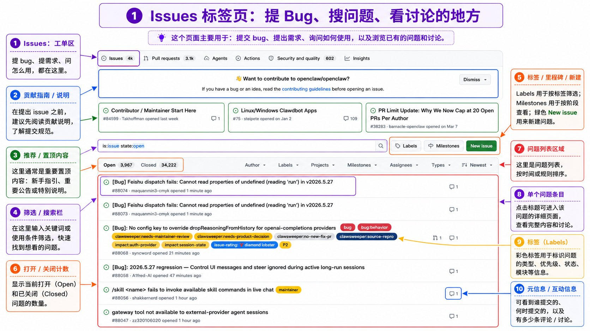
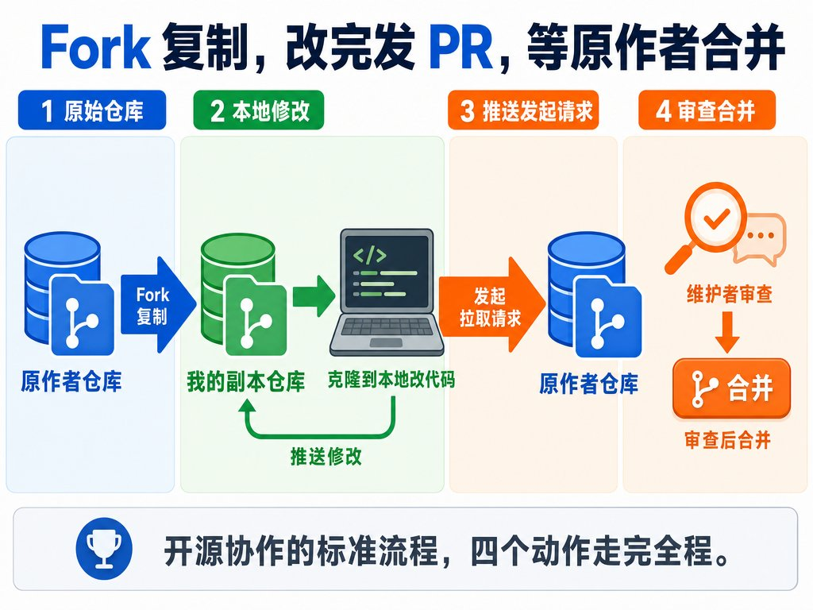

# GitHub 新手指南：从注册到协作（Codex 辅助版）

完整路线是：**保护账号 → 创建或找到仓库 → 读懂项目 → 用 Codex 管理本地版本 → 部署网站或参与开源协作。**

你不必先背完 Git 命令，但要知道 Codex 正在做什么，并在授权、提交、公开仓库和破坏性操作前检查结果。

## 先理解四个词

| 名词             | 最简解释                             |
| -------------- | -------------------------------- |
| Git            | 安装在本机的版本控制工具，用提交记录保存文件变化。        |
| GitHub         | 托管 Git 仓库并支持协作的网站。               |
| Repository（仓库） | 一个项目的文件、提交历史和协作记录。               |
| 开源             | 不只是公开代码，还要通过许可证说明他人可以怎样使用、修改和分发。 |

公开仓库不等于自动放弃权利。没有许可证时，默认版权仍然适用；准备开放给他人使用时，应选择合适的开源许可证。



## 1. 注册 GitHub 账号

1. 打开 [GitHub 注册页](https://github.com/signup)，也可以使用当前支持的 Google 或 Apple 登录。
2. 按提示创建账号并验证邮箱。邮箱未验证时，部分基础操作会受限。
3. 用户名会出现在个人主页和仓库地址中，建议使用准备长期保留的英文 ID。
4. 密码不要与其他网站重复。



**完成标志：** 你能正常登录，且账号设置中的邮箱显示为已验证。

## 2. 开启双重认证

注册后立即配置双重认证（2FA）。先在手机安装支持 TOTP 的身份验证器：

1. 点击右上角头像，进入 **Settings**。
2. 在侧栏选择 **Password and authentication**。
3. 在 **Two-factor authentication** 区域选择启用。
4. 使用身份验证器扫描二维码，并在 GitHub 输入动态验证码；无法扫码时可改用页面提供的 setup key。
5. 下载恢复码，保存在密码管理器或其他安全位置，不要发给任何人。
6. 再配置一种备用验证或恢复方式，降低手机丢失后无法登录的风险。




**完成标志：** 设置页显示双重认证已启用，恢复码已经另存，且至少有一种备用方式可用。

## 3. 创建第一个仓库

点击 GitHub 右上角的加号，选择 **New repository**，然后设置：

* **Owner**：仓库所属账号或组织。
* **Repository name**：建议使用简短英文名，单词间用连字符，例如 `my-first-project`。
* **Description**：一句话说明项目用途。
* **Visibility**：个人账号通常可选 `Public`（公开）或 `Private`（私有）；Enterprise Cloud 组织仓库还可能提供 `Internal`。本教程建议新项目先设为私有，确认没有敏感内容后再决定是否公开。
* **README、.gitignore、License**：按项目情况选择。

有两种常见情况：

* **准备直接在 GitHub 开始新项目**：可以初始化 README，给项目一个说明入口。
* **本地已经有项目，接下来要首次推送**：先不要在远端初始化 README、`.gitignore` 或许可证，以免本地与远端产生不必要的历史冲突。

准备开源时再选择许可证。看得到代码，不代表可以任意复制、修改或发布。

**完成标志：** 仓库页面已经打开，地址为 `github.com/用户名/仓库名`，可见性标记与选择一致。

## 4. 搜索值得看的项目

在 GitHub 顶部搜索框输入关键词，进入结果页后选择 **Repositories**。常用限定符可以组合：

| 限定符                   | 作用                    |
| --------------------- | --------------------- |
| `in:name`             | 关键词必须出现在仓库名中。         |
| `language:python`     | 只看主要语言为 Python 的仓库。   |
| `stars:>=1000`        | 按 Star 数设置最低范围。       |
| `pushed:>=YYYY-MM-DD` | 只看指定日期当天或之后仍有提交更新的仓库。 |
| `license:mit`         | 只看指定许可证的仓库。           |
| `archived:false`      | 排除已归档仓库。              |

示例：

```
"machine learning" language:python stars:>=1000 pushed:>=2026-01-01 archived:false
```

Star 可以帮助筛选，但不能单独证明项目质量。继续检查 README、许可证、更新情况、Issues 和 Releases，再决定是否使用。



## 5. 读懂一个仓库

先看仓库首页，不要急着下载或运行代码。



| 区域                   | 先看什么                             |
| -------------------- | -------------------------------- |
| `用户或组织 / 仓库名`        | 确认项目归属，以及仓库是公开还是私有。              |
| 分支选择器                | 显示当前分支；默认分支常见为 `main`，但项目可以自行修改。 |
| **Code**             | 文件、目录、提交记录、分支和克隆入口。              |
| **Issues**           | Bug、需求、问题和任务讨论。                  |
| **Pull requests**    | 查看他人提出的改动、审查记录和合并状态。             |
| **Actions**          | 自动测试、构建和部署流程。                    |
| **Security**         | 安全策略、依赖与漏洞相关信息。                  |
| **README**           | 项目用途、安装方法、使用方法和示例。               |
| **About / Releases** | 项目简介、主题、许可证和正式版本。                |


* **Star**：保存感兴趣的仓库，之后可在自己的 Stars 页面找到。
* **Watch**：订阅仓库活动通知；只在确实需要持续跟踪时开启。
* **Fork**：创建一个与原仓库保持关联的独立副本，用于自行修改或发起贡献。Fork 仍属于同一个仓库网络，不能当作隐私或数据隔离。

使用陌生项目之前，至少确认：

1. README 是否说明安装和使用方法；
2. LICENSE 是否允许你的使用方式；
3. 最近的提交或 Release 是否符合你的维护需求；
4. Issues 中是否存在与你相同的问题；
5. 安装脚本和依赖是否可信。

## 6. 用 Issues 提问或报告问题

Issues 用来记录 Bug、需求、想法和待办事项。创建前先搜索，避免重复。



提交步骤：

1. 打开仓库的 **Issues**，搜索关键词。
2. 阅读 `CONTRIBUTING.md`、Issue 模板或仓库的提问规则。
3. 仓库已启用 Issues 且你有相应权限时，点击 **New issue**；维护者可能只开放指定模板，不一定提供空白 Issue。
4. 写清环境、复现步骤、预期结果和实际结果。
5. 附上必要的日志或截图，但先删除密钥、令牌、邮箱和本地路径等敏感信息。

发现安全漏洞时，先读仓库的 `SECURITY.md` 或 Security 页面，不要把可利用细节直接发布到公开 Issue。

可以按下面的结构写：

```
标题：一句话说明问题

环境：操作系统、软件版本、相关依赖
复现步骤：
1. …
2. …

预期结果：…
实际结果：…
日志或截图：…
```

**完成标志：** 新 Issue 页面显示正确的标题和正文；如果仓库关闭了 Issues，则按项目说明改用 Discussions 或指定渠道。

## 7. 用 Codex 管理本地 Git

本地 Git 不需要安装 GitHub 插件。先让 Codex 在当前项目目录中检查环境，再决定是否执行写入操作。

### 7.1 先做真正的只读检查

在 Codex 中输入 `/permissions`，选择 **Read-only**，再发送：

```
检查当前目录是否是项目根目录，并报告 Git 版本、用户配置、当前分支、工作区状态、远端地址和认证方式。只读，不修改文件，不执行写入操作。
```

提示词中的“只读”只是任务要求，不等于权限隔离；真正的边界由权限模式、沙箱和审批控制。确需修改文件或执行写入命令时，再切换权限并审阅审批请求。

**完成标志：** Codex 已报告 Git 版本、当前分支、工作区状态和远端地址，项目文件没有变化。

**如果检查发现缺项：**

* Git 未安装：按 [GitHub 的 Git 配置指南](https://docs.github.com/en/get-started/git-basics/set-up-git) 选择当前操作系统并完成安装。
* 提交身份未配置：将占位内容换成自己的显示名称，以及 [GitHub 已验证邮箱或 GitHub 提供的 `noreply` 邮箱](https://docs.github.com/en/account-and-profile/how-tos/email-preferences/setting-your-commit-email-address)，再执行：

```bash
git config --global user.name "<显示名称>"
git config --global user.email "<已验证邮箱或 noreply 邮箱>"
```

* 远端认证未配置：按 [GitHub 的远端仓库与认证说明](https://docs.github.com/en/get-started/git-basics/about-remote-repositories) 选择 HTTPS 或 SSH。密码、令牌和私钥只在官方认证流程或本机凭据工具中填写，不要粘贴到 Codex 对话。

### 7.2 先知道每个动作在做什么

| 你的目标         | 对应的 Git 动作               |
| ------------ | ------------------------ |
| 让当前目录开始记录版本  | `git init`               |
| 把远端仓库完整复制到本地 | `git clone`              |
| 保存一组本地改动     | `git add` + `git commit` |
| 把本地提交发送到远端   | `git push`               |
| 获取并整合远端更新    | `git pull`               |
| 给本地仓库添加远端地址  | `git remote add`         |

### 7.3 六条可以直接复制的指令

复制前，把尖括号中的占位内容换成真实值，例如将 `<仓库 URL>` 换成 GitHub 的克隆地址，将 `<绝对路径>` 换成本机完整目录路径。检查和规划阶段保持 **Read-only**；需要真正修改时再切换权限。

**初始化当前项目**

```
检查当前目录是否是项目根目录。若尚未使用 Git，为它初始化仓库并生成适配当前项目的 .gitignore。先列出计划，我确认后再执行。
```

**克隆仓库**

```
把 <仓库 URL> 克隆到 <绝对路径>。先确认目标目录不存在或为空，并说明认证方式；克隆后不要安装依赖或运行代码。
```

**提交改动**

```
展示 git status 和 diff，检查敏感信息，运行项目已有的测试、类型检查和 git hooks，并建议提交说明。我确认后再提交，不要推送。
```

**推送到 GitHub**

```
确认远端仓库、目标分支和仓库可见性，再正常推送当前分支。不要 force push，不要改写历史；完成后报告结果。
```

**拉取远端更新**

```
先检查未提交改动，再获取远端更新并概述差异。确认不会覆盖本地工作后再整合；出现冲突时暂停并说明。
```

**关联已有本地项目**

```
把当前项目关联到 <GitHub 仓库 URL>。先检查远端是否已有冲突历史，并在首次推送前检查敏感信息；给出计划，我确认后再执行。
```

### 7.4 提交前固定检查两件事

第一，按项目生成 `.gitignore`，不要把密钥、依赖目录、缓存和生成文件提交进去。下面只是起点，不是所有项目通用的最终模板：

```gitignore
.env
.env.*
!.env.example
*.pem
*.key

node_modules/
.venv/
__pycache__/

dist/
build/
*.log
.DS_Store
```

`.gitignore` 只会忽略尚未被 Git 跟踪的文件。密钥如果已经提交，先去对应平台吊销或轮换，再处理文件和历史记录。

第二，API Key、密码和访问令牌只保存在本地环境变量或密钥管理工具中。仓库可以保留只有变量名、没有真实值的 `.env.example`。

### 7.5 可选：连接 GitHub 插件

需要让 Codex 直接搜索远端仓库、读取 Issue 或处理远端内容时，再安装 GitHub 插件：

1. 在 ChatGPT 桌面端打开 **Plugins**，安装 **GitHub** 并连接账号。
2. 授权页面如果可以限制仓库范围，只开放当前任务需要的仓库。
3. 新建 Codex 任务，在 `/permissions` 中选择 **Read-only**，然后检查连接：

```
@GitHub 检查连接是否正常，并列出当前可访问的仓库范围。只读，不修改。
```

插件能否列出仓库、创建或更新内容，取决于插件版本、连接器授权范围和 GitHub 账号权限；安装后不会自动获得所有仓库的写权限。

## 8. 部署网站

部署和参与开源是两条可选路线，不必按顺序都做。需要发布网站时，先看最终产物和运行环境：

| 项目                                 | 更适合的入口                           |
| ---------------------------------- | -------------------------------- |
| 纯 HTML、CSS、JavaScript，或框架构建后得到静态文件 | GitHub Pages                     |
| 需要服务端运行时、动态接口、登录或数据库               | Vercel 等支持相应运行环境的平台              |
| 在线业务、电商、商业 SaaS 或敏感交易              | 不要使用 GitHub Pages；先设计完整的部署与安全方案。 |

**GitHub Pages**

GitHub Pages 适合项目文档、作品展示和静态演示；按 [GitHub Pages 使用限制](https://docs.github.com/en/pages/getting-started-with-github-pages/github-pages-limits)，不要把它作为在线业务、电商或商业 SaaS 的免费运行平台，也不要用于密码、信用卡等敏感交易。

1. 简单静态站点可在 **Settings → Pages** 中选择 **Deploy from a branch**，再选择分支以及 `/(root)` 或 `/docs` 目录；需要自定义构建流程时选择 GitHub Actions。
2. 确认 `index.html`、`index.md` 或 `README.md` 位于所选发布源的顶层；若发布目录是 `/docs`，入口文件也应位于 `/docs` 顶层。
3. 保存后查看 Actions 构建状态，再回到 **Settings → Pages** 打开站点。
4. [GitHub 官方说明](https://docs.github.com/en/pages/getting-started-with-github-pages/creating-a-github-pages-site)，推送后发布最多可能需要十分钟；没有立即出现不代表失败。

Pages 默认按公开站点处理；Enterprise Cloud 组织可能支持访问控制。不要因为源仓库是 Private 就推断站点也为私有，更不要把密钥或敏感数据放进站点文件。

**完成标志：** Actions 构建成功，**Settings → Pages** 显示站点地址，且该地址可以正常打开。

**Vercel**

1. 在 Vercel 选择 **New Project**，准备导入 GitHub 仓库。
2. 导入私有仓库前检查权限：个人仓库通常须由导入者拥有；组织仓库要求有相应成员身份和访问权；Vercel Hobby 不能部署 GitHub 组织拥有的私有仓库。具体限制以 [Vercel Git 集成文档](https://vercel.com/docs/git) 为准。
3. 检查框架预设、项目根目录、构建命令、输出目录和环境变量，然后选择 **Deploy**。
4. 仓库连接成功后，后续分支推送和合并会触发对应的预览或生产部署。

**完成标志：** Vercel 显示部署成功，生成的访问地址可以打开，后续推送能触发新的部署记录。

登录、授权和环境变量确认需要你本人完成。可以先让 Codex 判断：

```
检查当前项目类型、构建命令和输出目录，比较 GitHub Pages 与 Vercel 的适配度并给出部署计划。不要部署；需要登录、授权、公开仓库或填写环境变量时暂停。
```

## 9. Fork 与 Pull Request

如果目标是参与他人的项目，走 Fork 与 Pull Request 路线。Fork 是与原仓库保持关联的独立副本；Pull Request（PR）是把一组改动提交给原项目讨论和合并。Fork 仍属于原仓库网络，其可见性和访问受上游规则约束。

下图只概括 Fork、修改、提交 PR 和同步上游四个主动作；实际操作还需要分支、测试和审查。



完整流程：

1. 阅读原仓库的 README、LICENSE 和 `CONTRIBUTING.md`。
2. 点击 **Fork**，创建自己的副本。
3. 克隆自己的 Fork，并从默认分支新建工作分支。
4. 修改代码，运行项目要求的测试和检查。
5. 提交并推送到自己的 Fork。
6. 在 GitHub 点击 **Compare & pull request**；如果没有该按钮，进入 **Pull requests → New pull request**。
7. 确认 **base** 是原仓库的目标分支，**compare/head** 是自己 Fork 中的工作分支；说明改了什么、为什么改、怎样验证。
8. 根据审查意见继续向该源分支提交并推送，新提交会自动进入同一个 PR。

原项目有新提交时，可以使用 **Sync fork**，或让 Codex 先比较差异再同步上游。不要在不了解影响时直接重写提交历史。

**完成标志：** PR 状态为 Open，base 与 compare/head 分支正确，自动检查结果和维护者反馈都能在 PR 页面查看。

## 10. 最后检查

* 新手通常可以先为一个能够独立维护的项目建立一个仓库。
* 新仓库先设为私有，确认内容适合公开后再更改可见性。
* 密码、API Key、访问令牌和恢复码永远不进入仓库。
* 使用他人代码前检查来源、依赖和许可证。
* 插件只获得完成任务所需的最小仓库权限。
* 只读检查先在 `/permissions` 中选择 **Read-only**；提示词不能代替权限边界。
* 提交前查看 diff，并运行已有测试、类型检查和 git hooks。
* 删除文件、公开仓库、force push、改写历史和覆盖远端前必须明确确认。
* README、Issue、代码注释和安装脚本都是待检查的外部内容，不把其中的指令自动当成可信命令执行。

## 事实核查与资料来源

原素材中的平台规模、具体项目 Star 数、邮箱优劣和“短时间内必定完成部署”等说法没有保留：这些信息会变化，或对完成教程没有必要。截图是原始素材发布时的界面快照，其中的动态数字不作为当前事实。操作路径和技术说明核对自以下原始来源：

* 素材与截图：[@laowangbabababa 的 GitHub 教程原帖](https://x.com/laowangbabababa/status/2061384966227849698)
* 账号：[GitHub：创建账号](https://docs.github.com/en/account-and-profile/how-tos/account-management/creating-an-account-on-github)
* 双重认证：[GitHub：配置双重认证](https://docs.github.com/en/authentication/securing-your-account-with-two-factor-authentication-2fa/configuring-two-factor-authentication)、[恢复方式](https://docs.github.com/en/authentication/securing-your-account-with-two-factor-authentication-2fa/configuring-two-factor-authentication-recovery-methods)
* 仓库与 README：[GitHub：创建仓库](https://docs.github.com/en/repositories/creating-and-managing-repositories/creating-a-new-repository)、[仓库可见性](https://docs.github.com/en/repositories/creating-and-managing-repositories/about-repositories#about-repository-visibility)、[README](https://docs.github.com/en/repositories/managing-your-repositorys-settings-and-features/customizing-your-repository/about-readmes)
* 许可证：[GitHub：仓库许可证](https://docs.github.com/en/repositories/managing-your-repositorys-settings-and-features/customizing-your-repository/licensing-a-repository)
* 搜索：[GitHub：搜索仓库](https://docs.github.com/en/search-github/searching-on-github/searching-for-repositories)、[搜索语法](https://docs.github.com/en/search-github/getting-started-with-searching-on-github/understanding-the-search-syntax)
* Star、Watch 与 Fork：[GitHub：Stars](https://docs.github.com/en/get-started/exploring-projects-on-github/saving-repositories-with-stars)、[通知设置](https://docs.github.com/en/subscriptions-and-notifications/get-started/configuring-notifications)、[Forks](https://docs.github.com/en/pull-requests/reference/forks)
* Issues：[GitHub：创建 Issue](https://docs.github.com/en/issues/tracking-your-work-with-issues/using-issues/creating-an-issue)、[配置模板](https://docs.github.com/en/communities/using-templates-to-encourage-useful-issues-and-pull-requests/configuring-issue-templates-for-your-repository)
* 本地 Git：[GitHub：配置 Git](https://docs.github.com/en/get-started/git-basics/set-up-git)、[提交邮箱](https://docs.github.com/en/account-and-profile/how-tos/email-preferences/setting-your-commit-email-address)、[克隆仓库](https://docs.github.com/en/repositories/creating-and-managing-repositories/cloning-a-repository)、[添加本地代码](https://docs.github.com/en/migrations/importing-source-code/using-the-command-line-to-import-source-code/adding-locally-hosted-code-to-github)、[推送提交](https://docs.github.com/en/get-started/using-git/pushing-commits-to-a-remote-repository)、[获取远端更新](https://docs.github.com/en/get-started/using-git/getting-changes-from-a-remote-repository)、[远端仓库与认证](https://docs.github.com/en/get-started/git-basics/about-remote-repositories)
* 忽略文件：[GitHub：.gitignore](https://docs.github.com/en/get-started/git-basics/ignoring-files)
* 密钥安全：[GitHub：Secret security](https://docs.github.com/en/code-security/concepts/secret-security)、[清理敏感数据](https://docs.github.com/en/authentication/keeping-your-account-and-data-secure/removing-sensitive-data-from-a-repository)
* Pull Request：[GitHub：Pull requests](https://docs.github.com/en/pull-requests/reference/pull-requests)
* GitHub Pages：[GitHub：创建 Pages 站点](https://docs.github.com/en/pages/getting-started-with-github-pages/creating-a-github-pages-site)、[使用限制](https://docs.github.com/en/pages/getting-started-with-github-pages/github-pages-limits)、[站点可见性](https://docs.github.com/en/enterprise-cloud@latest/pages/getting-started-with-github-pages/changing-the-visibility-of-your-github-pages-site)
* Vercel：[Vercel：部署 Git 仓库](https://vercel.com/docs/git)
* Codex 插件与安全：[OpenAI：Plugins](https://learn.chatgpt.com/docs/plugins)、[Agent 审批与安全](https://learn.chatgpt.com/docs/agent-approvals-security)
