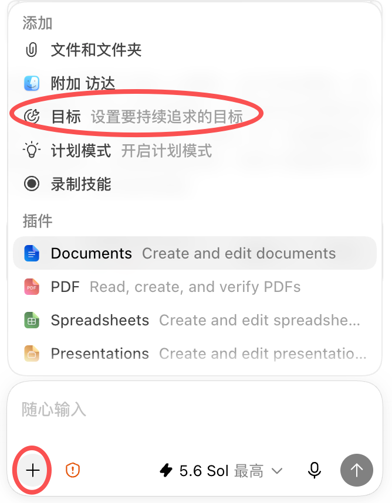

# Codex 桌面端「目标」模式：让长任务持续推进

普通任务适合一问一答；「目标」模式适合需要连续读取资料、修改文件、检查结果，再根据真实结果继续推进的长任务。

它会给当前聊天设置一个要持续追求的目标。只要聊天处于可继续工作的状态，Codex 就会围绕这个目标推进，直到达成完成条件、需要你决策、被你暂停，或受到使用额度等条件限制。它不是“无限运行”开关，真正决定效果的是目标是否清楚、边界是否安全、完成条件能否验证。[OpenAI：Long-running work](https://learn.chatgpt.com/docs/long-running-work)

## 从左下角「+」打开目标模式

在 Codex 桌面端的消息输入框左下角，点击 **+**，然后选择 **目标**。当前桌面端在这个入口下方给出的说明是：**设置要持续追求的目标**。

选中后，输入框会切换到目标模式。此时直接写下目标并发送即可。



_图：当前 Codex 桌面端真实界面。点击输入框左下角的 +，选择“目标”，即可设置要持续追求的目标。截图由本文作者提供。_

目标模式的输入提示强调两件事：描述目标，并定义可衡量的成果。换句话说，不要只告诉 Codex “做什么”，还要告诉它“做到什么程度才算完成”。

## 什么任务适合设为目标

适合的任务通常有一个主要结果，但要经过多步工作才能完成，例如：

* 修复一组相互关联的测试失败，并反复验证；
* 完成一次代码迁移，同时保留原有行为；
* 整理大量资料，生成可检查的文档或数据文件；
* 根据测试、截图或评审结果持续改进一个原型；
* 复现一个实验，并明确区分成功、近似结果和未验证部分。

简单问答、解释一段报错、修改一句文案，或者彼此无关的一串待办，通常不需要目标模式。OpenAI 建议把相关工作留在同一聊天里，让 Codex 使用同一份上下文判断下一步；独立任务则应分开处理。[OpenAI：Long-running work](https://learn.chatgpt.com/docs/long-running-work)

## 一个好目标要写清什么

OpenAI 当前的长任务指南把核心内容归纳为结果、约束和验证。实际使用时，再补上开始前要读取的资料，以及必须暂停的情况，会更稳妥。

| 要素  | 要写清的问题                 |
| --- | ---------------------- |
| 结果  | 最终要交付什么，而不只是要执行什么动作    |
| 上下文 | 开始前必须读取哪些文件、说明、日志或参考资料 |
| 边界  | 可以改什么，不能改什么，哪些决定必须先问你  |
| 验证  | 用什么测试、数据、截图或人工检查证明结果有效 |
| 停止  | 何时算完成，遇到什么情况必须暂停并说明阻塞  |

### 不会写目标？先让 Codex 帮你起草

这个思路完全可行，而且很适合第一次使用目标模式的人。OpenAI 的官方指南也建议：当结果还不够清楚时，先让 Codex 通过提问梳理约束，再把信息整理成带有可衡量成功标准的目标。[OpenAI：Long-running work](https://learn.chatgpt.com/docs/long-running-work)

普通对话就可以完成这件事。如果连最终交付物都还没有想清楚，也可以从同一个 **+** 菜单选择 **计划模式**，让 Codex 先做访谈和整理。无论使用哪一种方式，都建议先让它提交目标草稿，等你检查并确认后，再从 **+ → 目标** 正式启动。

可以直接把下面这段发给 Codex：

```
我有一个想法，但还不会把它写成可执行的目标。

现在先不要执行任务，也不要替我启动目标。
请先通过提问补齐这些信息：
- 最终要交付什么；
- 开始前必须读取哪些资料；
- 可以改什么，不能改什么；
- 用什么证据判断已经完成；
- 遇到什么情况必须暂停并询问我。

信息足够后，请整理出一份可以直接放进 Codex“目标”模式的完整目标。
先把草稿交给我审核，等我确认后再开始执行。

我的初步想法是：……
```

这一步最好和正式执行分开。目标文字既是任务的起点，也是 Codex 判断是否完成的标准；先审一遍草稿，可以及时补上遗漏的边界和验收条件。[OpenAI：Long-running work](https://learn.chatgpt.com/docs/long-running-work)

下面这种目标是失败的，因为“好”没有准确的定义：

```
把这个项目优化好。
```

可以改成：

```
修复当前项目中已有的测试失败，并保持既有用户行为不变。

开始前读取项目说明、协作规则、测试配置和当前失败日志。
允许修改与失败直接相关的源码和测试实现；不要删除测试、放宽断言、
跳过安全检查，也不要自行升级依赖的大版本。

每完成一个检查点，运行项目现有的测试、类型检查和构建流程，
根据真实输出决定下一步，并保留简短的进度记录。

完成条件：现有检查通过，并交付修改文件、验证方式、实际结果和剩余风险。
如果需要账号、密钥、产品取舍或扩大修改范围，先暂停并说明阻塞。
```

重点是让 Codex 能判断：现在离完成还有多远，下一步应该验证什么，什么时候不能再自行推进。

## 运行中怎么查看和调整

目标开始后，输入框上方会出现目标进度栏。你可以在这里查看当前目标，并直接执行这些操作：

* **编辑目标**：调整结果、边界或完成条件；
* **暂停目标**：让 Codex 暂时停止继续推进；
* **恢复目标**：让已暂停的目标继续工作；
* **清除目标**：结束当前目标状态；
* **展开目标**：查看完整目标内容。


_图：OpenAI 官方提供的 Codex 桌面端真实界面截图。中文界面中的对应操作为编辑目标、恢复目标、清除目标和展开目标。来源：_[_OpenAI：Long-running work_](https://learn.chatgpt.com/docs/long-running-work)_。_

如果目标方向没有变化，只是需要补充资料或收紧限制，可以继续在同一聊天中发送消息。需要改变最终结果时，优先编辑目标，避免新要求与旧完成条件互相冲突。

当前桌面端在替换目标时会保留聊天内容，但会用输入框中的新文本替换已保存的目标。因此，编辑前要重新检查完成条件，不能只改其中一句而忘记前后约束。

## 离开电脑前要检查什么

如果希望 Codex 在你离开后继续处理本地任务，先确认：

* 目标里已经写明完成条件和必须暂停的情况；
* 当前权限足以完成预期操作，不需要等待你批准下一步；
* 项目、文件和必要的本地服务仍然可用；
* 桌面端保持运行，并在设置中开启 **运行时防止系统休眠**。

OpenAI 的桌面端指南也建议在本地长任务运行时开启防休眠设置。[OpenAI：Long-running work](https://learn.chatgpt.com/docs/long-running-work)

目标模式不会自动扩大 Codex 的权限。它仍然受当前沙箱、审批方式和网络权限约束；遇到需要人工决定的事项时，应该暂停并等待，而不是绕过限制。[OpenAI：Permissions](https://learn.chatgpt.com/docs/permission-modes)

## 它为什么会停下来

桌面端会区分进行中、已暂停、已达成、已停滞、目标受限和使用受限等状态。因此，“持续追求”不等于永远循环。

常见的停止原因包括：

* 已经满足目标中的完成条件；
* 目标被你暂停或清除；
* 缺少资料、权限或必须由你做出的决定；
* 工作无法继续取得可验证的进展；
* 当前使用额度或目标预算受到限制；
* 电脑休眠、应用退出或本地环境不可用。

这正是目标模式比一句“继续做下去”更可靠的地方：它要求 Codex 围绕完成条件持续推进，也允许它在无法安全继续时明确停下。

## 最后怎么验收

不要只看“已达成目标”这句话。至少检查：

* 交付物是否真的存在，格式是否正确；
* 修改了哪些文件，是否超出允许范围；
* 实际运行了哪些验证，结果是什么；
* 完成条件是否逐项满足；
* 是否还有近似结果、未验证部分或剩余风险；
* 如果曾经阻塞，阻塞是否真的解决。

测试通过、构建成功、可复查的截图、产物文件和日志，都可以成为证据。选择哪一种，取决于任务本身。

## 常见错误

* 把多个无关任务塞进同一个目标；
* 只写“做好”“优化”“更专业”，不给验收条件；
* 为了通过检查而删除测试、降低标准或绕过安全检查；
* 不限定可修改的文件、可执行操作和外部系统；
* 同时让多个聊天修改同一批文件，造成相互覆盖；
* 把接近目标的结果当成已经完成；
* 离开电脑前没有处理权限请求，也没有开启防休眠。

可以把目标压缩成一句公式：

```
目标 = 可验收的结果 + 明确的边界 + 可重复的验证 + 清楚的停止条件
```

Codex 能不能持续把事情往前推进，不取决于你有没有催它“继续”，而取决于这份目标是否让它在每个检查点之后都能安全地判断下一步。

## 参考资料

* [OpenAI：Long-running work](https://learn.chatgpt.com/docs/long-running-work)
* [OpenAI：Follow a goal](https://learn.chatgpt.com/use-cases/follow-goals)
* [OpenAI：Permissions](https://learn.chatgpt.com/docs/permission-modes)
* 界面名称与状态文案：本机当前 Codex 桌面端内置简体中文资源
