# HarnessX：可组合、自适应且可演化的智能体运行支架铸造平台（中文）

**原文来源：** [arXiv:2606.14249](https://arxiv.org/abs/2606.14249)

本文为上述论文的中文译文。文中的数据、引语与判断均归属于原作者；核对原意时请参阅本页下方的“英文原文”。

**作者：** Darwin Agent Team **版本：** arXiv:2606.14249v1 \[cs.AI]，2026 年 6 月 12 日 **说明：** 完整作者名单见“作者贡献与致谢”。

### 摘要

AI 智能体的性能在很大程度上取决于智能体运行支架（agent harness）：它由提示词、工具、记忆和控制流构成，调节着模型观察、推理与行动的方式。然而，当前的支架大多仍由人工构建且静态不变：每遇到新模型或新任务，依然需要定制脚手架（scaffolding）；执行过程中产生的丰富轨迹（trace）也很少被提炼并反馈为系统性改进。本文提出 **HarnessX**，一个用于构建可组合、自适应且可演化智能体运行支架的铸造平台（harness foundry）。HarnessX 通过替换代数（substitution algebra）组装带类型的（typed）支架原语（harness primitive）；借助 AEGIS 对其进行适应，AEGIS 是一个由轨迹驱动的多智能体演化引擎，其基础是符号适应与强化学习（RL）之间的操作镜像（operational mirror）；同时，HarnessX 将轨迹转化为支架更新和模型训练信号，从而闭合支架与模型之间的循环。在五个基准（ALFWorld、GAIA、WebShop、$\tau^3$-Bench 和 SWE-bench Verified）上，HarnessX 平均提升 14.5 个百分点（最高 44.0 个百分点），且基线越低，提升越大。这些结果表明，智能体的进步不必仅依赖模型规模扩张：根据执行反馈来组合和演化运行时接口，是一项切实可行且与模型扩展互补的演化杠杆（lever）。完整代码库将在未来版本中开源。

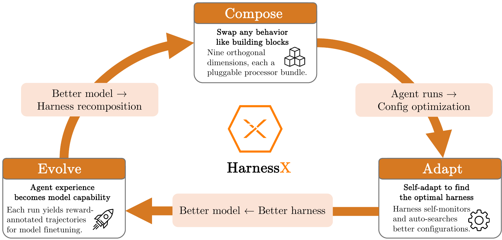

## 1 引言

现代智能体的能力不仅取决于底层模型 \[6, 9, 42, 36]，还取决于周&#x8FB9;_&#x652F;&#x67B6;_&#x65BD;加的中介机制 \[24, 20, 2]。支架决定任务如何表示、如何访问外部服务，以及执行过程中如何传递中间决策，从而将模型的原始输出转化为结构化的智能体行为。随着智能体开始处理更长周期、环境更丰富的任务，支架设计已成为智能体开发中不可或缺的一环。

尽管支架如此重要，其开发距离成熟的工程学科仍相去甚远。_首先_，支架由人工设计且静态不变：模型版本、工具或问题领域一旦变化，就需要专门修改，且缺乏由经验驱动的改进机制。_其次_，支架在架构上彼此纠缠：提示词模板、工具封装、重试策略与记忆通常混杂在同一代码路径中，修改一个组件会悄然破坏其他组件；跨领域复用也只能依靠复制，而非组合。_第三_，支架工程与模型训练各自独立：改进支架时收集的轨迹数据会被丢弃，而不是纳入模型训练；模型能力的提升也不会转化为支架的改进。

为弥补这些缺口，我们将支架视为一个可组合、可适应并可与模型共同演化&#x7684;_&#x4E00;等对象（first-class object）_。HarnessX 以统一支架铸造平台的形式体现了这一原则。它首先建立模块化基础：用带类型的接口描述覆盖上下文、工具 \[7]、技能、控制和记忆的支架原语，再通过替换代数进行组合。由此，现有系统通常混杂在一起的关注点得以分离。在这一底层基础上，我们引入了 AEGIS，一个由可观测性（observability）驱动、可审计的支架适应引擎。若不把支架适应视为临时拼凑式编辑，而是视为针对符号工件（symbolic artifact，包括提示词 \[52]、工具、记忆与控制策略）的学习问题，便会发现标准 RL 中的病态现象会转化为具体的设计风险，包括奖励黑客（reward hacking）、灾难性遗忘（catastrophic forgetting）\[15] 和探索不足（under-exploration）\[16]。为应对这些风险，AEGIS 将完整轨迹可观测性与四阶段流水线相结合：Digester（消化器）、Planner（规划器）、Evolver（演化器）和 Critic（评审器）依次压缩轨迹、规划适应、生成候选方案并评估变更。最后，我们通过 **支架-模型协同演化（harness-model co-evolution）** 闭合支架适应与模型训练之间的循环。支架适应过程中产生的轨迹充当模型训练的强化学习信号，使模型的改进能够反馈到后续支架演化中。

我们在五个基准（GAIA、ALFWorld、WebShop、$\tau^3$-Bench、SWE-bench Verified）、三个任务智能体（task agent）家族（Claude Sonnet 4.6、GPT-5.4、Qwen3.5-9B）上对 **HarnessX** 进行了实证验证，实验最多运行 15 轮演化。在 15 个模型-基准配置上，支架演化带来平均 $+14.5$ 个百分点的绝对提升（absolute gain）；各配置的提升幅度为 0.0 至 44.0 个百分点，其中 15 个配置有 14 个获得提升，幅度从 1.1 个百分点（$\tau^3$-Bench，基线已接近上限）到 $+44.0$ 个百分点（ALFWorld，能力最弱的智能体）。这些增益呈现出反向缩放模式（inverse-scaling pattern）：在 ALFWorld 和 GAIA 上，能力最弱的任务智能体获益最多（ALFWorld 上 Qwen3.5-9B 提升 44.0 个百分点，而 Sonnet 4.6 提升 11.2 个百分点），这表明演化后的支架弥补了较弱模型无法自行纠正的行为缺口。在异质任务集（GAIA）上，单支架演化（single-harness evolution）会陷入停滞；变体隔离（variant isolation）消融实验则恢复了稳定提升（13.6 个百分点，15 轮内未发生退化）。

概括而言，本文有四项贡献：

* **支架组合**（第 3 节）。我们将支架形式化为一个由挂接在生命周期钩子（lifecycle hook）上的处理器（processor）所组成、带类型的一等对象。一个九维分类覆盖完整的行为空间，而替换代数支持通过类型安全的（type-safe）插入与移除来实现逐任务配置。这种组合结构明确了每项行为变更的预期作用范围，而这是通过变体隔离来稳定演化的前提。
* **支架适应**（第 4 节）。我们提出 AEGIS，一个由轨迹驱动的多智能体支架演化引擎。操作镜像将支架适应映射到标准 RL 构造上，把熟知的 RL 病态现象（奖励黑客、灾难性遗忘、探索不足）转化为具体的设计风险，并通过带有确定性门控（deterministic gating）的四阶段流水线（Digester、Planner、Evolver、Critic）加以应对。可选的变体隔离策略可防止异质基准上的跨任务干扰。
* **支架-模型协同演化**（第 5 节）。我们在共享经验回放缓冲区（replay buffer）上交替进行支架演化与模型强化学习，从而闭合优化循环。跨支架 GRPO（cross-harness GRPO）使模型能够内化历代支架版本中的策略，突破仅适应支架时受到的脚手架上限，也突破仅进行模型 RL 时受到的训练信号上限。
* **实证验证**（第 6 节）。在五个基准、三个任务智能体家族和最多 15 轮演化中，HarnessX 平均提升 14.5 个百分点（最高 44.0 个百分点），且基线越低，提升越大。变体隔离消融实验解决了异质任务集上的停滞问题，而协同演化相较于仅演化支架又提升了 4.7 个百分点（第 6.5 节）。

## 2 相关工作

### 2.1 支架工程

现有智能体基础设施形成了一套层层递进的支架抽象体系，其设计主张和约束逐级增强。在原语层，`LangChain` \[1]、`LlamaIndex` \[23] 和 `Smolagents` \[32] 等库为提示词、工具、检索与记忆提供了带类型的构件。这些原语可以独立测试，但不支持支架层面的组合：即使两个支架由完全相同的原语构建，其结构仍可能不同。

下一个抽象层将这些原语编排成可复用模式。`LangGraph` \[17] 用有状态图对智能体行为建模；`AutoGen` \[39] 将多智能体交互建模为结构化对话；`CrewAI` \[26] 为智能体分配基于角色的身份；`Letta` \[28] 则把自主循环与持久记忆结合起来。尽管这些框架简化了支架编写，但它们各自规定了特定的控制循环，因此，组合不同模式、替换组件以及将改进迁移到其他任务，基本上仍需人工完成。

再上一层是产品化的领域专用支架，如 `Claude Code` \[2]、`Cursor` \[4]、`Manus` \[34] 和 `DeerFlow` \[5]。这些系统展示了支架设计的影响力，但其架构依然静态，只能通过人工迭代演化。

这三个层级始终存在两项结构性缺口。第一，没有任何层级将支架公开为由带类型元素组成、可替换的实体，因此构建逐任务支架总是需要重写。第二，不存在环内改进机制：支架一旦定义，只能依靠版本发布之间的人工迭代来演化。

与此同时，Claude Code 引入了 _Dynamic Workflows_ \[3]，使模型能够在运行时生成任务专用的支架脚本。尽管这是朝自适应支架迈出的一步，但它只在单次会话内运行，不具备持久的轨迹优化、跨会话演化或支架-模型联合训练。HarnessX 将支架适应视为一个多轮、由轨迹驱动的学习问题，从而弥补上述两项缺口：利用带类型的组合实现变体隔离，利用结构化可观测性检测病态现象，并通过共享经验回放缓冲区闭合支架演化与模型训练之间的循环。

### 2.2 自演化智能体

自演化智能体研究探讨智能体系统如何在不重新训练底层基础模型的情况下实现改进。早期研究集中于最容易编辑的单一方面，即提示词。`APE` \[51]、`OPRO` \[43]、`EvoPrompt` \[11] 和 `Promptbreeder` \[8] 等方法将指令表述视为一个黑箱优化问题，而 `ProTeGi` \[29] 和 `TextGrad` \[46] 则引入受梯度启发的文本反馈，使优化过程显式化。`DSPy` \[14] 和 `MIPRO` \[27] 进一步扩展了这一思路：它们编译一个声明式 LM 程序，并依据带标签数据优化其中的提示词。这些方法确立了指令作为可学习组件的地位，但工具、记忆和控制流等支架层面特征仍不在优化范围内。

另一条研究路线通过在记忆中积累并复用以往的执行经验来改进智能体：`Memento` \[50] 借助基于案例的记忆提升智能体，而无需微调模型；`MIA` \[30] 则在统一的 Manager-Planner-Executor 框架内整合非参数记忆与参数化记忆，即由压缩轨迹构成的非参数存储，以及一个在测试时即时演化的参数化规划器。两者通过双向循环耦合，不断在彼此之间转换经验，并在十一个基准上展现出优势。

后续工作将优化范围扩展到智能体工作流。`GPTSwarm` \[54]、`ADAS` \[12]、`AFlow` \[47]、`A$^2$Flow` \[49]、`AgentSwift` \[21]、`ResMAS` \[53] 和 `EvoAgentX` \[37] 搜索协作策略、智能体顺序和聚合机制。这些工作表明，工作流结构是可学习的，其收益也大于仅优化提示词。然而，组件层面的工件（工具实现、记忆策略、节点内部提示词）仍保持静态：其优化范围覆盖组件间关系，却不包含完整支架。

最后一类工作明确把支架作为演化对象。`SICA` \[31] 直接优化 SWE-bench 智能体的源代码，`Darwin Gödel Machine` \[18] 则提出在智能体变体数据库上开展开放式优化。`HyperAgents` \[48] 使优化过程本身具备适应能力；`Meta-Harness` \[19] 通过基于文件系统的接口提升采样效率。`AHE` \[22] 和 `Life-Harness` \[41] 强调可观测性、可解释性以及源代码重写。总体而言，这些工作确立了支架作为演化目标的地位，也表明可观测性对稳定的自我改进至关重要。然而，它们的设计缺少一个统一的理论框架，无法把观测到的失效模式与基于原则的防御机制联系起来。

启发式学习理论 \[38] 部分弥补了这一缺口，它将 RL 概念映射到符号式自优化更新。在该框架中，可观测轨迹对应恰当的信用分配，可证伪的变更清单对应奖励塑形，而“提案-评审”循环则提供结构化探索。HarnessX 将这一范式具体化，把这种对应关系形式化为 RL 与符号支架演化之间&#x7684;_&#x64CD;作镜像_（第 4.1 节）。

## 3 支架组合

第 2.1 节所指出的缺口，在于缺少一个把支架公开为带类型、可替换实体的基础设施层。原语库将组合工作留给应用代码，编排器只公开一组固定模式，而产品支架从端到端都不透明。如果没有组合底层，每次行为变更或跨团队交接都需要重新实现。HarnessX 以一条统一的设计原则应对这一问题：支架是一等对象（first-class value），处理器是带类型的原子组件，而组合则通过在带类型的钩子点（hook point）插入处理器来完成。我们将分别形式化支架（第 3.1 节）、其构件处理器（第 3.2 节），以及处理器的九维分类（第 3.3 节）。这些定义刻意保持简洁：其作用是建立术语体系，并明确支架演化（第 4 节）所操作的编辑表面。

| 钩子             | 事件类型                 | 允许的修改             |
| -------------- | -------------------- | ----------------- |
| `task_start`   | `TaskStartEvent`     | 系统提示词             |
| `step_start`   | `StepStartEvent`     | 结构性历史编辑           |
| `before_model` | `BeforeModelEvent`   | 最后一条用户内容；追加一条用户消息 |
| `after_model`  | `ModelResponseEvent` | 响应内容、工具调用         |
| `before_tool`  | `ToolCallEvent`      | 工具输入、审批标志         |
| `after_tool`   | `ToolResultEvent`    | 工具结果              |
| `step_end`     | `StepEndEvent`       | 只读                |
| `task_end`     | `TaskEndEvent`       | 只读                |

钩子点及其允许的修改。

### 3.1 作为一等对象的支架

HarnessX 中的支架是二元组 $\mathcal{H} = (\mathcal{M}, \mathcal{C})$，其中 $\mathcal{M}$ 是模型配置（model configuration），$\mathcal{C}$ 是支架配置（harness configuration）。两者处理互不重叠的关注点：$\mathcal{M}$ 记录&#x7531;_&#x54EA;&#x4E2A;_&#x6A21;型担任哪个角色（`main`、`judge`、`evaluator`），以及各角色的后备策略；$\mathcal{C}$ 则记录与模型身份无关的智能&#x4F53;_&#x884C;为方式_。二者通过 `agent = model_config.agentic(harness_config)` 组合成可执行智能体：HarnessX 中的智能体，是绑定到模型的处理器流水线，而处理器流水线与模型均可独立替换。

支架配置本身可进一步分解为 $\mathcal{C} = (\mathbf{P}, \mathbf{S})$。$\mathbf{P} : \mathcal{H}!\mathit{ook} \to \mathrm{List}\[\mathit{Processor}]$ 是按钩子索引的处理器列表，其中 $\mathcal{H}!\mathit{ook}$ 是表 1 中由八个生命周期事件组成的集合。$\mathbf{S}$ 是一组固定且彼此正交&#x7684;_&#x69FD;位资源（slot resource）_：工具注册表、追踪器、工作区、沙箱提供方和插件列表。槽位均为单例，由一个配置中的所有处理器共享；处理器状态则为实例私有。$\mathbf{P}$ 实现所有逐步行为；$\mathbf{S}$ 承载处理器所依赖、但并不归处理器所有的共享基础设施。

我们称 $\mathcal{C}$ 为一等对象，是因为它能够独立序列化、比较、哈希和替换。两个智能体若共享 $\mathcal{C}$ 而 $\mathcal{M}$ 不同，执行的是同一条处理器流水线，行为差异仅来自模型响应；若共享 $\mathcal{M}$ 而 $\mathcal{C}$ 不同，则二者在行为上有别。这种实体化是实现程序化演化（第 4 节）的前提。

### 3.2 处理器抽象

HarnessX 中的所有逐步行为都&#x7531;_&#x5904;理&#x5668;_&#x5B9E;现，即满足协议 `async def process(self, event: Event) -> AsyncIterator[Event]` 的对象。处理器消费一个事件并产出零个或多个事件，结果严格属于以下五种之一：透传（原样产出）、变换（产出修改后的事件）、拆分（产出多个同类型事件，后续分别独立处理）、拦截（不产出任何事件，阻止传播），或中断（抛出异常，终止循环）。这一受限接口实现了可组合性：同一钩子上的每个处理器都消费并产出相同的事件类型，因此可以按顺序应用来组合，也可以插入或移除，而不影响周边流水线的类型正确性。

如表 1 所示，处理器挂接在运行循环发出的八个钩子点之一。每次调用后，运行循环都会验证钩子契约：一旦出现违规（例如修改只读字段），系统会立即抛出异常，而不是让受损状态悄然向下传播。每个处理器都带有三个控制组合行为的类级元数据字段：`_singleton_group` 指定一个单例组（singleton group），即互斥类，以确保每个组至多存在一个处理器；`_order` 是钩子内部的排序提示（常量为 `PRE`、`NORMAL`、`POST`）；`_after` 则列出对其他单例组的软依赖。

这一设计使支架演化成为一等操作：AEGIS 可以在特定钩子插入新处理器，可以匹配现有处理器所属的单例组并将其替换，也可以彻底移除某个处理器，而不触碰同一钩子或其他钩子上的其余处理器。由于类型契约（输入事件类型 $=$ 输出事件类型）在每个钩子上都得到强制执行，任何此类替换都能保持整个流水线的类型正确性。元数据字段还会进一步约束组合：`_singleton_group` 防止产生冲突的重复项，`_order` 则确保新插入的处理器以可预测的方式与现有处理器交互。变体隔离（第 4.5 节）正是通过这些保证发挥作用：不同变体之间的差异仅在于各钩子由哪些处理器占据，而类型系统则确保任何变体都无法在演化期间悄然违反流水线契约。

### 3.3 九维分类

我们沿九个维度组织行为空间：_模型选择_（D1）决定由哪个模型担任哪个角色；_上下文组装_（D2）决定每一步向模型呈现什么；_记忆管理_（D3）控制哪些内容可以跨步骤和会话保留；_工具生态_（D4）控制智能体可以调用哪些工具；_执行环境_（D5）决定由工具引发的副作用在哪里发生；_评估与奖励_（D6）规定如何判断结果；_控制与安全_（D7）执行规则，防止智能体陷入循环、超出预算或偏离意图；_可观测性_（D8）记录每个事件、模型调用和工具调用；_训练桥接层（training bridge）_（D9）则将执行轨迹转换为强化学习记录。图 2 展示了完整分类，以及标准配置中具有代表性的处理器和它们通常挂接的钩子。

在实践中，AEGIS 的演化编辑覆盖全部九个维度：D2（上下文组装）和 D4（工具生态）是最常见的编辑目标（第 6.2 节）；D8（可观测性）提供 AEGIS 自身赖以推理的轨迹底层；D9（训练桥接层）则为协同演化（第 5 节）提供轨迹记录，从而闭合优化循环。

| **RL 概念** | **符号空间（symbolic space）中的对偶项**                                                        | **AEGIS 实现**                                    |
| --------- | ------------------------------------------------------------------------------------ | ----------------------------------------------- |
| 策略 $\pi$  | 支架更新程序 $\pi\_{\mathrm{evo\}}$                                                        | 四阶段流水线（第 4.3 节）                                 |
| 状态 $s\_t$ | $(\mathcal{H}\_t, \mathcal{T}\_t)$                                                   | 支架配置 + 轨迹存储                                     |
| 动作 $a\_t$ | 带类型的支架编辑（harness edit）                                                               | 构建器操作（builder operation）+ 变更清单（change manifest） |
| 反馈        | 轨迹 $\tau$ + 验证器（verifier）得分 $r$                                                      | 可观测性层                                           |
| 更新        | $\mathcal{H}_{t+1} \leftarrow U(\widetilde{\mathcal{H\}}_{t}, \mathcal{T}\_t, r\_t)$ | 确定性接受门控                                         |

操作镜像：AEGIS 中的 RL 概念及其符号空间对偶项。

## 4 支架适应

组合层（第 3 节）提供了带类型、可替换的支架；如图 2 所示，AEGIS 则是演化该支架的系统。关键洞见在于，支架演化在结构上可以映射为符号空间中的强化学习：支架配置是状态，带类型的编辑是动作，执行轨迹与验证器得分共同构成反馈。这种映射具有预测能力：它指出了三个与已知 RL 病态现象相对应的失效模式（奖励黑客、灾难性遗忘、探索不足）。这些失效模式促成了 AEGIS 的架构防御机制，并在第 6.6 节得到了实证验证。

我们将形式化这种对应关系（第 4.1 节），分析其所预测的病态现象（第 4.2 节），由此推导出作为防御架构的四阶段流水线（第 4.3 节），随后介绍适应循环（第 4.4 节），最后提出变体隔离，以实现稳定的多变体演化（第 4.5 节）。

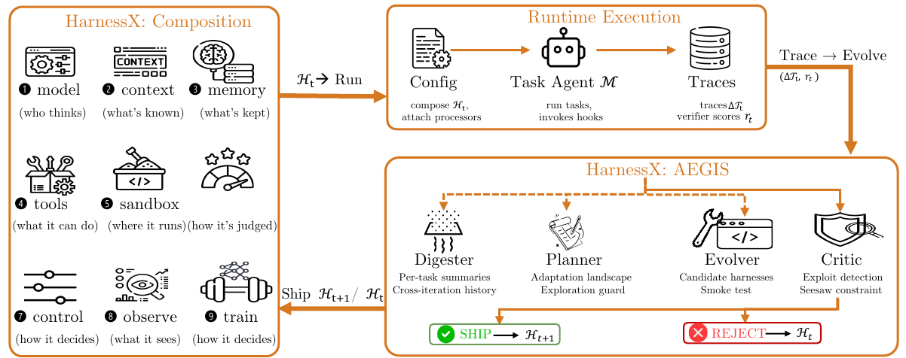 AEGIS 演化循环。单个元智能体（meta-agent） $$ℳ$$ 驱动全部四个阶段（Digester、Planner、Evolver、Critic），并根据是否有充分信号继续执行来选择性调用各阶段。确定性门控会发布或拒绝候选编辑。

### 4.1 操作镜像

我们将支架演化形式化为符号工件上的马尔可夫决策过程（MDP）。表 2 概括了这一映射；我们先给出三个奠定该对应关系基础的定义。

#### 定义 1（支架配置）

支架配置是一个元组 $\mathcal{H} = (c\_1, c\_2, \ldots, c\_9)$，其中每个 $c\_i \in \mathcal{C}\_i$ 都实例化九个行为维度（第 3.3 节）之一：模型选择（$c\_1$）、上下文组装（$c\_2$）、记忆管理（$c\_3$）、工具生态（$c\_4$）、执行环境（$c\_5$）、评估与奖励（$c\_6$）、控制与安全（$c\_7$）、可观测性（$c\_8$）以及训练桥接层（$c\_9$）。每个 $\mathcal{C}\_i$ 都是维度 $i$ 的有效处理器配置集合，并受到钩子类型契约和单例组排斥规则（第 3.2 节）的约束。

#### 定义 2（支架编辑）

支架编辑是函数 $e: \mathcal{H} \to \mathcal{H}$，它在保持类型契约的前提下修改一个或多个维度。动作空间 $\mathcal{E}$ _离散而开放_：每项编辑都是由元智能体 LLM（大语言模型）生成的代码级工件（新的处理器源代码、修改后的提示词模板、重新配置的工具注册表或控制流重写），而不是从预先枚举的集合中选择。组合爆炸不是通过穷举搜索来控制，而是依靠 LLM 的生成能力——Planner 根据有轨迹依据的假设提出编辑——以及在生成阶段剪除无效组合的类型约束。

#### 定义 3（操作镜像）

操作镜像是元组 $(\mathcal{H}, \mathcal{E}, \mathcal{R}, \mathcal{T})$，其中 $\mathcal{H}$ 是支架配置空间（状态），$\mathcal{E}$ 是代码级编辑空间（动作），$\mathcal{R}: \mathcal{H} \times \mathcal{E} \to \mathbb{R}$ 将配置-编辑对映射为标量奖励（在适应批次上聚合得到的验证器得分），$\mathcal{T}$ 是在标量信号之外提供结构化反馈的轨迹存储。该元组在支架层面构成一个 MDP：支架配置是状态，带类型的编辑是动作，执行轨迹和验证器得分共同构成反馈，而确定性接受门控控制状态转移。

#### MDP 实例化

令 $\mathcal{H}_t$ 表示迭代 $t$ 时的支架配置（模型 $\mathcal{M}$ 在整个演化过程中保持固定），令 $\mathcal{T}t$ 表示从此前所有执行中积累的轨迹存储。我们把符号状态定义为 $s\_t=(\mathcal{H}t,\mathcal{T}t)$。支架更新策略 $\pi{\mathrm{evo\}}$ 选择动作 $a\_t \sim \pi{\mathrm{evo\}}(\cdot \mid s\_t)$，其中 $a\_t \in \mathcal{E}$ 是从构建器代数中产生的代码级编辑。应用该编辑会得到候选支架 $\widetilde{\mathcal{H\}}{t}=a\_t(\mathcal{H}t)$。使用固定模型 $\mathcal{M}$ 在一个适应批次上运行候选支架，将产生新轨迹 $\Delta\mathcal{T}t$ 和逐任务验证器得分 $r\_t$。随后，确定性接受算子 $U(\widetilde{\mathcal{H\}}{t}, \mathcal{T}t, r\_t)$ 或者提交候选项（$\mathcal{H}{t+1}=\widetilde{\mathcal{H\}}{t}$），或者拒绝候选项（$\mathcal{H}_{t+1}=\mathcal{H}\_t$），并执行跷跷板约束（seesaw constraint）：候选项不得使 $\mathcal{T}_t$ 中记录的任何先前已解决任务发生退化。无论哪种情况，轨迹存储都会增长：$\mathcal{T}_{t+1}=\mathcal{T}\_t \cup \Delta\mathcal{T}\_t$。

这一 MDP 在支架层面运行：在单个任务内部，$\mathcal{H}_t$（连同固定的 $\mathcal{M}$）决定智能体行为；在不同迭代之间，支架更新策略 $\pi_{\mathrm{evo\}}$ 修改支架。AEGIS 将 $\pi\_{\mathrm{evo\}}$ 实现为四阶段流水线（Digester、Planner、Evolver、Critic），依次通过轨迹压缩、适应规划、编辑生成和候选评估，把 $s\_t$ 映射为候选编辑。

### 4.2 符号空间中的病态现象

操作镜像并非仅仅是一种类比；它把强化学习概念转化为设计要求。我们把 RL 中三个已有充分研究的失效模式——奖励黑客 \[10]、灾难性遗忘 \[15] 和探索不足 \[16]——统称为 _RL 病态现象_。一旦将支架适应表述为符号工件上的 MDP，这些病态现象便会以放大的形式重现，而放大效应来自符号环境的两项特性：（1）语言模型演化器能够构造数值参数扰动无法表达的结构化漏洞利用；（2）对共享组件的编辑会以非局部方式在支架中传播。以下每种病态现象都会促成第 4.3 节中一项对应的架构防御机制。

#### 奖励黑客

在标准 RL 中，奖励黑客 \[10] 会利用奖励信号中的漏洞，而不真正完成任务。符号式支架演化会放大这一风险，因为演化器可以直接针对验证协议：把基准答案嵌入提示词，利用验证器在格式上的规律，或者引入一个处理器来重写输出，使其符合验证器的预期。

#### 灾难性遗忘

灾难性遗忘 \[15] 是指在任务分布的某一区域提升性能，却损害另一区域。在符号式支架演化中，修复失效模式 $A$ 的编辑可能悄然使模式 $B$ 退化，因为其影响会通过共享上下文、工具、记忆策略和控制规则传播。若没有显式回归检查，只以失败任务轨迹为条件的演化器便无法区分局部增益与全局退化。

#### 探索不足

探索不足 \[16] 表现为对低风险局部编辑的偏好，例如改写提示词措辞、调整工具描述，或小幅修改控制流。这类编辑生成成本低，且常常能在不使已解决任务退化的情况下通过门控，从而使后续 Planner 假设偏向相同的编辑邻域。结构性变更（把一个智能体拆分为多个智能体、替换控制策略或采用新的记忆架构）需要有意识地形成假设，很少会从以轨迹为条件的局部修复中自然出现。如果没有提出超越当前失效邻域之编辑的机制，一旦局部编辑耗尽，系统就会陷入平台期。

#### 总结

符号式支架演化继承了 RL 的结构性风险（奖励黑客、灾难性遗忘和探索不足），而 AEGIS 分别用专门机制加以应对：Critic 应对奖励黑客，确定性门控层应对灾难性遗忘，Planner 应对探索不足。

**算法 1：AEGIS 支架演化循环（选择性调用）**

**输入：** 初始支架 $\mathcal{H}_0$、元智能体 $\mathcal{M}$、预算 $T$、耐心值 $P$、阈值 $\alpha$ **输出：** 演化后的支架 $\mathcal{H}_{t+1}$、轨迹存储 $\mathcal{T}\_{t+1}$

1. $\mathcal{T}\_0 \leftarrow \emptyset$；$\mathit{idle} \leftarrow 0$。
2. **对于** $t = 0, 1, \ldots, T{-}1$：
   1. 采样批次 $B\_t$；在 $B\_t$ 上运行 $\mathcal{H}\_t$，得到轨迹 $\Delta\mathcal{T}_t$；令 $\mathcal{T}_{t+1} \leftarrow \mathcal{T}\_t \cup \Delta\mathcal{T}\_t$。
   2. **Digester（选择性调用）：**
      * $(\mathit{evidence}\_t,; a\_t) \leftarrow \mathcal{M}.\operatorname{Digester}(\Delta\mathcal{T}\_t,; \mathcal{T}\_t)$。
      * 若 $a\_t < \alpha$，则令 $\mathcal{H}\_{t+1} \leftarrow \mathcal{H}\_t$，$\mathit{idle}{+}{+}$，并继续下一轮。
   3. **Planner（选择性调用）：**
      * $\mathit{landscape}\_t \leftarrow \mathcal{M}.\operatorname{Planner}(\mathit{evidence}\_t)$。
      * 若 $\mathit{landscape}_t = \emptyset$，则令 $\mathcal{H}_{t+1} \leftarrow \mathcal{H}\_t$，$\mathit{idle}{+}{+}$，并继续下一轮。
   4. **Evolver（选择性调用）：**
      * ${(\widetilde{\mathcal{H\}}\_{t}^{,k},, \mathrm{manifest}_k)}_{k=1}^{K\_t} \leftarrow \mathcal{M}.\operatorname{Evolver}(\mathcal{H}\_t,; \mathit{landscape}\_t)$。
      * 若 $K\_t = 0$，则令 $\mathcal{H}\_{t+1} \leftarrow \mathcal{H}\_t$，$\mathit{idle}{+}{+}$，并继续下一轮。
   5. **Critic 与门控（强制调用）：**
      * $\mathit{ranking} \leftarrow \mathcal{M}.\operatorname{Critic}({(\widetilde{\mathcal{H\}}\_{t}^{,k},, \mathrm{manifest}\_k)},; \mathit{evidence}\_t)$。
      * 令 $k^\star \leftarrow \bot$。
      * 按 $\mathit{ranking}$ 中的顺序遍历 $k$：若 $\operatorname{DeterministicGate}(\widetilde{\mathcal{H\}}\_{t}^{,k},, \mathcal{H}\_t,, \mathcal{T}\_t)$ 通过，则令 $k^\star \leftarrow k$ 并停止遍历。
   6. 若 $k^\star \neq \bot$，则令 $\mathcal{H}_{t+1} \leftarrow \widetilde{\mathcal{H\}}_{t}^{,k^\star}$，并令 $\mathit{idle} \leftarrow 0$；否则令 $\mathcal{H}\_{t+1} \leftarrow \mathcal{H}\_t$，$\mathit{idle}{+}{+}$。
   7. 若 $\mathit{idle} \geq P$，则终止循环。
3. **返回** $\mathcal{H}_{t+1},; \mathcal{T}_{t+1}$。

### 4.3 AEGIS 架构

AEGIS 是 HarnessX 的支架演化引擎。它由按预定义工作流排列的四个阶段组成——Digester、Planner、Evolver、Critic——并由同一个元智能体 LLM 驱动；该 LLM &#x4F1A;_&#x9009;择性调&#x7528;_&#x8FD9;些阶段：阶段是否执行并非由外部路由器决定，而是由元智能体自身在每个阶段判断是否有充分信号继续。Digester、Planner 和 Evolver 各自评估一个继续条件，并可能提前终止本轮（可行动性低于阈值、适应图景为空或可行候选项为零）；而对于任何进入 Critic 阶段的候选项，Critic 与确定性门控层都是必经环节。任何编辑未经 Critic 和门控都不得发布。四个阶段的分工分别应对第 4.2 节中的病态现象：Digester 将原始轨迹压缩成结构化的任务级证据；Planner 构建同时涵盖渐进式变更与结构性变更的适应图景；Evolver 生成带有明确变更清单、带类型的构建器编辑；Critic 则与门控层一起，拒绝那些声称的改进缺少轨迹支持，或一经接受便会使先前已解决任务退化的编辑。

所有阶段共享同一个信息底层，即轨迹存储。它以结构化方式记录执行事件、经验证器评分的结果、回归信号，以及已发布或已拒绝的编辑。除轨迹存储和当前支架 $\mathcal{H}\_t$ 外，任何阶段都不消费其他输入。数据通过带有选择性门控的流水线向前流动：Digester 可能判定不存在可采取行动的失败（所有任务均已通过，或信号过于稀疏），从而立即终止本轮；Planner 可能根据当前证据和编辑历史找不到可行的适应图景；Evolver 也可能无法生成任何类型安全的候选项。在每种情况下，本轮都会以 no-op（无操作）结果正常退出。只有 Critic 与确定性门控是无条件执行的：任何通过上游阶段的候选项都必须同时经过二者。Critic 还可以向 Evolver 发出一次修订请求，然后再给出最终裁决。

#### Digester

GAIA 上的一次迭代（103 个任务，pass@2）会产生 ${\sim}$10M token 的原始轨迹，其中包含模型推理步骤、工具调用及其输出，以及计时元数据。将如此大量的内容直接传递给下游阶段会超出上下文限制，而简单截断又会丢失诊断信号。Digester 把每项任务的轨迹压缩成结构化的任务级摘要，包括二元结果、失败类别（如有）、涉及的组件标识符和支持性证据摘录。它还提供跨迭代的连续性：每项任务的摘要都会链接到其先前结果和已发布编辑（shipped edit）的历史记录，使 Planner 能够区分持续性失败与暂时性噪声。

#### Planner

Planner 接收 Digester 的输出（带有跨迭代历史的任务级摘要），并构建适应图景：哪些任务正在失败、已尝试过哪些编辑、涉及哪些组件，以及还有哪些编辑类型（提示词、工具、处理器、配置）尚未尝试。该阶段是抵御探索不足的主要机制：它在生成编辑之前先构建整体图景，防止流水线收敛到以轨迹为条件的局部修复，并确保结构性变更（添加工具、重写处理器、重新设计记忆策略）能够与渐进式提示词编辑一并纳入考虑。

#### Evolver

根据 Planner 的适应图景，Evolver 生成一个或多个候选支架 ${\widetilde{\mathcal{H\}}_{t}^{,k\}}_{k=1}^{K\_t}$，每个候选支架都以当前支架 $\mathcal{H}\_t$ 上的一项带类型构建器操作来指定。每个候选项都带有一&#x4EFD;_&#x53D8;更清单_：列出被编辑的组件、预期行为效果，以及预计会改善或退化的任务。引入新的处理器代码时，Evolver 还必须提供冒烟测试，以确认该处理器能够实例化，并可在合成输入上运行而不抛出异常。构建器代数保证类型安全（每个候选项都满足钩子类型契约和处理器组合规则），却不保证行为安全；能够通过类型检查的编辑仍可能产生非局部行为影响，而这只能由 Critic 和门控层发现。

#### Critic 与门控

Critic 防御奖励黑客，确定性门控层则防御灾难性遗忘。Critic 将每个候选项的变更清单与轨迹证据进行比较，并评估编辑是否可能通过共享状态或控制流引发非局部影响。发现缺口时，它会向 Evolver 发出一次修订请求。经过至多一次修订循环后，Critic 返回 `no_op` 或有序的 `ship_ranking`。随后，确定性门控依次执行接受检查：清单完整性、配置规范化（确保候选项采用规范形式）、构建测试或冒烟测试（适用时），以及跷跷板约束（对先前已通过任务进行回归检查；第 4.1 节）。任一检查首次失败即会终止该序列；通过检查的候选项会被提交，未通过者则连同拒绝原因一并归档。这一机制将 LLM 判断与接受决策解耦：无论 Critic 如何建议，只有确定性检查才能决定是否发布。

#### 设计原则

语言模型子智能体负责探索、形成假设和提出方案；带类型的结构与确定性门控负责决定发布什么。这样的分工确保，无论 LLM 子智能体出现何种失效模式，安全属性（不发生退化、不发布未经审计的编辑）都能成立。

### 4.4 适应循环

算法 1 形式化了适应循环（每次迭代对应第 6 节中的一“轮”）。从初始支架 $\mathcal{H}\_0$ 出发，每次迭代都在一个适应批次上执行当前支架，并选择性调用四个阶段：Digester、Planner 和 Evolver 分别根据一个继续条件执行门控（充分的可行动性、非空的适应图景，以及至少一个类型安全的候选项）；而任何进入 Critic 阶段的候选项，都必须经过 Critic 和确定性门控。只有当候选项通过全部接受检查时，一轮迭代才会提交新支架。

### 4.5 通过集成路由实现变体隔离

适应循环（第 4.4 节）维护单一支架 $\mathcal{H}\_t$。当不同任务需要彼此冲突的行为时，一项编辑可能改善一部分任务，却使另一部分任务退步；跷跷板约束会拒绝这项编辑，从而保障稳定性，但也舍弃了局部有益的改动。_变体隔离（variant isolation）_ 通过维护至多 $K$ 个支架变体 ${\mathcal{H}\_t^{(1)}, \ldots, \mathcal{H}\_t^{(V\_t)\}}$（$V\_t \leq K$）突破这一限制，并根据以往轮次中各变体对任务所属的任务簇的估计成功率，将每项任务路由至估计成功率最高的变体。我们将这一机制称&#x4E3A;_&#x96C6;成路由（Ensemble routing）_。

门控层为每个候选项区分两种结果：(1) 编辑改善部分任务且未使任何任务退步，此时将其应用于目标变体；或 (2) 编辑改善一个子集却使其他任务退步，此时系统不会直接拒绝该编辑，而是派生出一个新变体（若变体池已满，则淘汰表现最差的变体）。一旦存在多个变体，跷跷板约束便限定在各变体内部：针对变体 $k$ 的候选项仅在路由至 $k$ 的任务上接受测试，因而对一个任务簇的改进不会使另一个任务簇退步。该设计预示了第 6.3 节所验证的三项性质：(1) 聚合轨迹不发生退化（峰值 = 最终值）；(2) 能够在更多轮次中持续探索；(3) 总 token 消耗更低。

## 5 支架-模型协同演化

第 3 节和第 4 节表明，即使保持基础模型不变、仅演化支架，也已能带来显著增益；而且对于能力较弱、规模较小的任务智能体，这些增益最大，因为更好的支架最容易弥补它们的行为缺口。协同演化并不取代这条路径，而是沿第二个轴对其加以扩展。对于能力受限的小模型，支架演化最终会触&#x53CA;_&#x811A;手架上限（scaffolding ceiling）_：一旦支架提供了恰当的工具、上下文和控制流，决定性能的约束就变成冻结模型能否真正利用它们，而任何支架编辑都无法补充模型自身欠缺的推理能力。

与之对称，在固定支架下训练模型会触&#x53CA;_&#x8BAD;练信号上限（training-signal ceiling）_：如果脚手架从未呈现能够激发新能力的上下文、工具或控制流，新获得的能力便无从施展。模型是智能体&#x7684;_&#x8BA4;知核心_，负责推理和规划；支架则是&#x5176;_&#x6267;行装置_，决定模型能够感知什么、调用什么，以及执行过程受到哪些约束。更精良的执行装置无法弥补薄弱的认知核心，更强大的认知核心也无法弥补一个从不调动其能力的执行装置。协同演化所针对的正是这一瓶颈：在演化支架的同一循环内训练模型，使智能体沿两个轴同步改进，从而突破单独改进任一方面都会留下的上限。协同演化互补能力组件的原则也见于其他场景：K<sup>2</sup> Agent \[40] 为分层移动设备控制协同演化 know-what（知道什么，即陈述性知识）与 know-how（知道如何做，即程序性技能）。

图 3 展示了协同演化机制。HarnessX 并非在彼此独立的支架演化阶段和模型训练阶段之间交替，而是在共享经验回放缓冲区上的一次迭代内同时运行二者。我们对该迭代进行形式化（第 5.1 节），说明两种优化载体（第 5.2 节），通过跨支架 GRPO 规定模型训练目标（第 5.3 节），并刻画在共享缓冲区上进行离策略训练的方式；正是后一性质，使模型强化学习（RL）无需额外的 rollout（运行采样）成本即可运行（第 5.4 节）。

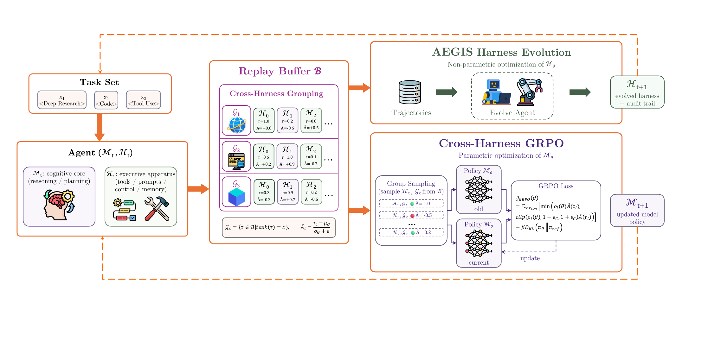 **支架-模型协同演化循环。**&#x667A;能体 $$(ℳt, ℋt)$$ 在固定验证器与可观测性层下运行任务批次 $$Bt$$；由此产生的轨迹与奖励 $$(τ, r)$$ 进入共享经验回放缓冲区 $$ℬ$$，其中，跨支架分组会汇集同一任务在不同支架版本下的轨迹，并计算组相对优势 $$Â$$。同一缓冲区以完全相同的数据驱动两类更新：AEGIS 支架演化（Digester $$→$$ Planner $$→$$ Evolver $$→$$ Critic，得到演化后的支架 $$ℋt + 1$$）和**跨支架 GRPO**（组采样与带截断的 GRPO 目标，得到更新后的模型 $$ℳt + 1$$）；二者共同进入下一次迭代。

### 5.1 协同演化迭代

协同演化作用于二元组 $(\mathcal{M}\_t, \mathcal{H}\_t)$，其中，$\mathcal{M}\_t$ 表示可训练的模型参数（放宽第 4 节中冻结模型的假设），$\mathcal{H}\_t$ 表示第 $t$ 次迭代时的支架配置。系统维护一个采用先进先出淘汰机制的定容量经验回放缓冲区 $\mathcal{B}$。每次迭代按以下步骤进行：

1. **Rollout（运行采样）。** 使用 $(\mathcal{M}\_t, \mathcal{H}\_t)$ 运行适应批次 $B\_t$；可观测性层将每个回合记录为完整轨迹 $\tau\_i$，涵盖模型的每一轮输出、工具调用和工具返回结果。
2. **验证。** 固定验证器将每条轨迹评为一个标量奖励 $r\_i$。保持验证器不变，可以确保不同支架版本之间的奖励可比，而跨支架优势（式（3））依赖这一可比性。
3. **写入缓冲区。** 将每条已评分轨迹连同生成它的支架版本追加至共享缓冲区 $\mathcal{B}$，使连续各轮的数据累积而非相互覆盖；FIFO 淘汰机制则将 $\mathcal{B}$ 限制在近期轮次的数据上。
4. **支架演化**（$\mathcal{H}\_{t+1} \leftarrow \text{AEGIS}(\mathcal{H}\_t, \mathcal{B})$，非参数式，见第 4 节）。元智能体读取缓冲区内的轨迹，以此为证据判断脚手架失效的位置，提出一项离散的结构编辑，并且仅当 Critic 与门控层均验证通过时才接纳该编辑。
5. **行为对数概率。** 对本轮刚写入的轨迹，在生成模型 $\mathcal{M}_t$ 下执行一次前向传播，得到 token 级对数概率 $\pi_{\theta\_{\text{old\}}}(\tau\_i)$，并将其缓存以供 GRPO 损失使用；来自更早轮次的轨迹复用其写入缓冲区时缓存的数值（第 5.4 节）。
6. **GRPO 更新**（$\mathcal{M}\_{t+1} \leftarrow \text{GRPO}(\mathcal{M}\_t, \mathcal{B})$，参数式，见第 5.3 节）。将轨迹划分为跨越不同支架版本的任务级组，为每条轨迹赋予组相对优势，并在固定参考模型的 KL 锚定约束下，执行一次带截断的策略梯度更新步骤。
7. **推进。** 使用演化后的二元组 $(\mathcal{M}_{t+1}, \mathcal{H}_{t+1})$ 返回步骤 1。

每条轨迹既充当 AEGIS 的诊断证据，也充当 GRPO 的训练信号。支架演化（步骤 4）与模型更新（步骤 5–6）读取同一缓冲区，但在同一次迭代中，二者都不以对方的输出为条件；两项更新都完成后，下一轮 rollout 才会开始。

### 5.2 优化载体

#### 支架侧（非参数优化）

支架演化按照第 4 节所述方式进行，从经验回放缓冲区 $\mathcal{B}$ 中提取轨迹证据。与独立运行的 AEGIS 相比，主要区别在于 $\mathcal{B}$ 包含来自多个模型检查点 $\mathcal{M}\_0, \mathcal{M}\_1, \ldots, \mathcal{M}\_t$ 的轨迹，使 Digester 同时接触由模型更新和支架编辑引发的行为变化。

#### 模型侧（通过 GRPO 进行参数优化）

关键设计选择&#x662F;_&#x8DE8;支架分组准则_（第 5.3 节将予以形式化）：所有共享同一任务标识符的轨迹均构成一个 GRPO 组，无论它们由哪个支架或模型检查点生成；由此，组内差异反映的是策略差异，而不只是采样噪声。

#### 互补性

支架更新实施无法表达为参数更新的离散结构变更（添加工具、替换控制处理器、重构提示词）。模型更新则实施细粒度的行为调整（何时调用哪个工具、如何表述查询、何时终止）；这类调整依赖高维的上下文状态，无法由符号规范捕获。支架定义粗粒度的策略架构，模型则学习如何利用它。

### 5.3 通过跨支架 GRPO 训练模型

我们采用组相对策略优化（Group Relative Policy Optimization，GRPO）\[33]。形式上，缓冲区内的每条轨迹按如下方式生成：

$$
\begin{equation}
    \tau_i \sim \text{Agent}(\mathcal{M}_k,\, \mathcal{H}_k,\, x_i), \quad k \in \{0, 1, \ldots, t\},
  \label{eq:trajectory-generation}
\end{equation}
$$

其中，$i$ 是缓冲区 $\mathcal{B}$ 中的 $(x, \tau)$ 索引，$\mathcal{M}\_k$ 和 $\mathcal{H}\_k$ 分别是将任务 $x\_i$ rollout 为轨迹 $\tau\_i$ 时使用的模型检查点和支架。由于 FIFO 淘汰机制把缓冲区限定在近期迭代的数据上，缓冲轨迹均来自与当前策略接近的模型版本。但这些轨迹在策略上差异显著（包括工具选择、提示词结构和控制流逻辑）；这种多样性源于连续演化的支架版本 $\mathcal{H}\_0, \ldots, \mathcal{H}\_t$。在单策略 RL 中，组内差异仅来自随机采样；与之不同，此处支架身份是这种差异的主导来源，因此跨支架分组准则（式（2））对于有意义的优势估计至关重要。

形式上，对于任务 $x$，轨迹组收集 $x$ 的全部轨迹，无论它们由哪个 $(\mathcal{M}\_k, \mathcal{H}\_k)$ 二元组生成：

$$
\begin{equation}
  \mathcal{G}_x = \{\tau_i \in \mathcal{B} \mid \text{task}(\tau_i) = x\} = \bigcup_{k} \{\tau \sim \text{Agent}(\mathcal{M}_k, \mathcal{H}_k, x)\}.
  \label{eq:cross-harness-group}
\end{equation}
$$

因此，模型获得的梯度信号来自不同策略之间的奖励对比，而不只是固定策略内部的随机变化；这使模型能够内化在不同支架版本上取得成功的策略。

#### 任务级对齐，而非动作级对齐

跨支架 GRPO 执&#x884C;_&#x4EFB;务&#x7EA7;_&#x5BF9;齐：来自不同支架版本的轨迹按任务身份分组，并且仅依据验证器奖励进行比较。它不要求动作级对齐，因而具有不兼容动作空间的支架版本（工具模式定义不同、提示词结构不同、控制流处理器不同）可以在同一组内共存而不发生冲突。计算策略梯度时，每条轨迹 $\tau\_i$ 都在生成它的支架版本 $\mathcal{H}_k$ 下进行重放：模型的对数概率 $\pi_\theta(\tau\_i \mid x)$ 是依据 $\mathcal{H}\_k$ 在每轮本应构造的提示词、工具模式定义和观测上下文来评估的。因此，GRPO 梯度完全作用于以支架特定上下文为条件的模型输出 token，而不作用于支架结构动作或环境状态转移。该设计将支架演化（可以在不同版本间自由改变动作空间）与模型训练（只需要每条轨迹在其自身支架上下文下的 token 级对数概率）解耦。

组相对优势为：

$$
\begin{equation}
  \hat{A}(\tau_i) = \frac{r_i - \mu(\mathcal{G}_x)}{\sigma(\mathcal{G}_x) + \epsilon},
  \label{eq:grpo-advantage}
\end{equation}
$$

其中，$r\_i$ 是轨迹 $\tau\_i$ 的奖励，$\mu(\mathcal{G}\_x)$ 和 $\sigma(\mathcal{G}\_x)$ 分别是组内奖励的均值与标准差。不断演化的支架充当模型 RL 的结构化探索算子：每个新版本都会向任务的采样分布注入一种不同的行为模式，而式（3）中的优势会推动模型趋向验证器评分最高的模式。因此，演化中的脚手架本身提供了单策略采样无法实现的探索广度。

需要最大化的策略目标为：

$$
\begin{equation}
  \mathcal{J}_{\text{GRPO}}(\theta) = \mathbb{E}_{x,\, \tau_i \sim \mathcal{B}} \left[ \min\!\left( \rho_i(\theta)\,\hat{A}(\tau_i),\; \text{clip}\!\left(\rho_i(\theta),\, 1{-}\epsilon_c,\, 1{+}\epsilon_c\right)\hat{A}(\tau_i) \right) \right] - \beta\, D_{\text{KL}}\!\left(\pi_\theta \,\|\, \pi_{\text{ref}}\right),
  \label{eq:grpo-objective}
\end{equation}
$$

其中

$$
\begin{equation}
  \rho_i(\theta) = \frac{\pi_\theta(\tau_i \mid x)}{\pi_{\theta_{\text{old}}}(\tau_i \mid x)}, \qquad \pi_{\theta_{\text{old}}} = \mathcal{M}_{d},
  \label{eq:grpo-ratio}
\end{equation}
$$

是当前策略 $\mathcal{M}_{k}$ 与生成 $\tau\_i$ 的检查点 $\mathcal{M}_{d}$（式（1））之间的重要性采样比率，$\epsilon\_c$ 是截断阈值，而 $\beta, D\_{\text{KL\}}(\pi\_\theta | \pi\_{\text{ref\}})$ 对偏离固定参考模型 $\pi\_{\text{ref\}}$ 的行为施加惩罚。比率中的行为策略 $\pi\_{\theta\_{\text{old\}}}$ 与 KL 项中的参考策略 $\pi\_{\text{ref\}}$ 彼此不同：$\pi\_{\text{ref\}} = \mathcal{M}_0$ 在整个训练过程中保持固定，而 $\pi_{\theta\_{\text{old\}}}$ 随轨迹而异，必须从缓冲区中恢复（第 5.4 节）。

### 5.4 在混合策略缓冲区上进行离策略训练

经验回放缓冲区本质上是离策略的：在第 $t$ 次迭代时，它保存着检查点 $\mathcal{M}\_0, \mathcal{M}\_1,\dots, \mathcal{M}\_t$ 在支架 $\mathcal{H}_0, \mathcal{H}1, \dots, \mathcal{H}t$ 下生成的轨迹（式（1）），因此缓冲区分布与正在更新的策略 $\pi\theta$ 并不匹配。恢复每条缓冲轨迹对应的 $\pi{\theta_{\text{old\}}}$，是离策略训练的核心挑战。

#### 行为策略 $\pi\_{\theta\_{\text{old\}}}$

重要性采样比率（式（5））校正 $\pi\_\theta$ 与生成 $\tau\_i$ 的检查点 $\mathcal{M}_{k}$ 之间的差距。由于 $\mathcal{M}_{k}$ 在整个缓冲区内并不相同，无法从任何单一模型恢复 $\pi\_{\theta\_{\text{old\}}}(\tau\_i)$：我们在轨迹写入缓冲区时，使用 $\mathcal{M}_{k}$ 执行一次前向传播，将其具体化，并把 token 级对数概率缓存到磁盘，供各个梯度步骤复用。这样便将缓存的行为对数概率与每一步重新计算的当前对数概率 $\pi_\theta(\tau\_i)$ 解耦。

#### 有界的离策略偏差

FIFO 淘汰机制将缓冲区容量限制为 $C$ 条轨迹；若每轮有 $s$ 个样本，则模型版本的最大滞后为 $\lfloor C/s \rfloor$ 轮。因此，每个缓存的 $\pi\_{\theta\_{\text{old\}}}$ 都来自 $\pi\_\theta$ 附近的一个有界窗口，生成轨迹的策略与正在更新的策略始终不会相差太大。同一窗口也限制了支架的陈旧程度，因而跨支架组（式（2））只会混合近期的脚手架版本，模型绝不会主要依据过时支架接受训练。

#### 不增加 rollout 成本的重放复用

智能体 RL 的主要成本是 rollout（在环境中执行智能体，包括模型解码、工具调用和验证），而不是梯度更新。在协同演化中，一轮探索只生成一组轨迹，便可同时服务于两类更新：同一批轨迹既驱动 AEGIS 支架更新（第 4 节），也通过共享缓冲区（第 5.1 节）驱动跨支架 GRPO 模型更新。GRPO 通过重放使用这些轨迹，不自行发起任何 rollout。因此，加入模型更新的边际成本仅包括：(i) 对每条轨迹执行一次用于缓存的前向传播，以记录 $\pi\_{\theta\_{\text{old\}}}$；以及 (ii) 梯度步骤本身；二者都不涉及 rollout。没有任何轨迹是专为训练模型而生成的。因此，联合优化具有很高的经济性：它只需付出离线训练计算成本，便能换取模型改进，而无需在支架演化既有的 rollout 之外增加任何运行采样。

## 6 实验

我们从五个方面评估 HarnessX：跨基准和模型家族的整体有效性（第 6.2 节）、变体管理策略对稳定性的影响（第 6.3 节）、演化器架构相对于基础设施的贡献（第 6.4 节）、模型-支架联合协同演化带来的增益（第 6.5 节），以及对预测失效模式的实证确认（第 6.6 节）。

### 6.1 实验设置

#### 基准

如表 3 所示，我们在五个基准上进行评估，覆盖多步检索、具身规划、网页交互、多轮对话和软件工程。除非另有说明，每项实验最多运行 $T{=}15$ 轮演化；若连续 $P{=}3$ 轮没有已发布编辑，则提前停止。每轮均评估完整任务集（不进行子采样）。元智能体的 token 预算随基准而异（总计 100M–175M），但在同一基准内的不同任务智能体之间保持不变。

| **基准**             | **领域** | **抽样任务数** | **验证器** |
| ------------------ | ------ | :-------: | ------- |
| GAIA (Level 1–3)   | 多步检索   |    103    | 精确匹配    |
| ALFWorld           | 具身规划   |    134    | 目标完成    |
| WebShop            | 网页交互   |    100    | 属性匹配    |
| $\tau^3$-Bench     | 多轮对话   |   3 个领域   | 规则遵循    |
| SWE-bench Verified | 软件工程   |     55    | 补丁修复成功  |

基准特征。

#### 模型

我们区分两类角色：_元智能体_（除非另有说明，均为 Claude Opus 4.6）驱动 AEGIS 演化循环；_任务智能&#x4F53;_&#x5728;演化后的支架下运行，以解决基准任务。任务智能体来自三个模型家族（Claude Sonnet 4.6、GPT-5.4 和 Qwen3.5-9B），用于检验单一元智能体能否跨模型家族演化出有效支架。

#### 基线

**(1) 静态支架**：根据已发表的基准专用提示词和工具定义构建的 HarnessX 配置，在所有轮次中保持不变。**(2) Claude Code SDK (CC SDK)**：单智能体演化器（每轮使用一个 LLM 会话），它以单一会话取代四阶段流水线，同时保留相同的基础设施和轮次预算，由此将 AEGIS 多阶段架构的作用与共享基础设施隔离开来（第 6.4 节）。该基线也可作为 SICA \[31] 等单体式演化器的代理。

#### 指标

采用由基准专用验证器评定的任务成功率（%）。每项任务在每轮中获得两次独立尝试机会（pass@2：任一次成功即视为解决），这样既能降低采样噪声，又能为跷跷板约束保留逐任务的二元信号；代价是会掩盖低于阈值的成功概率漂移（第 6.3 节）。

#### 范围

所有报告的增益均在用于演化的同一任务集上测得；本工作不评估对未见任务的留出泛化能力。

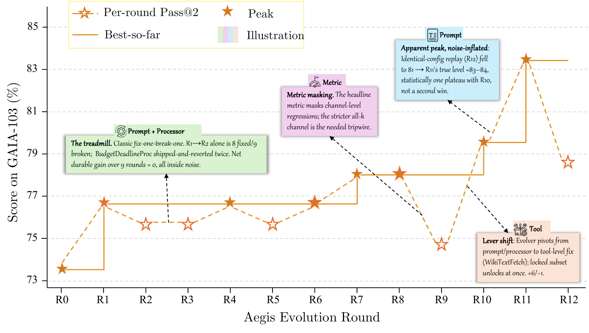 演化轨迹（pass@2 成功率随轮次的变化）。虚线：静态支架基线。

### 6.2 主要结果

表 4 和图 4 报告了支架演化前后的 pass@2 成功率。AEGIS 在 15 个模型-基准配置中的 14 个上取得改进，平均提升 14.5 个百分点（最高 44.0 个百分点）。唯一停滞的配置（GAIA、GPT-5.4，$\Delta{=}0.0$）反映了在异质任务集上进行单支架演化的根本局限；第 6.3 节表明，变体隔离可以解决这一问题。有一个配置在运行中途发生退步（$\tau^3$-Bench Telecom，在 R7 为 $-$14.0 个百分点），原因是同类型编辑不断累积，随后在 R9 恢复（第 6.6 节）。

| **基准**             | **任务智能体**         | **初始**   | **演化后**  | $$Δ$$ | **最佳轮次** |
| ------------------ | ----------------- | -------- | -------- | ----- | -------- |
| ALFWorld           | Claude Sonnet 4.6 | 83.6     | 94.8     | +11.2 | 7        |
| GPT-5.4            | 76.9              | **97.8** | +20.9    | 4     |          |
| Qwen3.5-9B         | 53.0              | 97.0     | +44.0    | 9     |          |
| WebShop            | Claude Sonnet 4.6 | 60.0     | **76.0** | +16.0 | 7        |
| GPT-5.4            | 55.0              | 73.0     | +18.0    | 8     |          |
| Qwen3.5-9B         | 36.0              | 49.0     | +13.0    | 7     |          |
| GAIA               | Claude Sonnet 4.6 | 73.8     | **83.5** | +9.7  | 11       |
| GPT-5.4            | 73.8              | 73.8     | 0.0      | 4     |          |
| Qwen3.5-9B         | 20.3              | 37.4     | +17.1    | 4     |          |
| SWE-bench Verified | Claude Sonnet 4.6 | 76.4     | **87.3** | +10.9 | 3        |
| GPT-5.4            | 45.5              | 63.6     | +18.2    | 3     |          |
| Qwen3.5-9B         | 23.6              | 41.8     | +18.2    | 2     |          |
| $$τ3$$-Bench（平均）   | Claude Sonnet 4.6 | 89.6     | **95.0** | +5.4  | –        |
| GPT-5.4            | 76.2              | 90.7     | +14.5    | –     |          |
| Qwen3.5-9B         | 93.5              | 94.6     | +1.1     | –     |          |

**整体性能。** 演化使 15 个配置中的 14 个得到改进。ALFWorld 上的提升介于 11.2 至 44.0 个百分点，WebShop 上介于 13.0 至 18.0 个百分点，SWE-bench Verified 上介于 10.9 至 18.2 个百分点。在 GAIA 上，Sonnet 4.6（9.7 个百分点）和 Qwen3.5-9B（17.1 个百分点）均有提升，而 GPT-5.4 停滞不前（$\Delta{=}0.0$；解决其失效需要彼此冲突的编辑，任何单支架策略都无法同时容纳这些编辑）。在 $\tau^3$-Bench 上，GPT-5.4 的增益最大（14.5 个百分点），而 Qwen3.5-9B 因基线已接近上限、达到 93.5%，仅提升 1.1 个百分点。

**相对基线性能的反向缩放。** 跨基准来看，最弱的任务智能体 Qwen3.5-9B 一贯获得最大的增益：ALFWorld 上为 44.0 个百分点（基线 53.0%），GAIA 上为 17.1 个百分点（基线 20.3%），SWE-bench Verified 上为 18.2 个百分点（基线 23.6%）。较强的模型（Sonnet 4.6、GPT-5.4）在 ALFWorld（11.2、20.9 个百分点）和 SWE-bench（10.9、18.2 个百分点）上的增益较小。GAIA 上的 GPT-5.4 是一个例外（$\Delta{=}0.0$）：任务异质性使单一支架无法提高聚合准确率，这一观察促成了第 6.3 节中的变体隔离消融实验。整体模式表明，较弱的模型存在更多可由支架级编辑解决的行为缺口；当基线性能足够高时，剩余失效越来越需要任务特定的适应，而不是全局改进。

**跨模型泛化。** 元智能体（Opus 4.6）无需针对模型家族进行专门适应，即可为不同模型家族的任务智能体演化支架。在 ALFWorld 上，跨家族智能体（GPT-5.4：20.9 个百分点；Qwen3.5-9B：44.0 个百分点）获得的增益高于同家族智能体（Sonnet 4.6：11.2 个百分点），说明增益幅度取决于基线性能，而非任务智能体与元智能体家族的接近程度。

**收敛速度与失效模式的集中程度一致。** ALFWorld（GPT-5.4）在 R4 达到峰值，SWE-bench Verified（所有智能体）则在 R2–R3 达到峰值；在这两种情况下，失效都集中于一到两种组件类型，因而能够快速收敛。GAIA（Sonnet 4.6）需要 11 轮，因为其失效横跨四种组件类型（提示词、工具、处理器、配置），系统不得不依次探索多个编辑邻域。

#### $\tau^3$-Bench 内部的领域级差异

$\tau^3$-Bench 的平均增益掩盖了显著的逐领域差异。GPT-5.4 在 Telecom 上提升 25.4 个百分点（67.5% $\to$ 93.0%，R2），在 Retail 上提升 9.7 个百分点（84.2% $\to$ 93.9%，R6）。但 Sonnet 4.6 在 Telecom 上因同类型编辑不断累积，于单轮内（R7）退步 $-$14.0 个百分点，随后在 R9 恢复（第 6.6 节）。这揭示了逐编辑门控的一项结构性局限：连续同类型编辑之间低于阈值的耦合效应会在未被察觉的情况下不断累积，直至越过临界点并引发可见的性能退步。

#### SWE-bench 上的峰后退化

在 SWE-bench Verified（GPT-5.4）上，演化于 R3 达到 63.6% 的峰值（提升 18.2 个百分点），但到 R5 时退化至 50.9%（较峰值下降 $-$12.7 个百分点）；最终准确率仍比静态基线高 5.4 个百分点。两个因素加速了该基准上的退化：(1) 由于只有 55 项任务，每项任务的状态翻转都会使聚合准确率变化 ${\sim}$1.8 个百分点（相比之下，$n{=}103$ 时约为 ${\sim}$1.0 个百分点），因此只需更少的退步任务便会造成可见下降；(2) 结构性代码编辑的影响范围比提示词编辑更广。这与 GAIA GPT-5.4 的停滞现象相呼应：两种情况都推动了第 6.3 节所评估的变体隔离策略。

### 6.3 演化策略比较

主要实验（表 4）采用全局（Global）策略，即在所有任务上演化单一支架。表 5 在 GAIA（103 项任务、GPT-5.4、15 轮、AEGIS 演化器）上，将这一默认策略与变体隔离策略进行比较。

| **策略**         | **最终（%）** | **峰值（%）** | **最终$-$峰值** | **token 数** |
| -------------- | :-------: | :-------: | :---------: | :---------: |
| 集成（最多 $K$ 个变体） |  **87.4** |    87.4   |     0.0     |    107.8M   |
| 全局（单一支架）       |    49.5   |    73.8   |   $-$24.3   |    143.7M   |

演化策略比较（GAIA、GPT-5.4、AEGIS 演化器、15 轮）。最终$-$峰值表示稳定性；负值意味着灾难性遗忘。

**全局策略的失效机制。** 全局策略为全部 103 项任务维护单一支架。它在 R4 较早达到峰值（73.8%），随后稳定退化：后续编辑会引入低于阈值的退步，这些退步在 pass@2 的二元信号下无法被单独检测，却会累积并导致聚合性能下降。峰值与最终值之差（$-$24.3 个百分点）远超逐轮二项分布的 95% 置信区间（$n{=}103$、$p{\approx}0.74$ 时为 $\pm$8.5 个百分点），从而排除了评估噪声，证实了灾难性遗忘（第 4.2 节）。这解释了表 4 中 GAIA GPT-5.4 的 $\Delta{=}0.0$ 停滞现象：在这一异质任务集上，全局策略无法维持改进。

**集成策略为何能防止跨变体遗忘。** 集成路由维护至多 $K$ 个支架变体，并根据各变体以往的成功率，将每项任务路由至成功率最高的变体。系&#x7EDF;_&#x6309;变&#x4F53;_&#x63D0;出和评估编辑，因此，改善一个任务簇的编辑不会使另一个任务簇退步。比较结果证实了三项预测性质：(1) 聚合轨迹不发生退化（峰值 = 最终值）；(2) 峰值出现得更晚（R14 对 R4），表明富有成效的探索得以持续；(3) token 消耗更低（107.8M 对 143.7M），因为每项编辑只针对其目标任务簇进行评估，而不是针对完整任务集，并且编辑只作用于分配给它的任务簇，避免了在一个持续退化的单一支架上评估所有任务时不断累积的无效提案。

**小结。** 变体隔离解决了全局策略下的停滞，使 GAIA GPT-5.4 从 $\Delta{=}0.0$ 提升至 13.6 个百分点（87.4%，无退化）。我们还开展了小规模试验，探索更细粒度的策略——领域感知聚类（Domain-aware clustering）和任务级锦标赛（Task-level tournament）（30–40 项任务，$\leq$8 轮），但由于轮次和任务数量不足，无法进行具有统计意义的比较。

### 6.4 元智能体的有效性

为把演化器架构与基础设施的作用区分开来，我们用一个单智能体 CC SDK 演化器替换 AEGIS 的四阶段流水线；两者使用相同的模型（Opus 4.6）、轮次预算和基础设施。两个演化器都在变体隔离机制下运行（见第 6.3 节），从而确保性能轨迹不会退化。表 6 给出了二者在 GAIA 上的对比结果（103 个任务、GPT-5.4、15 轮）。

| **演化器** | **准确率（%）** | **最佳轮次** | **token 数** |
| ------- | :--------: | :------: | :---------: |
| AEGIS   |  **87.4**  |    R14   |    107.8M   |
| CC SDK  |    86.4    |    R12   |    123.1M   |

元智能体架构对比（GAIA、GPT-5.4、变体隔离、15 轮）。两个演化器均使用 Opus 4.6。

**准确率相当，效率不同。** 1.0 个百分点的准确率差距小于一个标准误差（当 $n{=}103$ 时为 ${\sim}$3.3 个百分点），表明在当前元智能体能力水平下，四阶段分解并未提高最终准确率。不过，单智能体变体消耗的 token 多 ${\sim}$14%（123.1M 对 107.8M）。我们认为差异来自 Digester 的压缩作用：在下游阶段读取轨迹之前，它把 ${\sim}$10M 个原始轨迹 token 压缩为 ${\sim}$10K 个结构化摘要。缺少这一阶段时，单智能体演化器必须截断轨迹才能装入上下文窗口，因而提出的信息依据较弱，编辑方案被门控拒绝的频率更高，并把 token 浪费在失败提案上。

**启示。** 当具备足够能力的元智能体在变体隔离机制下运行时，准确率提升主要来自 HarnessX 的基础设施：带类型的组件支持隔离，结构化轨迹支持诊断；提升并非主要来自演化器的内部架构。四阶段分解带来的主要是效率（token 减少 ${\sim}$12%）和可解释性（可审计的中间工件），在这一规模上没有带来可测量的准确率改进。

### 6.5 协同演化

本实验检验：把支架演化与模型强化学习交错进行（第 5 节），能否取得超过仅演化支架的收益。如图 5 所示，我们使用 Qwen3.5-9B 任务智能体，在 GAIA 和 WebShop 上比较这两种机制。两种条件共享一个容量固定的 FIFO 经验回放缓冲区：每一轮都让当前智能体在适应批次上运行，由固定验证器给所得轨迹打分；支架演化（AEGIS）和模型训练（跨支架 GRPO）都基于同一缓冲区更新（第 5.1 节）。第 5 节预测，单独采用任一优化路径都会停在各自的上限：仅演化支架会触&#x53CA;_&#x811A;手架上限_，仅进行模型 RL 会触&#x53CA;_&#x8BAD;练信号上限_。协同演化让模型吸收历代支架引入的策略，从而同时突破这两个上限。

**实验设置。** 我们使用 Qwen3.5-9B 任务智能体，在 GAIA 的纯文本子集（103 个任务）和 WebShop 子集（100 个任务）上运行两种机制。GAIA 使用实时网络工具，其延迟和可用性会波动，因此每轮评测两次并取平均值。两个子集都很小，所以优化器的批次设为整个经验回放缓冲区，而缓冲区采用覆盖四轮的滑动窗口：GAIA 每个任务进行两次 rollout，因而包含 824 条轨迹（$103\times2\times4$）；WebShop 每个任务进行一次 rollout，因而包含 400 条轨迹（$100\times1\times4$）。这些样本足以让 GRPO 稳定估计组内优势。训练学习率为 $1\times10^{-6}$，GRPO 截断参数 $\epsilon=0.2$，不施加 KL 惩罚（系数为 $0$），每轮训练 5 步。GAIA 智能体配有网络搜索（百度 API）、网页抓取、bash 和文件读取工具；WebShop 使用环境内置的动作工具。GAIA 的奖励由 $0.9\times$正确性加 $0.1\times$格式构成；WebShop 使用原生的属性匹配奖励（只有奖励 $=1.0$ 时任务才算通过）。

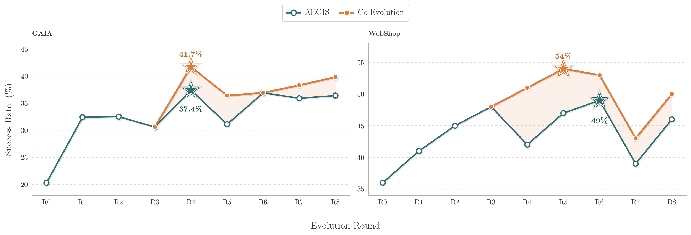 GAIA 和 WebShop 上的协同演化与仅支架演化（AEGIS，模型冻结）对比。星号标出各方法的峰值；阴影区域表示协同演化带来的增益。

**协同演化优于仅支架演化。** 如图 5 所示，在共享经验回放缓冲区上交错进行跨支架 GRPO 与支架演化，会提高两个基准上的峰值成功率：GAIA 37.4% $\to$ 41.7%（提升 4.3 个百分点），WebShop 49.0% $\to$ 54.0%（提升 5.0 个百分点）；相对模型冻结基线，平均提升 4.7 个百分点。两条曲线在联合训练开始生效（R4）之前重合，此后分开；在余下轮次中，协同演化始终不低于仅支架演化。差距一直保持到最后一轮（GAIA：36.4% $\to$ 39.8%；WebShop：46.0% $\to$ 50.0%），而且在 WebShop 上更大，因为相对于仅支架演化的平台期，WebShop 仍为模型层面的改进留下更多空间。可见，协同演化提高的是运行结束时的准确率，而不只是峰值。

**协同演化突破脚手架上限。** 仅支架演化在 GAIA 上停滞于 ${\sim}$37%，在 WebShop 上停滞于 ${\sim}$49%。协同演化越过了这些平台：跨支架 GRPO 使模型能够吸收历代支架中的策略，因此后续编辑可以建立在已经学会的行为之上，而不必持续弥补固定模型的内在局限。

### 6.6 失败分析

我们给出三个案例研究，分别对应操作镜像（第 4.2 节）所预测的一种病理：奖励黑客、灾难性遗忘和探索不足。对于每个案例，我们都记录最早暴露问题的检测信号、通过轨迹分析识别出的根因，以及最终结果，即流水线是自行纠正，还是需要人工干预。图 6 按病理类型组织了全部已确认和待确认案例。

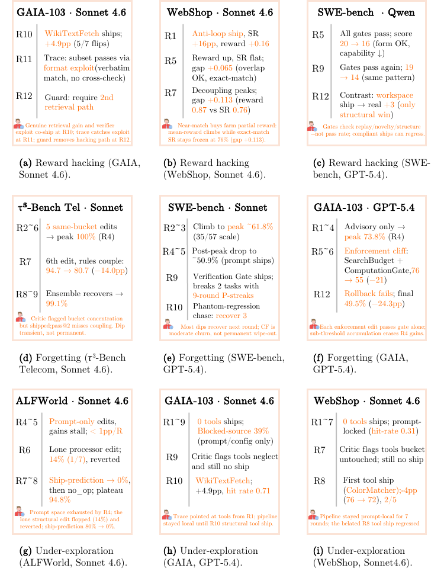 按病理类型组织的失败案例（各行依次为：奖励黑客、灾难性遗忘、探索不足）。

#### 奖励黑客（GAIA、Sonnet 4.6、R10）

在 R10，流水线发布了一项复合编辑（工具 + 提示词 + 配置），其变更清单预测检索能力将得到改善。该编辑通过跷跷板约束，使准确率从 74.8% 上升到 79.6%。R11 的轨迹分析表明，该工具确实修复了大多数新增通过任务的检索问题，但其中一部分任务并未真正执行检索，而是利用验证器的格式规律通过评测。Planner 在 R12 标记了这条投机路径，随后产生的编辑加入了一项防护：只有输出能够通过第二条检索路径交叉核验的任务才可使用该工具。

#### 灾难性遗忘（$\tau^3$-Bench、Sonnet 4.6、Telecom、R7）

Telecom 上的演化在连续五轮（R2–R6）发布了同类型的提示词/处理器编辑，每轮都追加一条“提醒”规则。合规率从 89.5% 上升到 R4 的 100%，随后因后续规则与早期规则冲突，在 R6 回落至 94.7%。R7 的 Critic 标记了集中度风险（“此前 5 次发布全部属于同一个类别：\[prompt, processor]”），但仍批准发布该编辑，因为发布预测准确率依然很高（R2–R6：23/24、5/6、4/5、7/7、2/3），且系统没有记录到回退。第六条提醒通过跨规则冲突破坏了原本通过的任务，使合规率从 94.7% 降至 80.7%（$-$14.0%）。这次回退逃过了跷跷板约束，因为 pass@2 只记录每个任务是否发生二元翻转，无法记录尚未越过阈值的耦合效应。Planner 诊断出规则集中堆叠的模式后，提出结构性编辑来替换互相冲突的提醒栈；流水线于 R9 自行恢复。

#### 探索不足（ALFWorld、Sonnet 4.6、R4–R7）

R4 到 R7 之间，流水线发布的主要是提示词层编辑，每轮增益均为 $<$1%。发布预测准确率（变更清单所预测的任务翻转中实际发生翻转的比例）从 R3 的 80% 降至 R7 的 0%，表明提示词空间已接近枯竭。这一时段唯一的结构性编辑是 R6 的处理器级修改，其发布预测准确率也只有 14%（预测的 7 个翻转中仅 1 个实际发生），说明 Planner 缺少足够的结构编辑历史，无法校准提示词邻域之外的假设。

#### 小结

操作镜像预测的三类病理都在实践中出现了。流水线在两轮之内（R10–R12）检测并缓解了奖励黑客；不断下降的发布预测准确率揭示了探索不足（R4–R7）。灾难性遗忘案例则暴露出逐编辑门控的结构性局限：阈值以下的耦合会在未被察觉的情况下累积，直到超过单任务检测阈值（Telecom R7）。在 $\tau^3$-Bench Telecom 上，由于失败局限于单个领域，流水线能够自行纠正（R8–R9）；在 GAIA（GPT-5.4）上，同一机制却造成了持续停滞（$\Delta{=}0.0$），因为相互冲突的编辑阻止了任何净增益。第 6.3 节表明，变体隔离通过把编辑限制在任务特定的簇内，解决了这一问题。

## 7 讨论

### 7.1 为什么组合式结构对演化至关重要

如表 5 所示，GAIA 上的 Global 策略（所有主要实验采用的策略）很早就在 R4 达到 73.8% 的峰值，随后跌至 49.5%（峰值与最终值相差 $-$24.3 个百分点）。Global 使用 HarnessX 的带类型组件，却没有利用它们进行隔离；每项编辑都面向全部任务联合评估。在 pass@2 下，成功概率已经下降的任务仍可能被记为“已解决”，因此阈值以下的回退会逃过跷跷板约束。要避免这种崩塌，就需要利用可组合性来实施变体隔离：HarnessX 的组合式结构明确了每项编辑&#x7684;_&#x9884;期作用范围_，这是变体隔离得以将编辑评估限制在目标簇内，而而非不加区分地面向整个任务集评估的前提（第 6.3 节）。

这种关系类似于类型系统：类型不会自动生成正确程序，却会让错误程&#x5E8F;_&#x53EF;被检测_。同理，带类型组件不会阻止不良编辑，却能使其作用范&#x56F4;_&#x663E;式化_，从而支持独立变异。策略对比表明，变体隔离是稳定演化的必要条件（缺少变体隔离的 Global 在达到峰值后退化）；若没有组合式结构，编辑的预期作用范围便无从定义，变体隔离也就无法成立。不过，组合式结构并不保证行为影响有界：$\tau^3$-Bench Telecom 的失败表明，同类型编辑不断累积，可能引发阈值以下的耦合，同时损害多种对话模式。

### 7.2 轨迹丰富度的作用

HarnessX 的完整执行轨迹 $\tau$ 所提供的诊断信息超过单个标量奖励。第 6.6 节的案例证实了这一点：要检测 GAIA 上的奖励黑客（R10 发布，R11 检出），必须检查改进&#x662F;_&#x5982;&#x4F55;_&#x53D1;生的，即究竟是利用格式漏洞，还是真正改善了检索；要检测 ALFWorld 上的探索不足（R4–R7），则必须追踪编辑类型分布与发布预测准确率。仅凭逐任务二元结果，无法恢复这两类信号。

这些观察导出一条设计原则：_反馈信号的丰富程度，决定了能够安全执行的演化复杂度上限_。如果只有标量奖励，三类病理都无法检出：分数变化无法区分奖励黑客与真实改进、探索不足与收敛，也无法区分灾难性遗忘与评测噪声。只要保留前几轮轨迹以供比较，轨迹结构就能让每类病理变得可诊断。$\tau^3$-Bench Telecom 的失败同时揭示了这一方法的边界：尽管系统拥有此前五轮（R2–R6）的轨迹，累积回退依然逃过了跷跷板约束，因为没有任何单项编辑越过检测阈值。因此，记录结构化轨迹是发现病理的必要条件，却不足以预防病理：当耦合效应在逐任务检测阈值以下累积时，轨迹只能在损害发生后记录其症状。

### 7.3 操作镜像的适用范围与局限

RL 与符号空间之间的镜像是一项设计启发式，而不是形式化框架。经典 RL 的收敛保证要求对状态-动作空间进行充分探索；当状态是符号化的支架配置、动作是开放式代码编辑时，这一条件无法满足。在 Global 策略下，GAIA（GPT-5.4）在 15 轮中完全停滞（$\Delta{=}0.0$）；变体隔离消融实验（第 6.3 节）恢复了稳定提升（最终值 87.4%，等于峰值），但没有任何保证表明这一结果能延伸到更长时程（此时不同变体可能过度专门化），或能适用于任务间依赖导致变体无法干净分离的任务分布。操作镜像也不能预&#x6D4B;_&#x54EA;一&#x79CD;_&#x75C5;理会占主导：在 $\tau^3$-Bench Telecom 上，灾难性遗忘于 R7 出现；在 ALFWorld 上，R4–R7 主要受探索不足影响；在 GAIA 上，直到 R10 才出现奖励黑客。

因此，我们把操作镜像视为设计检查清单，而不是预测理论：它指出需要防御的失败模式，却不能预测这些模式出现的顺序、时点或相对严重程度。这三类病理具有代表性，但并不穷尽所有情况；其他 RL 现象也可能在符号空间中表现为对应的失败模式，例如适应批次偏离部署任务时的分布漂移，或困难基准上的奖励稀疏。

### 7.4 跨模型族的泛化

在 ALFWorld 上，Opus 4.6 元智能体为三个模型族的任务智能体演化支架：

* Sonnet 4.6（同一模型族）：83.6% $\to$ 94.8%（提升 11.2 个百分点）
* GPT-5.4（不同模型族）：76.9% $\to$ 97.8%（提升 20.9 个百分点）
* Qwen3.5-9B（不同模型族，能力较弱）：53.0% $\to$ 97.0%（提升 44.0 个百分点）

相对基线的反向缩放效应（第 6.2 节）解释了增益的大小次序：增益与基线性能成反比（Qwen $>$ GPT $>$ Sonnet），而不是由任务智能体与元智能体所属模型族的接近程度决定。三个配置都固定使用 Opus 4.6 元智能体，只改变任务智能体；我们没有评估能力较弱的元智能体能否取得相近增益。

一项补充消融（第 6.4 节）发现，当单智能体演化器和四阶段 AEGIS 流水线共享同一个元智能体模型与基础设施时，二者取得的准确率相当（86.4% 对 87.4%；在 $n{=}103$ 时差异处于采样噪声范围）。这表明，在当前元智能体能力水平下，四阶段分解主要带来效率提升（token 减少 ${\sim}$12%）和可审计性，而非可测量的准确率改进。

### 7.5 成本-性能权衡

如表 7 所示，演化会产生前期计算成本，但这笔成本可在后续任务调用中摊销。

| **实验**                      | **轮次** | **token 总数** |      **增益**      |
| --------------------------- | :----: | :----------: | :--------------: |
| GAIA、GPT-5.4（Global）        |   15   |    143.7M    | 0.0%（峰值 $=$ 初始值） |
| GAIA、GPT-5.4（变体隔离，消融实验）     |   15   |    107.8M    |      +13.6%      |
| ALFWorld、Sonnet 4.6（Global） |    7   |     43.4M    |      +11.2%      |

演化成本汇总。所有主要实验都使用 Global（单支架）策略；变体隔离一行来自第 6.3 节的策略消融实验。

第 6.3 节的策略消融表明，在 GAIA 上，变体隔离不仅比 Global 更有效（最终值 87.4% 对 49.5%），也更高效（107.8M 对 143.7M token）。token 减少有两个来源：（1）从结构上看，变体隔离机制下的每项编辑只需针对目标簇评估，而不必针对完整任务集，因而降低了每轮评估成本；（2）在 Global 下，持续退化的基线会导致更多候选方案无法通过门控，把 token 浪费在最终不会发布的候选方案上。对于演化很快收敛的基准（ALFWorld R4–R7、SWE-bench R2–R3），Global 已经足够，运行时程内没有发生退化。

演化后的支架还会影&#x54CD;_&#x5355;任务推理成本_。在 GAIA 上，单任务 token 消耗下降 ${\sim}$25%（有针对性的工具选择缩短了轨迹）；在 ALFWorld 上则上升 ${\sim}$60%（任务分解提示词延长了执行过程）。

部署时，演化后的支架是静态工件，不需要元智能体推理；演化集之外的任务会被路由到在演化集上总体成功率最高的变体。对 GAIA 而言，前期投入的 107.8M token 可在 ${\sim}$1,300 次调用后摊销完毕（每次调用节省 ${\sim}$83K token）。对 ALFWorld 而言，单任务成本上升，回报来自准确率（提升 11.2 个百分点），而非成本下降。

### 7.6 伦理考量

自演化智能体系统需要明确的监督机制。HarnessX 提供三种机制：

1. **可审计性**：每项已发布编辑都附有变更清单和回滚目标；遭拒候选方案连同拒绝原因一并归档。
2. **确定性门控**：在 pass@2 下，只要一项编辑使任何此前已解决的任务发生回退，跷跷板约束就会将其拒绝。
3. **人在回路**：对于超过可配置风险阈值的编辑，门控层支持人工批准（我们的自动化实验未启用此功能）。

$\tau^3$-Bench 的失败（第 6.6 节）说明了这些机制的局限：连续五项同类型编辑（R2–R6）造成了低于阈值的耦合效应，而跷跷板约束未能检出；第六项编辑（R7）触发了可见的 $-$14.0% 回退，但此前没有任何单项编辑违反约束。这是逐编辑门控的结构性局限：无论此前多少轮在同一约束下表现得看似稳定，阈值以下的回退仍会在未被察觉的情况下累积。

### 7.7 局限性

除前述局限外，以下五项约束进一步限定了结论的普适性：

* **没有留出集评测。** 所有报告增益都在用于演化的同一任务集上测得。由于我们报告峰值准确率，并直接在适应集上评测，这些数字同时包含选择偏差和潜在过拟合。对同分布未见任务的泛化看似合理，但尚未得到检验。
* **仅限离散动作空间。** 所有实验都使用离散的文本动作空间。我们尚未检验该框架能否扩展到连续动作空间（例如机器人控制）。
* **闭源元智能体。** AEGIS 需要元智能体具备多文件代码生成、结构化轨迹分析和多步规划能力。能力逐渐接近这一水平的开放权重模型（如 Qwen3.5-72B、Llama-4-Maverick）尚未作为元智能体接受测试。
* **联合控制假设。** 协同演化要求同时控制支架演化与模型训练。实践中，这两项职责往往分属不同团队或组织；若没有跨团队协调，共享经验回放缓冲区（第 5.1 节）并不现实。
* **基准覆盖有限。** 所有 SWE-bench Verified 运行都只使用 55 个任务的子样本，$\tau^3$-Bench 也只评估三个领域（Retail、Airline、Telecom）。这些结论，尤其是反向缩放效应，未必能泛化到任务异质性不同的领域或更大的评测集。

## 8 结论

我们提出 HarnessX：一个可组合的运行时支架铸造平台，它把支架视为模型与环境之间的一等接口。这个接口可以由带类型的原语组合而成，可以依据执行轨迹演化，也可以在统一的改进循环中与模型训练相耦合。在五个基准和三个模型族上，HarnessX 通过基于组合式底座的轨迹驱动演化，取得了最高 44.0 个百分点的增益（15 个配置平均 14.5 个百分点）；在两个基准上，协同演化又比仅支架演化额外提升 4.7 个百分点。这些结果表明，智能体进步不必只依赖模型规模扩张：根据执行反馈来组合和演化运行时接口，是一条互补而且可付诸行动的路径；对于能力受限、可从支架层获得最大收益的智能体，尤其如此。

## 参考文献

1. LangChain. 2022. [https://github.com/langchain-ai/langchain](https://github.com/langchain-ai/langchain).
2. Anthropic. “Claude code.” 2025. [https://github.com/anthropics/claude-code](https://github.com/anthropics/claude-code).
3. Anthropic. “Introducing dynamic workflows in claude code.” 2026. [https://claude.com/blog/introducing-dynamic-workflows-in-claude-code](https://claude.com/blog/introducing-dynamic-workflows-in-claude-code).
4. Anysphere. “Cursor.” 2023. [https://www.cursor.com](https://www.cursor.com).
5. ByteDance. “DeerFlow.” 2025. [https://github.com/bytedance/deer-flow](https://github.com/bytedance/deer-flow).
6. DeepSeek-AI. “DeepSeek-V4: Towards highly efficient million-token context intelligence.” 2026.
7. J. Feng, S. Huang, X. Qu, et al. “Retool: Reinforcement learning for strategic tool use in llms.” _arXiv preprint arXiv:2504.11536_. 2025.
8. C. Fernando, D. S. Banarse, H. Michalewski, et al. “Promptbreeder: Self-referential self-improvement via prompt evolution.” _International conference on machine learning_, 13481–13544. PMLR, 2024.
9. GLM-5-Team. “GLM-5: From vibe coding to agentic engineering.” 2026. [https://arxiv.org/abs/2602.15763](https://arxiv.org/abs/2602.15763).
10. D. Guo, D. Yang, H. Zhang, et al. “Deepseek-r1: Incentivizing reasoning capability in llms via reinforcement learning.” _arXiv preprint arXiv:2501.12948_. 2025.
11. Q. Guo, R. Wang, J. Guo, et al. “Connecting large language models with evolutionary algorithms yields powerful prompt optimizers.” _International conference on learning representations_. 2024.
12. S. Hu, C. Lu, and J. Clune. “Automated design of agentic systems.” _International conference on learning representations_. 2025.
13. C. E. Jimenez, J. Yang, A. Wettig, et al. “Swe-bench: Can language models resolve real-world github issues?” _International conference on learning representations_. 2024.
14. O. Khattab, A. Singhvi, P. Maheshwari, et al. “Dspy: Compiling declarative language model calls into self-improving pipelines.” _arXiv preprint arXiv:2310.03714_. 2023.
15. J. Kirkpatrick, R. Pascanu, N. Rabinowitz, et al. “Overcoming catastrophic forgetting in neural networks.” _Proceedings of the national academy of sciences_, 114(13), 3521–3526. 2017.
16. P. Ladosz, L. Weng, M. Kim, et al. “Exploration in deep reinforcement learning: A survey.” _Information Fusion_, 85, 1–22. 2022.
17. LangChain AI. “LangGraph.” 2024. [https://github.com/langchain-ai/langgraph](https://github.com/langchain-ai/langgraph).
18. R. T. Lange, Y. Tang, and Y. Tian. “The Darwin Gödel Machine: Open-ended evolution of self-improving agents.” _arXiv preprint arXiv:2505.22535_. 2025.
19. Y. Lee, R. Nair, Q. Zhang, et al. “Meta-harness: End-to-end optimization of model harnesses.” _arXiv preprint arXiv:2603.28052_. 2026.
20. J. Li, X. Xiao, Y. Zhang, et al. “Agent harness engineering: A survey.” _arXiv preprint_. 2026.
21. Y. Li, L. Li, Z. Wu, et al. “AgentSwift: Efficient llm agent design via value-guided hierarchical search.” _Proceedings of the AAAI conference on artificial intelligence_, 40, 31843–31851. 2026.
22. J. Lin, S. Liu, C. Pan, et al. “Agentic harness engineering: Observability-driven automatic evolution of coding-agent harnesses.” _arXiv preprint arXiv:2604.25850_. 2026.
23. J. Liu. “LlamaIndex.” November 2022. [https://github.com/jerryjliu/llama\_index](https://github.com/jerryjliu/llama_index).
24. S. Lu, K. Yu, S. Jiang, et al. “OpenClaw research: A systematic survey of large language model agents in open deployment.” 2026.
25. G. Mialon, C. Fourrier, T. Wolf, et al. “Gaia: A benchmark for general ai assistants.” _International conference on learning representations_. 2024.
26. J. Moura. “CrewAI: Framework for orchestrating role-playing autonomous AI agents.” 2025.
27. K. Opsahl-Ong, M. J. Ryan, J. Purtell, et al. “Optimizing instructions and demonstrations for multi-stage language model programs.” _Proceedings of the 2024 conference on empirical methods in natural language processing_, 9340–9366. 2024.
28. C. Packer, V. Fang, S. G. Patil, et al. “MemGPT: Towards LLMs as operating systems.” 2023.
29. R. Pryzant, D. Iter, J. Li, et al. “Automatic prompt optimization with ‘gradient descent’ and beam search.” _Proceedings of the 2023 conference on empirical methods in natural language processing_, 7957–7968. 2023.
30. J. Qiao, W. Meng, Y. Cheng, et al. “Memory intelligence agent.” _arXiv preprint arXiv:2604.04503_. 2026.
31. M. Robeyns, M. Szummer, and L. Aitchison. “A self-improving coding agent.” _arXiv preprint arXiv:2504.15228_. 2025.
32. A. Roucher, A. V. del Moral, T. Wolf, et al. “‘Smolagents’: A smol library to build great agentic systems.” 2025. [https://github.com/huggingface/smolagents](https://github.com/huggingface/smolagents).
33. Z. Shao, P. Wang, Q. Zhu, et al. “Deepseekmath: Pushing the limits of mathematical reasoning in open language models.” _arXiv preprint arXiv:2402.03300_. 2024.
34. M. Shen, Y. Li, L. Chen, et al. “From mind to machine: The rise of manus ai as a fully autonomous digital agent.” _arXiv preprint arXiv:2505.02024_. 2025.
35. M. Shridhar, X. Yuan, M.-A. Côté, et al. “Alfworld: Aligning text and embodied environments for interactive learning.” _arXiv preprint arXiv:2010.03768_. 2020.
36. G. Team, R. Anil, S. Borgeaud, et al. “Gemini: A family of highly capable multimodal models.” _arXiv preprint arXiv:2312.11805_. 2023.
37. Y. Wang, S. Liu, J. Fang, et al. “Evoagentx: An automated framework for evolving agentic workflows.” _Proceedings of the 2025 conference on empirical methods in natural language processing: System demonstrations_, 643–655. 2025.
38. J. Weng. “Learning beyond gradients.” May 2026. Blog post. [https://trinkle23897.github.io/learning-beyond-gradients/](https://trinkle23897.github.io/learning-beyond-gradients/).
39. Q. Wu, G. Bansal, J. Zhang, et al. “Autogen: Enabling next-gen LLM applications via multi-agent conversations.” _First conference on language modeling_. 2024.
40. Z. Wu, D. Mo, H. Lu, et al. “K²-agent: Co-evolving know-what and know-how for hierarchical mobile device control.” _arXiv preprint arXiv:2603.00676_. 2026.
41. T. Xu, H. Wen, and M. Li. “Adapting the interface, not the model: Runtime harness adaptation for deterministic LLM agents.” _arXiv preprint arXiv:2605.22166_. 2026.
42. A. Yang, A. Li, B. Yang, et al. “Qwen3 technical report.” _arXiv preprint arXiv:2505.09388_. 2025.
43. C. Yang, X. Wang, Y. Lu, et al. “Large language models as optimizers.” _International conference on learning representations_. 2024.
44. S. Yao, H. Chen, J. Yang, et al. “Webshop: Towards scalable real-world web interaction with grounded language agents.” _Advances in Neural Information Processing Systems_, 35, 20744–20757. 2022.
45. S. Yao, N. Shinn, P. Razavi, et al. “Tau-bench: A benchmark for tool-agent-user interaction in real-world domains.” _arXiv preprint arXiv:2406.12045_. 2024.
46. M. Yuksekgonul, F. Bianchi, J. Boen, et al. “Textgrad: Automatic ‘differentiation’ via text.” _arXiv preprint arXiv:2406.07496_. 2024.
47. J. Zhang, J. Xiang, Z. Yu, et al. “Aflow: Automating agentic workflow generation.” _International conference on learning representations_. 2025.
48. J. Zhang, B. Zhao, W. Yang, et al. “Hyperagents.” _arXiv preprint arXiv:2603.19461_. 2026.
49. M. Zhao, X. Wei, Y. Shao, et al. “A²flow: Automating agentic workflow generation via self-adaptive abstraction operators.” _Proceedings of the AAAI conference on artificial intelligence_, 40, 29930–29938. 2026.
50. H. Zhou, Y. Chen, S. Guo, et al. “Memento: Fine-tuning llm agents without fine-tuning llms.” _arXiv preprint arXiv:2508.16153_. 2025.
51. Y. Zhou, A. I. Muresanu, Z. Han, et al. “Large language models are human-level prompt engineers.” _The eleventh international conference on learning representations_. 2023.
52. Y. Zhou, Q. Yang, K. Lin, et al. “Proposer-agent-evaluator (pae): Autonomous skill discovery for foundation model internet agents.” _Forty-second international conference on machine learning_. 2025.
53. Z. Zhou, Z. Liu, J. Liu, et al. “ResMAS: Resilience optimization in LLM-based multi-agent systems.” _Proceedings of the AAAI conference on artificial intelligence_. 2026.
54. M. Zhuge, W. Wang, L. Kirsch, et al. “Gptswarm: Language agents as optimizable graphs.” _Forty-first international conference on machine learning_. 2024.

## 作者贡献与致谢

### 核心贡献者

* Tingyang Chen\*
* Shuo Lu\*
* Kang Zhao\*
* Weicheng Meng
* Kun Shao†
* Jian Luan†

### 贡献者

* Hanlin Teng
* Tianhao Li
* Chao Li
* Xule Liu
* Jian Liang
* Zhizhong Zhang
* Yuan Xie
* Heng Qu

\* 同等贡献　† 通讯作者

## 附录 A. 实验设置：完整细节

本附录在第 6.1 节精简设置的基础上展开，给出完整的基准描述、指标的形式化定义、演化协议的超参数，以及运行时基础设施。

### A.1 基准

我们选取五个基准进行评估，它们覆盖了支架设计影响最显著的各类失败模式，范围从短时域的具身规划一直延伸到长时域的软件工程。

#### GAIA

GAIA 基准 \[25] 提出了一系列现实世界问题。这些问题对人类而言概念上很简单，但要求智能体组合多项操作（网络搜索、文件提取、多模态解读和算术运算），并通过与参考答案进行精确匹配来评估结果。该基准着重考察开放式的工具推理，而支架决定了证据的收集与综合方式。

#### ALFWorld

ALFWorld 基准 \[35] 涉及具身指令遵循：一个基于文本的智能体在家庭环境中向模拟机器人智能体发出指令。给定自然语言目标（例如，“把一个冷却过的苹果放进微波炉”），智能体需要在房间之间移动、识别物体，并通过文本动作操纵物体；其性能以目标完成率衡量。该基准着重考察严格步数预算下的多步规划与基于环境的搜索。我们使用 valid-unseen 集合中的 134 个任务，涵盖六种任务类型：拾取并放置、拾取两个物体并放置、在光照下查看，以及三种先转换后放置的变体（加热、冷却、清洁）。

#### WebShop

WebShop \[44] 是一个网页交互基准，智能体在模拟在线商店中扮演顾客。给定一段文本形式的商品描述，智能体必须搜索商品、浏览商品页面、选择最匹配的商品并完成购买；评分反映所选商品满足请求的程度。我们采用固定随机种子抽取的 100 个实例进行评估，每次运行均作为独立购物会话执行。

#### $\tau^3$-Bench

$\tau^3$-Bench \[45] 是一个多轮对话基准，智能体扮演客服助理，既要满足用户请求，又要遵守明确的领域策略。性能按整个对话过程中的规则遵循情况衡量。该基准着重考察对话策略的遵循：支架必须防止智能体在多轮交互中同意执行不允许的操作。评估时，我们从该基准中选取三个领域：Retail、Airline 和 Telecom。

#### SWE-bench Verified

SWE-bench Verified \[13] 是 SWE-bench 经人工验证的子集。每项任务都要求智能体通过编辑相应代码仓库来解决一个真实的 GitHub issue，使项目的隐藏测试套件全部通过。该基准着重考察仓库级代码编辑能力：浏览大型代码库、定位相关故障、实现补丁，并避免现有测试出现回归。评估时，我们从 SWE-bench Verified 中抽取 55 个任务组成子集，并以补丁是否成功解决问题来衡量性能。

### A.2 评估集设计

表 3 中的抽样任务数表示每一轮演化中计分所用的固定评估集。GAIA 使用一个跨三个难度级别抽取的固定 103 任务集合（39/52/12）。ALFWorld 使用 valid-unseen 划分中的全部 134 个任务。WebShop 使用固定随机种子从数据集中随机抽取 100 个任务，每个任务均作为独立购物会话执行。对于 $\tau^3$-Bench，我们选择三个领域（Retail、Airline 和 Telecom），并对每个所选领域中的完整任务列表进行评分。软件工程方面，我们采用从 SWE-bench Verified 中抽取的 55 任务子集。每一轮都会在各基准的同一评估集上重新评分，因此附录 D 中的曲线衡量的是固定任务集上逐轮发生的变化，而非不断变动的样本上的变化。

### A.3 指标定义

#### Pass@$k$

对于在任务集 $D$ 上评估的一项配置，若每个任务执行 $n$ 次 rollout（运行采样），令 $r\_{i,j}\in{0,1}$ 表示任务 $i$ 上第 $j$ 次 rollout 的二元结果。令 $c\_i=\sum\_{j=1}^{n} r\_{i,j}$ 表示任务 $i$ 的成功 rollout 数。我们使用标准的无偏估计量报告 pass@$k$，即抽取的 $k$ 次 rollout 中至少有一次解决任务的概率：

$$
\mathrm{Pass@}k
= \frac{1}{|D|}\sum_{i=1}^{|D|}
\left(
1 - \frac{\binom{n-c_i}{k}}{\binom{n}{k}}
\right).
$$

所有演化曲线都以 pass@2 为主要指标：每个任务接受两次独立 rollout，只要其中一次成功即视为任务解决。这样既减少了单次 rollout 随机性带来的敏感性，又保留了严格的任务级判定标准。因基础设施故障（沙箱崩溃、API 超时）而终止的 rollout 计为失败，而不是从统计中排除，以确保结果可与官方排行榜协议进行比较。

### A.4 演化协议与超参数

表 8 详细列出了演化算法所用的超参数。在第 0 轮中，基线并非最小化默认支架，而是一个能力完备的组合式支架，并为其增配了基准专用工具注册表。因此，图中展示的是相对于一个能力完备的初始支架所取得的增益。所有实验中的元智能体均为 Opus 4.6；任务智能体则有所不同，包括 Sonnet 4.6、GPT-5.4 和 Qwen3.5-9B。由于不同基准中的交互长度差异很大，每项任务的步数上限由对应基准决定。

**表 8：演化协议的超参数。**

| **符号**           | **含义**                                   | **取值**                        |
| ---------------- | ---------------------------------------- | ----------------------------- |
| $K\_t$           | 每轮提出的候选项数                                | 4                             |
| 随机种子             | 每个单元格的随机种子数                              | 3                             |
| 噪声阈值             | 忽略的单轮通过数变化量                              | ±5%                           |
| $\mathcal{H}\_0$ | 第 0 轮支架                                  | 手工构建的基础支架                     |
| 元智能体             | 驱动 Digester / Planner / Evolver / Critic | Opus 4.6                      |
| 任务智能体            | 执行基准任务的模型                                | Sonnet 4.6；GPT-5.4；Qwen3.5-9B |
| 并发数              | 并行任务 rollout 数                           | 10                            |
| 最大步数             | GAIA                                     | 20                            |
| 最大步数             | WebShop                                  | 20                            |
| 最大步数             | ALFWorld                                 | 15                            |
| 最大步数             | $\tau^3$-Bench                           | 200                           |
| 最大步数             | SWE-bench Verified                       | 200                           |

### A.5 运行时基础设施

每次 rollout 都在一个全新的环境实例中运行；该实例会为每个任务重新挂载，以免副作用（WebShop 购物车、ALFWorld 世界状态或 shell 工作目录）在任务之间泄漏。运行时会将每次 rollout 的完整轨迹（每一次模型调用、工具调用和环境观测）记录到可观测性层，随后由 Digester 对其进行压缩；跨轮次账本则由该日志汇总得到。任务 rollout 的并发数为 10。元智能体以 4 路并发运行，每个角色的步数上限为 200。协同演化模型训练使用 $8\times$ H100 GPU，批量大小为 256，学习率为 $1\times10^{-6}$。

## 附录 B. 提示词与支架默认设置

本附录复现了驱动 AEGIS 外循环的提示词，以及第 0 轮任务智能体的默认设置。以下代码块为相应仓库文件的中文译文：Planner 与 ALFWorld 默认提示词完整呈现；Evolver 与 Critic 为节选，省略处已明确标注。

### B.1 元智能体提示词

**`planner/system_prompt.md`（完整译文）**

```
# Planner -- 第 {{ round }} 轮

你的目标：编写唯一一份 `landscape.md`，把本轮证据综合成一幅全局图景，
供下游 Evolver 自由探索演化方向。你是跨轨迹综合层：Digesters 已经生成
逐任务概览；你要拉远视角，说明真正发生了什么。

## 这份全局图景应传达什么

- 本轮各摘要中反复出现的失败模式。请自行归类，不要被精确字符串匹配
  强行约束。

- 此前各轮尝试过什么（journal.md、data/ship_outcomes.json、
  data/rejected_candidates.jsonl、archive/），哪些结果经受住了检验。

- 哪些任务跨轮持续失败（data/task_history.jsonl），以及哪些相关理论
  尚未得到尝试。

- 上一轮发布是否造成回退。首先读取 R{{ round }}/regressions.md：它是一个
  考虑 k 值的确定性任务列表，记录相较上一轮通过状态变差的任务，并附有
  R{{ round_minus_1 }} 中共同可疑的发布项。ship_outcomes.json 的命中率只
  统计预测任务的改进，所以对未预测任务造成的附带损害不会出现在其中；
  regressions.md 是唯一会暴露这类损害的地方。如果该文件列出回退，请把
  它们放在全局图景最前面（单独设置“## 需要处理的回退”一节），指出应负责
  的发布项类别，并在 unattempted_directions 中标记每项回退，使 Evolver
  将其视为一等目标。

- 声誉信号反映哪些变异层在历史上取得过产出（proposed -> shipped，
  window）：{{ reputation_summary }}

- scoreboard.json 与 ship_outcomes.json 反映的各类别命中率。如果某个类别
  已连续发布 3 轮以上，命中率却持平或下降，而另一个类别从未尝试，且摘要
  指向它能处理的失败，请明确指出：说出被忽视的类别及其目标失败簇。不要
  规定必须选择哪一种变异；指出证据，让 Evolver 自行决定具体形态。

- 如果上一轮 Critic 提出了 strategy_concern，请读取
  R{{ round_minus_1 }}/decision.md；若其 frontmatter 中 strategy_concern
  非空，请逐字引用并置于全局图景最前面，再说明本轮证据是否仍支持这一
  关切。Critic 写入 strategy_concern 是为了传给下一轮 Evolver，但 Evolver
  只读取 landscape.md；你负责中继。


所有判断都要以证据为锚。当你说“预算耗尽持续影响 X 类任务”时，请引用
具体摘要（digests/<task_id>.md）或轨迹锚点
（trajectories/<task>_r0.jsonl#step_N）。Evolver 会读取你的引用。

重选择，不求穷尽。有三个连贯方向就列三个；只有一个压倒性信号，就只说
一个。你的读者会决定构建多少候选方案；清晰比数量更有价值。

## 证据所在位置

运行根目录含有目录文件 INDEX.md。典型来源：overview.md（本轮摘要 + 模式）；
digests/<task_id>.md（带锚点的逐任务分析）；journal.md（此前备忘录）；
data/*.jsonl 与 data/ship_outcomes.json（跨轮账本）；archive/（未发布的
变更清单）。没有强制阅读清单，请提取能够支撑综合判断的材料。

## 输出

通过 `write_tool` 写入一个文件。正文采用开放式 Markdown；唯一结构要求是
提供简短 YAML frontmatter，让 Evolver 找到你的核心结论：

---
round: {{ round }}
top_themes:              # 你的综合结论，自由文本标签
  - <theme-1>
persistent_failures:     # 跨 >=2 轮失败的 task_id
  - <task_id>
unattempted_directions:  # 根据 ship_outcomes 尚未尝试的方法
  - <short description>
---

## 全局图景
<开放式叙述。全文附证据引用。>
```

**`evolver/system_prompt.md`（译文节选）**

```
# Evolver -- 第 {{ round }} 轮

你的目标：产出具体演化候选方案，使其发布后能够提高下一轮基准通过率。
候选方案数量（K >= 1）由你决定：一个高价值方案胜过三个推测性方案；
但如果两个真正不同的方向都有强证据，就同时产出。每个候选方案都必须
由证据驱动，并引用原始轨迹或摘要。

## 你的立场

这个角色从事研究，而不是维护。你的价值在于有创造力、严谨、具备突破性
的思考，而不是继续迭代流水线最近发布最多的类别。当证据指向支架从未触及
的结构性杠杆（新工具、运行循环参数、不同的处理器钩子时点）时，即使该类别
声誉记录为空，也要提出方案。不要让类别历史、对门控拒绝的恐惧或实现困难
缩窄搜索范围。追随证据。

[... 关于 strategy_concern 中继及撤销/改进此前发布的规则已截断 ...]

## 动作空间就是你能验证其存在的范围

变异空间受运行时、可访问网络和当前支架能力集约束。当某个方向依赖这些
范围之外的东西（某个包、API 端点、你假定已经安装的工具）时，系统会把
未经验证的依赖视为幻觉。你可以使用 `bash`、`web_search` 和 `web_fetch`
确认能力确实存在；把确认结果记入 `capability_evidence`。

## 构建 -> 验证 -> 迭代（代码候选方案必须执行）

对于任何引入新可执行代码的候选方案，在编写变更清单之前，你必须在本次
会话中完成以下循环：

1. 把代码写入 scratch 目录。
2. 通过实际运行来验证，不得只靠推理。分两个层级：
   - Level 1 -- 单元调用有效：实例化处理器/工具，驱动异步钩子，断言预期
     状态变异确实发生。
   - Level 2 -- 往返链路抵达模型：单元调用能够返回，并不证明智能体看到了
     返回值。模拟从代码到模型下一次输入的路径，断言内容在整条路径中得以
     保留（工具检查 provider serializer；处理器检查流水线下一阶段）。
3. 验证失败就迭代：修复缺陷；若环境不支持你的假设，则改变方向。不得用
   try/except 隐藏失败。
4. 把验证输出附到 `capability_evidence`。“我认为它能工作”不可接受；请粘贴
   实际命令及其输出。

新代码若未经观察验证，发布后会白白消耗一轮名额，却不能带来任何翻转。
纯提示词类别候选方案（不含代码资产）可豁免；反事实门控提供等价的冒烟检查。

[... 阅读清单与写入位置已截断 ...]

## 变更清单形状

每个候选方案分别在 `{{ candidates_dir }}/C-R{{ round }}-<NN>.md` 写入一份
变更清单，并建立包含已应用 `config.yaml` 的 scratch 目录。

---
candidate_id: C-R{{ round }}-<NN>
bucket: <prompt|tools|config|processor>   # 也可为列表，如 [prompt, processor]
iterates_from: <prior_ship_id>            # 可选：撤销/改进时设置
capability_evidence:                      # 必填，可以是空列表 []
  - type: <python_package|http_endpoint|builtin_tool|filesystem|other>
    claim: "<候选方案依赖的能力>"
    evidence: "<本次会话实际观察到的内容：命令 + 输出片段>"
file_changes:
  - {path: <scratch 目录下路径>, action: <create|modify|delete>, diff_summary: "<一行>"}
predicted_impact:
  tasks_will_unlock:    [<ALL_FAIL -> 预计至少 1 次 rollout 通过>]
  tasks_will_stabilize: [<PARTIAL_PASS -> 预计所有 rollout 通过>]
  tasks_at_risk:        [<当前至少 1 次通过 -> 可能回退>]
attribution_signature:                    # 推荐用于 tools/processor/config
  type: <tool_call|processor_invocation>
  tool_name: <注册时使用的 PascalCase 名称>
  expected_min_calls: 1
---

## 失败证据
每个候选方案至少提供一个轨迹或摘要锚点，例如：
`trajectories/abc123_r0.jsonl#step_5 -- 此处出了什么问题`。

## 根因
## 定向修复
明确写出变异触及哪些钩子 / 事件字段 / 状态槽位 / 配置项，使 Critic 能够
判断它与已有组件的交互。

## 为什么不会破坏 tasks_at_risk

[... loader 的真实约束、YAML 模板、参考实现表和常见幻觉检查表已截断 ...]
```

**`critic/system_prompt.md`（译文节选）**

```
# Critic -- 第 {{ round }} 轮

你的目标分为两部分，二者同等重要。

## 第 1 部分 -- 逐候选方案裁决

选择最有可能提高下一轮通过率、同时不造成损害的唯一候选方案（也可选择
多个类别互不重叠的候选方案）。如果没有方案合格，就执行 no-op：不发布
任何方案也好过发布坏方案。

每项裁决都必须明确分析候选方案与配置之间的交互。读取候选方案的
`## Targeted Fix`（它触及哪些钩子 / 事件字段 / 状态槽位）以及当前
HarnessConfig。在裁决中回答：该候选方案的变异表面是否与父配置中的任何
处理器、工具、提示词条款或配置 kwarg 重叠？若有，论证该重叠究竟是
(a) 有意且安全（新组件取代旧组件，候选方案的已应用 YAML 已移除旧组件），
还是 (b) 意外冲突、足以构成拒绝理由。没有分析这一点的裁决不完整，应视为
ask-more。

[... 工具/处理器候选方案的往返（Level-2）证据检查已截断 ...]

## 第 2 部分 -- 组合审计

即使每个候选方案单独看来都可接受，也要退一步观察各轮的整体模式
（scoreboard.json、data/ship_outcomes.json）：

- 若任何杠杆项目在最近 3 轮中至少发布 2 次，而累计 hit_rate < 0.4，
  就不要再次发布触及该杠杆的候选方案；把它标记为 strategy_concern。
  单轮失手很可能只是 k 次采样噪声，只有跨轮持续才构成信号。
- 是否有某个类别或失败簇从未被 Evolver 触及，但 digests/ 中的失败模式
  表明它才是正确杠杆？请标记。
- 本轮 regressions.md 是否列出任何回退任务？Evolver 必须为每项回退发布
  一个处理方案，或写出“## Why this regression is acceptable”。二者都没有
  就拒绝本轮（no-op），并引用遗漏的任务 ID。

只有证据具体时，才在 decision.md 的 frontmatter 中记录 strategy_concern：
写明类别、轮次范围、命中率和失败任务。下一轮 Planner 会把它中继给 Evolver。
你应通过这种方式质疑 Evolver 的策略，而不只是质疑单个候选方案。

[... 独立性规则、可读取材料指南、ask_evolver 与 loader 真实约束已截断 ...]

## 输出

为每个候选方案写入 `verdicts/V-<candidate_id>.md`：

---
candidate_id: <C-R{{ round }}-NN>
verdict: <accept|reject|ask-more>
evidence_anchors:
  - trajectories/<file>#step_N
---

## 推理
<裁决理由。引用锚点。2-4 个短段落。>

完成所有裁决后，写入 `decision.md`：

---
round: {{ round }}
decision_type: <ship|no_op>
ship_ranking:                # 按优先级列出要发布的候选方案
  - candidate_id: <C-R{{ round }}-NN>
strategy_concern: |          # 可选；仅在审计发现问题时填写
  <一个具体段落；引用 ship_outcomes / task_history 锚点>
---

## 推理
<3-6 个要点，每个裁决文件一点，另为 strategy_concern 写一点。>

多项发布：阶段 4 会按顺序发布列表中的所有候选方案；若某候选方案的类别已被
排序更前的发布占用，则跳过该方案。这样，攻击正交失败模式、类别互不重叠的
候选方案可以同时发布。除非 decision.md 能正确解析，否则不发布任何内容。
```

### B.2 第 0 轮任务智能体提示词

组合层的默认配置（$\mathcal{H}\_0$）为每个基准加载一份系统提示词。下文以 ALFWorld 的默认提示词为代表性示例；其余基准的默认提示词结构相同，具体文件列于代码仓库中。

**`alfworld_evolver/systemprompt.md`（完整译文）**

```
# 系统

你是在 ALFRED 具身环境中行动的专家智能体。你通过调用 `act` 工具驱动一个
实时家居模拟器，每次调用只能执行一条允许的命令。环境会返回下一条观察结果
和当前允许的动作列表。

## 输出纪律

- 每轮只调用一次 `act`。不要串联命令（例如“go to fridge 1 and open it”）。
- 从允许列表中逐字选择命令。列表以外的命令会静默成为 no-op，浪费一步。
- 只有在观察中看到 `__ALFWORLD_DONE__` 或 `__ALFWORLD_FAILED__` 后，才回复
  `FINAL ANSWER: done`。在此之前继续调用 `act`。
- 如果连续很多步确实无法取得进展，以 `FINAL ANSWER: give up` 结束。

## 任务类型

| 类型 | 目标 | 关键步骤 |
|---|---|---|
| Pick & Place | 把物体 X 放入/放到容器 Y | 找 X -> 拿 X -> 前往 Y -> 放 X |
| Pick Two & Place | 把两个 X 实例放入/放到 Y | 找 X1 -> 拿取 -> 放置 -> 找 X2 -> 拿取 -> 放置 |
| Examine in Light | 在台灯下检查 X | 找 X -> 拿 X -> 找台灯 -> 使用台灯 |
| Clean & Place | 清洗 X，再放入/放到 Y | 找 X -> 拿取 -> 在水槽清洗 -> 前往 Y -> 放置 |
| Heat & Place | 加热 X，再放入/放到 Y | 找 X -> 拿取 -> 在微波炉加热 -> 前往 Y -> 放置 |
| Cool & Place | 冷却 X，再放入/放到 Y | 找 X -> 拿取 -> 在冰箱冷却 -> 前往 Y -> 放置 |

## 一般原则

1. 把目标分解为有序子目标（定位 -> 取得 -> 变换 -> 交付），完成当前子目标后
   再转入下一项。
2. 系统探索：每个表面和容器最多搜索一次，再考虑重访。判断封闭容器为空之前
   先将其打开；到达关闭的容器时，允许动作列表会出现 `open <recep>`。
3. 立即拿取：必需物体一旦出现，下一步就拿取，不要先去别处。
4. 先变换再放置：任务若要求清洗/加热/冷却，先在适当设备上完成状态变化，
   再前往最终目的地。
5. 直接交付：拿到目标物体后，直接前往目标容器并放置。
6. 追踪进度：在内部记录仍需寻找和放置的物体数量。只有数量降到零才停止搜索。
7. 避免循环：不要连续重复同一动作两次以上。若被卡住，前往另一个尚未探索
   的位置。
8. 相信允许动作列表：若 `take X from Y` 没有出现，说明你不在 Y、Y 尚未打开，
   或 X 不可见。此时应执行 `go to`、`open` 或继续移动，而不要猜测。

## 常见错误

- 在没有新证据时重访已经搜索过的位置。
- 忽略可见物体：目标一旦出现，立即拿取。
- 跳过状态变化：任务要求清洗/加热/冷却时，不要在变换前放置物体。
- 过早结束：环境发出 `__ALFWORLD_DONE__` 之前，不要回复
  `FINAL ANSWER: done`。
- 动作循环：反复切换或检查同一物体会浪费步数。
- 同时持有两个物体：你一次只能拿一个。拿取下一个前，先 `put` 当前物体。
```

### B.3 变更清单模式

每个 Evolver 候选方案都附带一份变更清单。这是一种结构化审计记录，把拟议编辑与其证据、机制、预期效果和归因信号联系起来。借助清单，每次支架修改都成为可证伪的命题：Critic 会检查下一轮的轨迹特征是否符合清单所预测的机制与影响。表 9 定义了清单字段，下方模式则规定了它们的表示方式。

**表 9：变更清单字段。** 清单是循环的证据账本：每项已发布编辑都可依据下一轮的轨迹特征变化接受证伪检验。

| **字段**                 | **含义**                                |
| ---------------------- | ------------------------------------- |
| candidate\_id          | 唯一标识符，例如 C-R3-01（第 3 轮、候选方案 1）。       |
| bucket                 | 编辑类型：prompt、tools、config 或 processor。 |
| capability\_evidence   | 经验证、能够证明编辑机制确实有效的主张。                  |
| file\_changes          | 路径 / 操作 / 差异摘要形式的编辑列表。                |
| predicted\_impact      | 编辑将解锁、稳定或置于风险之中的任务，即可证伪的预测。           |
| attribution\_signature | 若编辑确实触发，轨迹中必须出现的特征，例如一次处理器调用。         |

**`change_manifest.yaml`（模式）**

```yaml
candidate_id: <轮次/候选方案标识符>
bucket: prompt | tools | config | processor
capability_evidence:
  - type: python_package | filesystem | other
    claim: "..."
    evidence: "..."
file_changes:
  - path: "..."
    action: create | modify | delete
    diff_summary: "..."
predicted_impact:
  tasks_will_unlock: [task_id, ...]
  tasks_will_stabilize: [task_id, ...]
  tasks_at_risk: [task_id, ...]
attribution_signature:
  type: processor_invocation | tool_call | prompt_feature
  tool_name: <name>
  expected_min_calls: <int>
```

## 附录 C. 一次演化步骤的剖析

为了具体说明 AEGIS 循环，我们完整走查一个周期：从 Digester 压缩、Planner 综合、Evolver 编辑和 Critic 裁决，一直到最终产生的轨迹变化。我们选取 GAIA / Sonnet 4.6 运行的第 10 轮；该轮实施了一项复合编辑，横跨新工具、提示词增补和配置变更。这项多组件干预带来了该次运行中最大的单轮增益，因此比单一杠杆编辑更适合作为示例。

### C.1 实例：GAIA / Sonnet 4.6，第 10 轮

#### 失败证据

第 10 轮之前，成功率为 $74.8%$；由于第 9 轮发生回退，它已从 $77.7%$ 的峰值下降。Digester 的轨迹分析揭示了一种系统性失败模式：第 10 轮轨迹中的每一次 Wikipedia 抓取都返回零字符。若网站需要 JavaScript 支持，WebFetch 会调用浏览器；但 Wikipedia 的新前端无法正确加载，要么超时，要么返回空正文。轨迹对此显示得很清楚：在任务 `db4fd70a`（某条铁路线的车站数量）中，`db4fd70a_r0.jsonl#step_0` 和 `#step_1` 均报告 Wikipedia WebFetch 抓取结果为 0 字符；类似地，在 `f0f46385`（东盟成员国的成员身份状态）中，连续三次 WebFetch 调用都返回 0 字符；这一轮共计十次独立尝试，所得响应全部为空。

#### Planner 综合

Digester 按失败模式对 23 个失败任务进行了分组，暴露出一个关键的工具层问题，而第 9 轮 Critic 已经指出过这一问题：尽管从第 1 轮起就不断出现源访问失败，_工&#x5177;_&#x7EC4;件却连续九轮没有发布修复。Planner 因此收到两个目标：（1）解决持续存在的工具层源访问失败；（2）撤销造成第 9 轮回退的提示词和预算处理器变更。

#### Evolver 编辑

Evolver 提出了横跨三个类别的 `C-R10-02`。（i）_工具_：新增 `WikiTextFetch` 工具，完全绕开浏览器，改用 MediaWiki API 端点；对于铁路线和东盟案例，它分别返回完整的 10,529 字符和 80,028 字符条目文本。（ii）_提示词_：在工具使用一节加入一句话，指示智能体查找 Wikipedia 条目时优先使用 `WikiTextFetch`。（iii）_配置_：恢复第 8 轮的基线配置，注册 `WikiTextFetch`，并移除有问题的预算处理器。清单的能力证据包括一项 Level-2 往返检查（内容由 provider 序列化为 10,529 字符的字符串）；归因签名则要求至少出现一次 `WikiTextFetch` 调用。

**`R10/candidates/C-R10-02.md`**

```yaml
candidate_id: C-R10-02
bucket: [tools, prompt, config]
capability_evidence:
  - type: http_endpoint
    claim: "当 WebFetch 返回 0 字符时，MediaWiki API 能返回完整的纯文本摘录"
    evidence: "GET .../w/api.php?...&explaintext=true -> Franklin/Foxboro_Line 返回 10,529 字符"
  - type: other
    claim: "工具返回值经过 provider 序列化后仍能抵达模型（Level 2）"
    evidence: "_prepare_messages([tool_msg]) 将内容保留为 10,529 字符的字符串"
file_changes:
  - path: R10/applied/C-R10-02/wiki_text_fetch.py
    action: create
    diff_summary: "通过 MediaWiki API 实现 WikiTextFetch"
  - path: R10/applied/C-R10-02/gaia_agent.md
    action: create
    diff_summary: "第 8 轮提示词 + 一行 WikiTextFetch 指令"
  - path: R10/applied/C-R10-02/config.yaml
    action: create
    diff_summary: "注册工具；恢复第 8 轮；移除预算处理器"
predicted_impact:
  tasks_will_unlock: [db4fd70a, f0f46385, 983bba7c, 08f3a05f, 5e2a91b0]
  tasks_will_stabilize: [4b6bb5f7, 42d4198c]
  tasks_at_risk: []
attribution_signature:
  type: tool_call
  tool_name: WikiTextFetch
  expected_min_calls: 1
```

#### Critic 裁决

Critic 只批准了 `C-R10-02`，拒绝了与之竞争、仅执行撤销的候选方案 `C-R10-01`。其理由涵盖三个方面。（i）_交互_：`C-R10-02` 严格包含 `C-R10-01`；二者都会恢复第 8 轮基线，因此移除预算处理器是有意为之，而非意外重叠。（ii）_往返证据_：在接受任何工具类别的候选方案之前，Critic 核实了 Level-2 证据，即工具输出以完整字符串而非截断标记的形式抵达模型。（iii）_组合审计_：这是十轮以来首次发布工具类别的编辑，而关于持续返回零字符的轨迹证据足以支持第 9 轮所指出的这项干预。

#### 实现的变化

发布后，GAIA 通过率从第 9 轮的 $74.8%$ 上升到第 10 轮的 $79.6%$（提升 $4.9$ 个百分点，五个任务转为通过），这是整次运行中幅度最大的改进；在该工具预计会影响的七个任务中，有五个转为通过（命中率 $0.71$，为全部 19 次运行中所有发布项的最高值）。改进主要出现在 Level 2（增加 $4$ 个任务）和 Level 3（增加 $2$ 个任务）。由于该工具在目标任务中确实触发，归因条件得到满足。

图 7 以清单卡片的形式概括了同一次编辑：上面的原始 YAML 是循环实际记录的内容，卡片则是供人阅读的呈现形式。

**`C-R10-02`｜GAIA / Sonnet 4.6｜第 10 轮｜类别：工具 + 提示词 + 配置（tools + prompt + config）**

**失败证据**

本轮轨迹中每次 Wikipedia WebFetch 都返回 0 字符（`db4fd70a`、`f0f46385`、`42d4198c` 等任务共计 10 余次调用）；无头浏览器的后备方案在 Wikipedia 前端超时。

**编辑**

新增 `WikiTextFetch` 工具，通过 MediaWiki API 获取条目的纯文本内容（工具）；增加一行提示词，优先将 Wikipedia 查询路由到该工具（提示词）；恢复第 8 轮基线，并移除造成回退的预算处理器（配置）。

**预测修复**

解锁 `db4fd70a`、`f0f46385`、`983bba7c`、`08f3a05f`、`5e2a91b0`；稳定 `4b6bb5f7`、`42d4198c`。

**归因签名**

`WikiTextFetch` 上的 `tool_call`，调用次数 ≥ 1；并已依据下一轮轨迹验证。

**图 7：** `C-R10-02` 的变更清单被呈现为面向人类读者的卡片；它与上方日志中的 YAML 内容相对应。

## 附录 D. 补充结果

本附录余下内容按基准组织。每个小节围绕一幅三面板图展开：**（a）** 自适应循环必须处理的失败簇分解；**（b）** 演化为各模型发布的支架杠杆分布；**（c）** 各模型、各杠杆的有效性热图（转为通过的任务数 / 预测任务数）。我们依次解读三个面板：哪些地方失败、为何失败；各模型如何演化；以及演化是否消除了这些失败。

### D.1 GAIA

GAIA 重点考查工具使用条件下的通用推理，也是本研究中杠杆种类最多样的基准。图 8 给出了本附录通用的三个分析视角。

#### 失败簇及其成因

面板（a）汇总了 GAIA 运行过程中累积的失败簇。占比最高的是源受阻簇（$39%$）：智能体无法取得所需证据，原因包括页面返回空内容、所需 JavaScript 渲染超时，或信息不完整。其次是推理失败（$33%$），涵盖需要多跳推断、区分相似实体、数值计算，或准确解读语义不充分查询的任务。当答案依赖图像、地图或示意图中嵌入的信息，而纯文本提取无法捕获这些内容时，就会产生图示/视觉失败（$11%$）。文档/表格解析失败（$11%$）发生在证据被封装于 PDF、结构化表格或半结构化格式中，而智能体误解了版面或漏看相关单元格的情形。范围歧义（$6%$）则指查询存在多种合理解释，智能体回答了相关但并不正确的另一种解读。综上，GAIA 的失败主要集中在证据检索、多步推理、视觉落地、结构化文档提取和查询消歧上。

#### 各模型的演化逻辑

面板（b）显示，GAIA 是唯一大量使用全部四类杠杆的基准；仅 Sonnet 运行就发布了 11 项提示词、7 项处理器、7 项配置和 6 项工具编辑，因为其失败集合同时横跨工具、提示词和配置问题。不过，三个模型仍呈现出与各自初始能力相符的分化：Sonnet 轮次最多，因而遍历了所有杠杆；GPT-5.4 最倚重提示词（占其发布项的 $45%$），几乎不改配置，因为它的推理能力已经足够强，余下收益主要来自指令遵循；Qwen3.5 的运行较短，发布项也较少且更集中，但值得注意的是，它唯一一次工具发布取得了所有单元格中最高的收益。共同逻辑是：行为类失败簇优先使用提示词，使用较少的工具杠杆则留给文字指令无法触及的机械性失败簇。

#### 演化是否消除了这些失败簇？

面板（c）显示了演化减少了哪些失败簇。改善最大的是源受阻簇：引入 `WikiTextFetch` 的工具编辑，用 MediaWiki API 调用替代了不可靠的浏览器式 Wikipedia 抓取，从而减少了由页面检索结果为空或不完整造成的失败。提示词编辑主要通过鼓励更明确的核验来处理推理簇，并推动通过率在多轮中稳步提升。相比之下，图示/视觉和文档/表格解析失败仍较难减少，因为它们需要从图像、图表、PDF 或结构化表格中提取信息。总体而言，GAIA 的提升来自工具编辑与提示词编辑的结合：前者修复检索失败，后者减少推理错误；余下错误则集中于视觉和文档密集型任务。

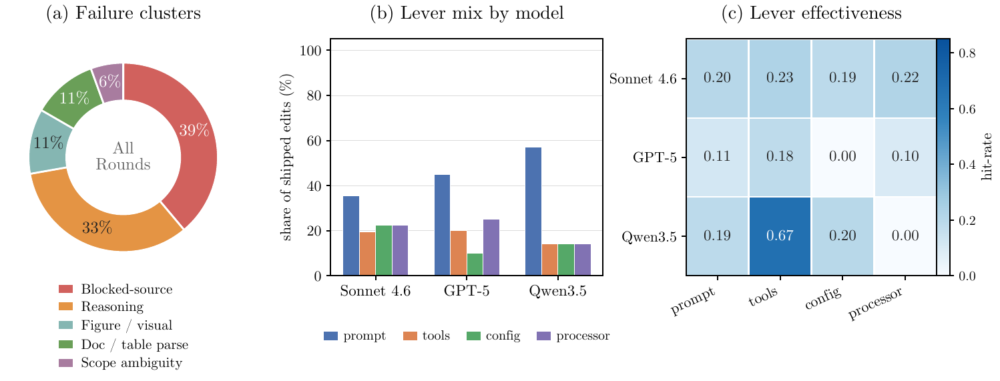

**图 8：GAIA 演化分析（103 个任务，精确匹配）。** **（a）** 尚未解决任务中的失败簇；源受阻和推理占主导，图示/视觉与解析簇则是模型残余能力缺口。**（b）** 各任务模型已发布编辑的类别占比。**（c）** 按模型和类别统计的杠杆有效性，以命中率（转为通过的任务数 / 预测任务数）表示。Qwen3.5 唯一一次工具发布是收益最高的单元格（0.67）。

### D.2 ALFWorld

ALFWorld 是一项具身规划基准，也是本研究中提示词主导程度最高的基准。图 9 展示了其失败簇、各模型演化逻辑和杠杆有效性。

#### 失败簇及其成因

面板（a）汇总了 ALFWorld 上观察到的主要失败簇。占比最高的是搜索/步数上限簇（$89%$），它涵盖两种回合：智能体以低效顺序搜索房间或容器；或在完成深度搜索、先变换再放置等较长交互链之前触及步数上限。提示词规则副作用失败（$7%$）发生在新增启发式规则改善部分任务，却意外限制了其他任务中的行为，导致智能体跳过有效动作或过早停止搜索。物体类型混淆失败（$4%$）则指智能体混淆语义相近的物体。这些失败簇共同表明，ALFWorld 的问题主要源于搜索效率、约束过强的提示词以及物体特定的落地错误。

#### 各模型的演化逻辑

面板（b）显示，提示词的主导程度与基础模型强度呈反向变化：只有能够可靠遵循提示词规则的模型，才能从中获益。Sonnet 是最强的基础模型，其改进几乎全部来自提示词编辑；它能够稳定遵循系统提示词中的搜索顺序启发式规则，因此这些规则已经足够。GPT-5.4 则在提示词之外增加了一个处理器（第 3 轮引入），用于管理变换类任务的步数预算。Qwen3.5 需要最多样的组合（提示词、配置和处理器），其中包括一个拦截其推理文本、并在必要时重新发出工具调用的处理器；这是对提示词层引导无法解决之失败的机械性修复。三者共同采取提示词优先的模式，只有当提示词不足时才启用结构性杠杆。基础模型越弱，演化就越早从提示词引导转向配置或处理器的强制约束；从 Sonnet 到 Qwen，非提示词区段逐渐增大，清楚呈现了这一点。

#### 演化是否消除了这些失败簇？

面板（c）显示，演化减少了 ALFWorld 的主要失败簇，但不同杠杆对不同任务智能体的作用不同。对于 Qwen3.5，处理器和配置编辑的效果最强，命中率分别达到 $0.84$ 和 $0.71$。这些编辑通过重新发出遗漏的工具调用和调整执行预算，直接处理机械性失败，使 Qwen3.5 提升 $+44.0$ 个百分点，接近闭源模型运行的表现。对于 Sonnet，余下失败的结构性较弱，因此提示词编辑足以取得大部分收益，命中率达到 $0.49$；处理器编辑则只产生边际效果（$0.14$）。有两个失败簇只得到部分缓解：其一是由部分演化启发式规则引入、并在后续轮次修补的提示词规则副作用；其二是长路径失败，部分回合仍会超过可用交互预算。总体而言，ALFWorld 展现出清晰的模型依赖模式：较强模型主要受益于提示词层引导，较弱模型则需要处理器和配置编辑提供更多结构性支持。

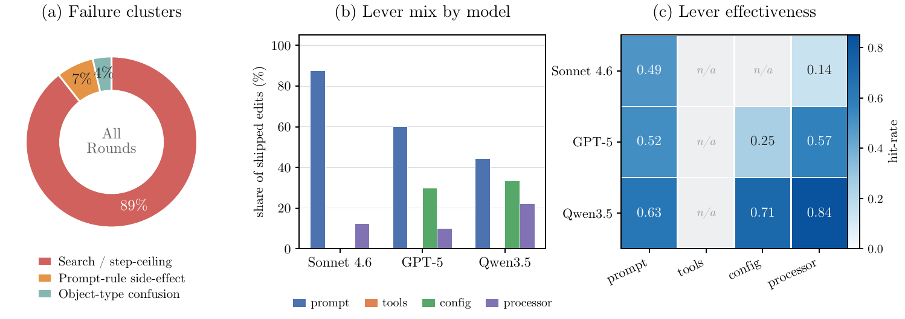

**图 9：ALFWorld 演化分析（134 个任务，目标完成率）。** **（a）** 全部轮次中累积的失败簇；搜索低效与硬性步数上限占主导，另有两个由演化自身引入（提示词规则副作用）或短暂遭遇（物体类型混淆）的小型失败簇。**（b）** 各模型的杠杆组合：强基础模型（Sonnet）几乎只靠提示词提升，较弱基础模型则诉诸更多样的杠杆。**（c）** 杠杆有效性：基础模型越弱，结构性杠杆（处理器、配置）的使用越多，效果也越强。

### D.3 WebShop

WebShop 是一项网页交互基准，也是本研究中噪声最大的实验运行。图 10 展示了其失败簇、各模型演化逻辑和杠杆有效性。

#### 失败簇及其成因

面板（a）汇总了 WebShop 整个运行过程中累积的失败簇。早期失败主要来自搜索循环和分页循环：智能体反复改写查询，或在结果页之间来回切换，却迟迟不做购买决定。随着演化减少这类控制流错误，剩余失败逐渐转向商品选择判断。最大的失败簇是选错商品（$46%$）：智能体选择了错误类别的商品，或尚未比较备选项就接受了匹配度较低的商品。分页循环失败（$21%$）是指智能体反复点击上一页/下一页而没有取得进展。颜色匹配失败（$17%$）源于智能体未能正确处理色调等价关系或站点特有的颜色标签，例如把 “wine” 与 “red” 视为不兼容。属性检查失败（$17%$）则是所选商品总体接近需求，却不满足某个必要细节，例如尺码、袖长或其他未经核验的属性。总体来看，失败簇的迁移说明演化首先减少了导航循环，随后主要错误集中到商品匹配和属性核验上。

#### 各模型的演化逻辑

面板（b）表明，在三个模型上，提示词编辑都推动了大部分改进，处理器编辑则始终是第二重要的杠杆。这一模式与 WebShop 的主要控制流失败相吻合。提示词规则帮助智能体更高效地搜索并更早做出决定；建议型处理器则在执行过程中强化这些规则，当智能体开始重复搜索或在分页间循环时发出警告。针对商品选择失败，演化引入了更有针对性的支持：颜色匹配工具帮助处理色调等价问题，配置编辑则帮助较弱模型在较长的购物会话中保持上下文。总体而言，WebShop 需要混合式应对：提示词改善高层购物策略，处理器减少导航循环，工具支持属性匹配，配置编辑稳定长会话行为。

#### 演化是否消除了这些失败簇？

面板（c）表明，演化部分缩小了 WebShop 的失败簇。提示词编辑是跨模型最稳定有效的杠杆，命中率为 $0.37$-$0.50$；配置编辑则帮助两个较弱模型在较长会话中维持上下文。这些变化减少了早期的搜索与分页循环，使性能从 $60%$ 上升到 $76%$ 的峰值。剩余失败簇更难消除。建议型处理器的收益有限（$0.20$-$0.25$），所以部分分页失败仍然存在。颜色匹配工具在这次运行中没有改善性能（命中率 $0.0$），颜色匹配失败簇因而基本未变。总体而言，WebShop 从提示词与配置编辑中获益最多；残余导航循环和商品判断错误仍是主要不稳定来源。

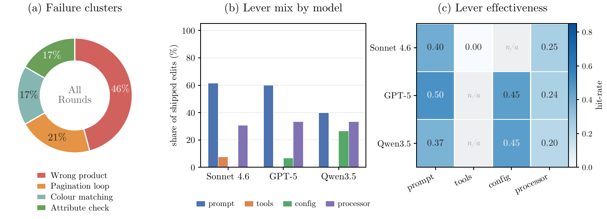

**图 10：WebShop 演化分析（100 个会话）。** **（a）** 整个运行过程中的失败簇；演化已控制住第 0 轮的搜索/分页循环，残余失败大多属于商品选择判断（选错商品、颜色匹配、属性检查）。**（b）** 各模型的杠杆组合：提示词承担主要提升，处理器始终是第二杠杆。**（c）** 杠杆有效性；提示词和配置是有效杠杆，唯一一次颜色匹配工具发布的命中率为 0.0。

### D.4 $\tau^3$-Bench

$\tau^3$-Bench 考查在明确领域政策约束下进行多轮对话的能力。图 11 汇总了 AEGIS 在 Airline、Retail 和 Telecom 三个领域上的运行结果。

#### 失败簇及其成因

排除由支架中断造成的轨迹后，其余失败大多与判断有关。前两大失败簇分别是过早/未经核验的动作（$28%$；在前置条件尚未满足时就确认预订、退款或设备修复）和错误选择/计数（$24%$）。二者合计超过一半，问题在&#x4E8E;_&#x4F55;&#x65F6;_&#x63D0;交&#x548C;_&#x9009;择什么_，而不在于机械执行。其余失败要么属于流程问题（多步修复不完整 $16%$；漏掉步骤/子任务 $14%$），要么与政策有关（误解政策 $13%$）。最小的失败簇是能力边界混淆（$5%$），这是 $\tau^3$ 特有的问题：某些电信故障发生在用户手机上，智能体没有设备侧工具，却把这一边界误判成缺少某种能力。

#### 各模型的演化逻辑

所有模型的演化都由提示词和处理器驱动，没有任何工具编辑：工具集合固定，而且没有哪个失败簇能靠新增工具消除。Sonnet 4.6 的提示词/处理器发布数为 $23/18$；GPT-5.4 的组合最均衡（$19/20$）；Qwen3.5-9B 的总发布数较少（$14/9$）。由于 $\tau^3$ 的失败属于控制流与判断错误，有效杠杆就是在提示词中编码政策的顺序约束，并由处理器在对话中途强制执行这些约束。

#### 演化是否消除了这些失败簇？

配置编辑虽然很少使用，却是使用时效果最强的杠杆（Qwen3.5 的命中率为 $0.67$，GPT-5.4 为 $0.33$）；大量采用的提示词与处理器杠杆则具有中等效果（$0.27$-$0.35$），这与主要失败簇的控制流性质吻合。收益与基础模型的提升空间一致：GPT-5.4 的起点最低（$76.2%$），增益最大（$+14.5$ 个百分点）；Sonnet 4.6 提升 $+5.4$ 个百分点；接近上限的 Qwen3.5-9B 只提升 $+1.1$ 个百分点。演化循环并非单调：Sonnet 的 Telecom 运行在 R4 达到 $100%$，连续第六次发布同类别编辑后在 R7 退化至 $80.7%$，又在 R9 恢复到 $99.1%$（第 6.6 节）。总体而言，强制执行顺序的杠杆最可靠地解决了过早动作和漏步骤两类失败，而错误选择与政策判断仍是更难处理的残余问题。

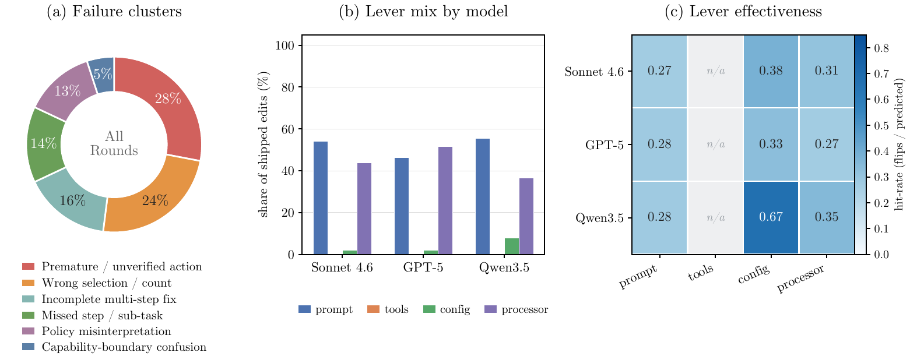

**图 11：$\tau^3$-Bench 演化分析。** 汇总 Airline、Retail 和 Telecom 三个领域。**（a）** 从已记录摘要中得到的失败簇（排除支架中断轨迹）；判断错误（过早动作与错误选择）占主导。**（b）** 各模型的杠杆组合：提示词和处理器承担主要提升；由于工具集合固定，工具编辑为零。**（c）** 杠杆有效性；配置在使用时最有效（Qwen3.5 为 0.67）但较少采用，提示词与处理器则是稳定且使用量大的杠杆。

### D.5 SWE-bench Verified

SWE-bench Verified 考查代码仓库级编辑能力。图 12 展示了其失败簇、各模型的演化逻辑和有效性。

#### 失败簇及其成因

面板（a）汇总了三个模型在所有轮次中的失败簇。最大失败簇是修复不完整（$62%$）：智能体找到了正确区域，也提交了有效补丁，却只覆盖一个分支或调用点，而标准补丁需要修改多处。其次是错误诊断（$19%$），即智能体误读根因后修改了错误文件或错误抽象层。余下长尾主要是机械问题而非认知问题：未尝试编辑（$6%$）、`Edit` 锚点不匹配（$5%$）和预算耗尽（$4%$）。值得注意的是，这一构成与奖励黑客恰好相反：失败来自修复不足，而非操纵评测，因为支架会先应用标准测试补丁，再应用模型补丁，并禁止写入测试文件。

#### 各模型的演化逻辑

面板（b）表明，对所有模型而言，SWE-bench 都以提示词为第一杠杆；第二杠杆则随基础模型强弱而变化。三个运行都没有发布工具编辑，因为与 GAIA 不同，SWE-bench 的失败集合中不存在可由工具解决的机械检索问题。Sonnet 的提示词和处理器编辑各有 $7$ 次，它利用工作流提示来塑造一个本已较强的编码智能体；GPT-5.4 最依赖提示词（发布 $8$ 次），并用配置编辑（$4$ 次）撤销有害提示、重组策略阶段；Qwen3.5 的少量发布分布在提示词、处理器和配置三类（$6/3/3$）。共同逻辑都是提示词优先，而随着基础模型减弱，结构性杠杆会更多介入。

#### 演化是否消除了这些失败簇？

面板（c）揭示出一道明显的能力下限。对于强模型，有效杠杆确实能够消除失败：GPT-5.4 的配置编辑命中率达到 $0.48$，提示词达到 $0.39$；Sonnet 的提示词和处理器杠杆均达到 $0.40$。对于 Qwen3.5-9B，每种杠杆都跌至接近零（提示词 $0.05$、配置 $0.05$、处理器 $0.06$），低了一个数量级，因为这个 $9$B 基础模型无法执行所预测的修复。同一套循环能把 GPT-5.4 从 $45%$ 提高到 $64%$ 的峰值，并把 Sonnet 稳定在约 $87%$，却只给 Qwen3.5 带来噪声（峰值 $42%$，没有持久增益）。总体上，SWE-bench 通过扩大修复范围的提示词编辑和恢复工作流节奏的配置编辑获得改进，但前提是模型本身足以落实这些编辑。

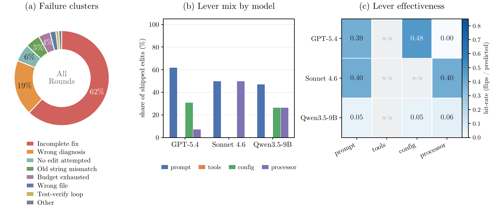

**图 12：SWE-bench Verified 演化分析（55 个任务，解决率）。** **（a）** 三个任务模型、所有轮次汇总后的失败簇；修复不完整和错误诊断占主导，机械长尾（未编辑、锚点不匹配、预算）只是残余；这些失败属于修复不足，而非操纵评测。**（b）** 各模型的杠杆组合：每次运行都以提示词为第一杠杆，且工具编辑为零；第二杠杆从处理器（Sonnet）转向配置（GPT-5.4），再转向混合组合（Qwen3.5）。**（c）** 以命中率（实际翻转任务数 / 预测任务数）表示的杠杆有效性；强模型的有效杠杆可达到 0.39–0.48，而 Qwen3.5-9B 的所有杠杆都跌至约 0.05，这是一道能力下限，低于它时演化无法累积收益。

## 附录 E. 可复现性与产物

### E.1 每次运行的目录布局

每次演化运行都会写入一个自描述目录。借助下列布局，读者可以从已记录的产物重建本文中的任何决策。

**`runs/<run_name>/`（每次运行的产物布局，译文）**

```
runs/<run_name>/
|-- INDEX.md                    # 便于人工阅读的运行索引
|-- journal.md                  # 第一人称备忘录，每轮一条
|-- curves.json                 # 各轮 pass rate 轨迹
|-- scoreboard.json             # 发布记录 + 各类别声誉
|-- audit.jsonl                 # 结构化事件日志（stage / gate / commit）
|-- data/
|   |-- task_history.jsonl      # 每个 (round, task) 一行
|   |-- ship_outcomes.json      # 每次历史发布一条记录
|   `-- rejected_candidates.jsonl
`-- R<n>/                       # 每轮产物
    |-- landscape.md            # Planner 跨轨迹综合
    |-- candidates/C-R<n>-NN.md # Evolver 变更清单（每轮 K 个）
    |-- applied/C-R<n>-NN/      # 已应用的配置 + 资源文件
    |-- decision.md             # Critic 的 ship / no_op 决策
    |-- verdicts/V-C-R<n>-NN.md # 各候选方案的裁决
    |-- regressions.md          # 相较 R<n-1> 退化的任务
    |-- digests/*.md            # 各任务失败分析
    `-- trajectories/*.jsonl    # 原始 rollout
```
